# High-Level Project Concept

Build a **multi-agent, cross-market quantitative intelligence platform** that continuously determines the state of financial markets, estimates uncertainty and risk, and dynamically proposes portfolio allocation, hedging, and trading decisions across multiple asset classes.

The system combines:

1. historical and real-time market data;
2. OHLCV and candlestick-derived quantitative features;
3. volatility and options information;
4. macroeconomic indicators;
5. cross-asset correlations and market structure;
6. financial, technological, geopolitical, and economic news;
7. historical market-regime behavior;
8. statistical, mathematical, machine-learning, and quantitative-finance models.

Rather than relying upon a single predictive model, the platform uses **composable software Agents and Operators** to independently analyze different dimensions of the market and then combine their outputs into uncertainty-aware decisions.

Conceptually:

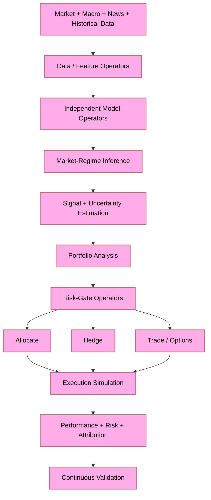

The central research question is:

> **Given all information legitimately available at time *t*, what market regime is most probable, what risks currently dominate, how uncertain is that assessment, and what portfolio allocation, hedge, or trading action provides the best risk-adjusted response?**

The project spans four interacting financial domains:

**Earth — Portfolio & Income**
Asset allocation, diversification, income, portfolio construction, capital preservation, and long-term risk-adjusted performance.

**Air — Hedging & Risk**
Exposure analysis, correlations, drawdown protection, tail-risk management, dynamic hedging, and portfolio-defense strategies.

**Fire — Volatility & Options Alpha**
Volatility regimes, options structures, derivatives, tactical opportunities, and volatility-based strategies.

**Water — Macro & Cross-Market Dynamics**
Interest rates, currencies, commodities, futures, economic indicators, geopolitical developments, news, and transitions between macroeconomic regimes.

These are **four views of one system rather than four independent applications**.

The architecture should therefore be capable of discovering situations in which signals interact. For example:

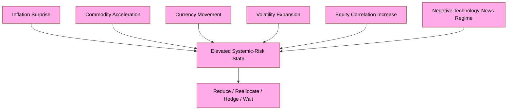

Likewise, apparently bullish technical patterns should not automatically cause trades. A candlestick pattern may generate a feature, but its significance must be evaluated against volatility, volume, regime, macro conditions, historical evidence, transaction costs, and uncertainty.

The system's fundamental principle is therefore:

> **Predict less blindly; measure more completely; quantify uncertainty; control risk before allocating capital.**

Agents are implemented as **executable, typed software Objects/Operators**, not `.agent.md` personas. Python provides research and orchestration; C++ supports performance-critical quantitative computation; Rust supports high-integrity concurrent/risk/execution components; and Go supports APIs, services, distributed orchestration, and telemetry where those languages provide genuine architectural value.

The initial objective is **not autonomous live trading**. The first target is a rigorous research and paper-trading platform capable of historical replay, backtesting, walk-forward validation, scenario analysis, stress testing, simulated execution, risk analysis, and reproducible comparison between strategies.

Ultimately, the platform should function as a **cross-market adaptive financial decision system**:

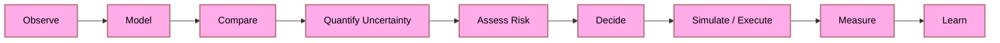

Success is not defined merely as maximizing predicted profit. It is defined as finding decisions that remain defensible when models disagree, markets change regime, forecasts fail, correlations break, volatility increases, and uncertainty becomes materially greater.

---

## Portfolio Diversification Philosophy

Diversification is a **first-class architectural concern**, not an afterthought. The platform does not treat "the market" as synonymous with equities. True risk-adjusted resilience requires exposure across uncorrelated asset classes, geographies, time horizons, and instruments — both short-term and long-term, both optioned and unoptioned, both liquid and semi-liquid.

> **A portfolio concentrated in a single asset class is not a portfolio — it is a bet.**

### Asset-Class Universe

The system operates across the full investable universe, broken into zoomed-in charts by bucket for readability.

#### Top-Level Buckets

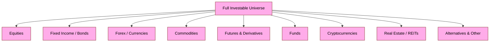

#### Equities & Fixed Income

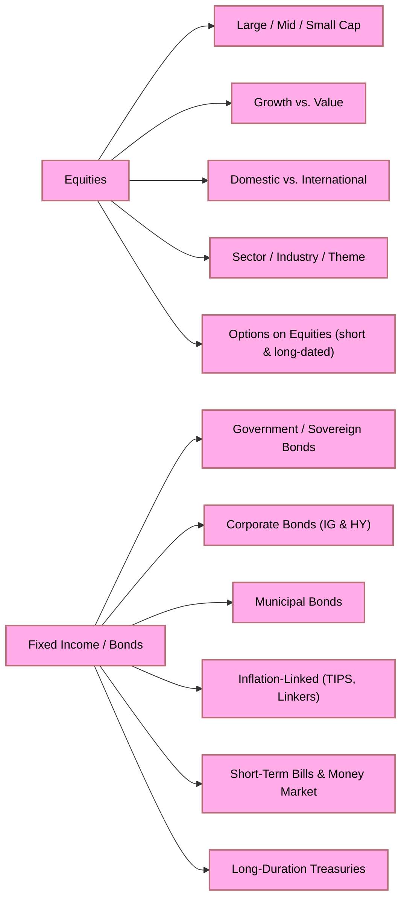

#### Forex & Commodities

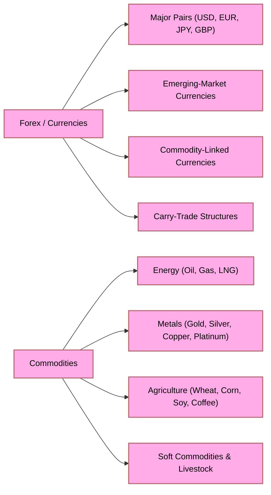

#### Futures & Funds

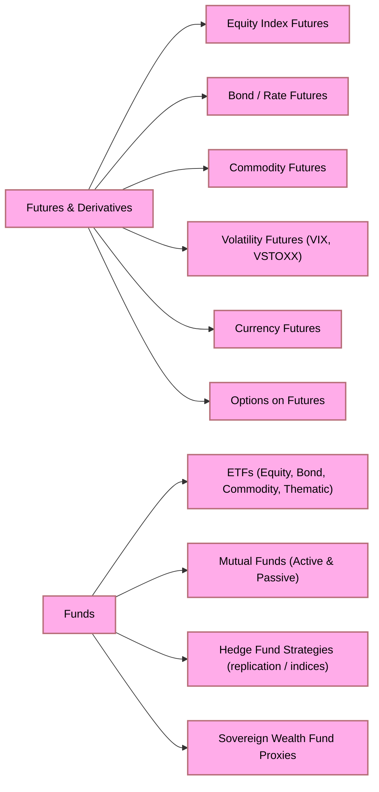

#### Crypto, Real Estate & Alternatives

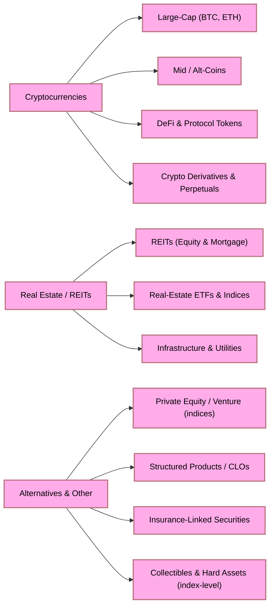

### Within-Bucket Diversification

Each asset class is itself diversified internally. Holding "equities" is not sufficient — the system must reason about concentration within equities across sectors, geographies, market caps, factors, and time horizons:

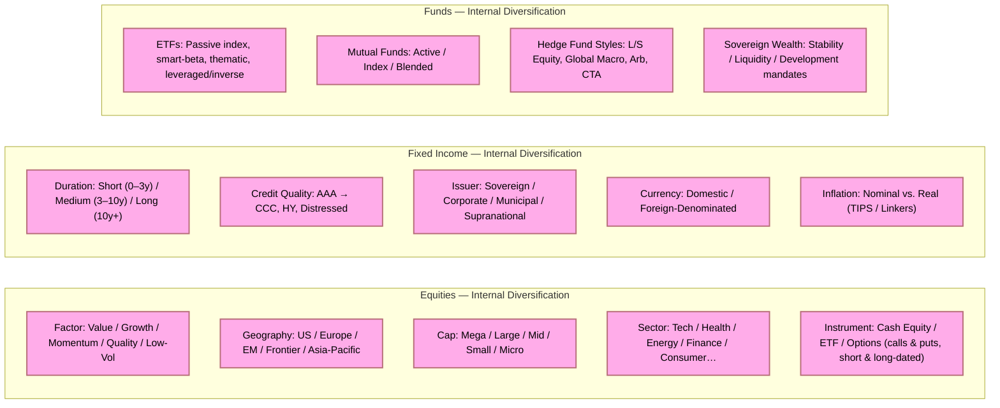

### Cross-Asset Correlation and Regime Sensitivity

Diversification is dynamic — correlations shift across market regimes. The platform continuously monitors inter-asset correlations and adjusts diversification targets accordingly:

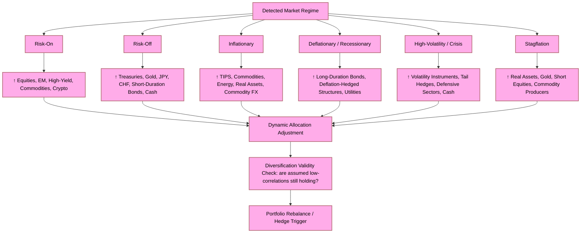

### Time-Horizon Layering

Diversification also applies across **investment time horizons**. The platform maintains layered positions spanning different holding periods, each with appropriate instruments and risk parameters:

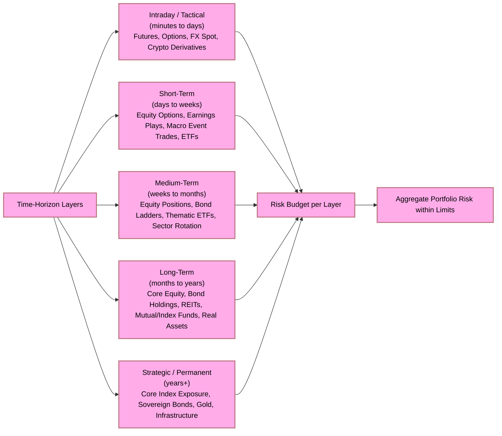

### Diversification as a System Constraint

Diversification is enforced at the system level as a hard and soft constraint, not a preference:

- **Hard constraints**: maximum concentration per single asset, issuer, sector, currency, and geography.
- **Soft constraints**: target correlation bands, volatility-contribution budgets per asset class, and factor-exposure limits.
- **Dynamic rebalancing triggers**: when concentration drifts, correlations spike, or regime shifts are detected, rebalancing proposals are generated before any new signal-based trade is considered.

> **No signal, however strong, overrides a diversification constraint without explicit risk-gate approval and documented justification.**
