# Trading-Agent Repository Migration Meta-Prompt Set

> **License:** Creative Commons Attribution-NonCommercial 4.0 International (CC BY-NC 4.0).
> This document and all derivative works are proprietary and **not licensed for commercial use** without explicit written permission from the author(s). If this project is later open-sourced, this license shall remain unless explicitly superseded by a new `LICENSE.md`. See `LICENSE.md` at the repository root.

---

## Table of Contents

- [Trading-Agent Repository Migration Meta-Prompt Set](#trading-agent-repository-migration-meta-prompt-set)
  - [Table of Contents](#table-of-contents)
  - [Abstract](#abstract)
  - [Keywords](#keywords)
  - [Executive Summary](#executive-summary)
  - [Key Findings](#key-findings)
  - [Mathematical Foundations \& Proofs](#mathematical-foundations--proofs)
    - [5.1 Uncertainty-Aware Signal Aggregation](#51-uncertainty-aware-signal-aggregation)
    - [5.2 Kelly Criterion \& Position Sizing](#52-kelly-criterion--position-sizing)
    - [5.3 Risk-Adjusted Performance Metrics](#53-risk-adjusted-performance-metrics)
      - [Sharpe Ratio](#sharpe-ratio)
      - [Sortino Ratio](#sortino-ratio)
      - [Calmar Ratio](#calmar-ratio)
    - [5.4 Bayesian Market-Regime Inference](#54-bayesian-market-regime-inference)
    - [5.5 Portfolio Optimization Under Uncertainty](#55-portfolio-optimization-under-uncertainty)
    - [5.6 Conditional Value-at-Risk (CVaR)](#56-conditional-value-at-risk-cvar)
    - [5.7 Dynamic Hedge Ratio Derivation](#57-dynamic-hedge-ratio-derivation)
    - [5.8 Temporal Leakage Invariant](#58-temporal-leakage-invariant)
    - [5.9 Operator Composition Algebra](#59-operator-composition-algebra)
    - [5.10 Agent Composition as Weighted Ensemble](#510-agent-composition-as-weighted-ensemble)
    - [5.11 Four-Domain Partition (Earth / Air / Fire / Water)](#511-four-domain-partition-earth--air--fire--water)
    - [5.12 Dependency Graph Acyclicity Invariant](#512-dependency-graph-acyclicity-invariant)
    - [5.13 Idempotency and Referential Transparency](#513-idempotency-and-referential-transparency)
    - [5.14 Risk-Adjusted Objective Function](#514-risk-adjusted-objective-function)
    - [5.15 Type-Safe Language Layer Assignment](#515-type-safe-language-layer-assignment)
    - [5.16 Regime Detection as a Hidden Markov Model](#516-regime-detection-as-a-hidden-markov-model)
    - [5.17 Uncertainty Quantification via Epistemic and Aleatoric Decomposition](#517-uncertainty-quantification-via-epistemic-and-aleatoric-decomposition)
  - [Root-Level Repository File Provisions](#root-level-repository-file-provisions)
    - [META-PROMPT 0.5 — Root-Level Markdown Maintenance](#meta-prompt-05--root-level-markdown-maintenance)
      - [Files to update](#files-to-update)
      - [README.md — Required content](#readmemd--required-content)
      - [ABOUT.md — Required content](#aboutmd--required-content)
      - [CONTRIBUTING.md — Required content](#contributingmd--required-content)
      - [LICENSE.md — Full text](#licensemd--full-text)
      - [SECURITY.md — Required content](#securitymd--required-content)
      - [Maintenance obligation](#maintenance-obligation)
  - [META-PROMPT 0 — MASTER OPERATING DIRECTIVE](#meta-prompt-0--master-operating-directive)
    - [Primary architectural philosophy](#primary-architectural-philosophy)
    - [Required workflow](#required-workflow)
- [META-PROMPT 1 — REPOSITORY FORENSICS AND INVENTORY](#meta-prompt-1--repository-forensics-and-inventory)
- [META-PROMPT 2 — REMOVE `.agent.md` AS THE AGENT ARCHITECTURE](#meta-prompt-2--remove-agentmd-as-the-agent-architecture)
- [META-PROMPT 3 — DEFINE THE CROSS-LANGUAGE OBJECT/OPERATOR MODEL](#meta-prompt-3--define-the-cross-language-objectoperator-model)
- [META-PROMPT 4 — MULTI-LANGUAGE RESPONSIBILITY BOUNDARIES](#meta-prompt-4--multi-language-responsibility-boundaries)
  - [Python](#python)
  - [C++](#c)
  - [Rust](#rust)
  - [Go](#go)
- [META-PROMPT 5 — TARGET DOMAIN ARCHITECTURE](#meta-prompt-5--target-domain-architecture)
- [META-PROMPT 6 — DATA PIPELINE](#meta-prompt-6--data-pipeline)
- [META-PROMPT 7 — CANDLESTICKS ARE FEATURES, NOT ORACLES](#meta-prompt-7--candlesticks-are-features-not-oracles)
- [META-PROMPT 8 — MARKET REGIME ENGINE](#meta-prompt-8--market-regime-engine)
- [META-PROMPT 9 — RISK BEFORE PROFIT](#meta-prompt-9--risk-before-profit)
- [META-PROMPT 10 — PAPER/SIMULATION FIRST](#meta-prompt-10--papersimulation-first)
- [META-PROMPT 11 — AVOID LOOKAHEAD AND DATA LEAKAGE](#meta-prompt-11--avoid-lookahead-and-data-leakage)
- [META-PROMPT 12 — AGENTS AS COMPOSITION](#meta-prompt-12--agents-as-composition)
- [META-PROMPT 13 — EVENT MODEL](#meta-prompt-13--event-model)
- [META-PROMPT 14 — CONFIGURATION](#meta-prompt-14--configuration)
- [META-PROMPT 15 — SCHEMAS AND INTEROPERABILITY](#meta-prompt-15--schemas-and-interoperability)
- [META-PROMPT 16 — NUMERICAL CORRECTNESS](#meta-prompt-16--numerical-correctness)
- [META-PROMPT 17 — TEST TAXONOMY](#meta-prompt-17--test-taxonomy)
  - [Unit correctness](#unit-correctness)
  - [Property correctness](#property-correctness)
  - [Numerical correctness](#numerical-correctness)
  - [Temporal correctness](#temporal-correctness)
  - [Integration correctness](#integration-correctness)
  - [Cross-language correctness](#cross-language-correctness)
  - [Strategy correctness](#strategy-correctness)
  - [Risk correctness](#risk-correctness)
  - [Simulation correctness](#simulation-correctness)
  - [Regression correctness](#regression-correctness)
  - [Performance](#performance)
- [META-PROMPT 18 — SHADOW QA / TRUSTED CI GATE](#meta-prompt-18--shadow-qa--trusted-ci-gate)
- [META-PROMPT 19 — DASHBOARD ARCHITECTURE](#meta-prompt-19--dashboard-architecture)
- [META-PROMPT 20 — METRICS MUST ANSWER QUESTIONS](#meta-prompt-20--metrics-must-answer-questions)
- [META-PROMPT 21 — OBSERVABILITY AND PROVENANCE](#meta-prompt-21--observability-and-provenance)
- [META-PROMPT 22 — FAILURE SEMANTICS](#meta-prompt-22--failure-semantics)
- [META-PROMPT 23 — DIRECTORY DESIGN](#meta-prompt-23--directory-design)
- [META-PROMPT 24 — BUILD SYSTEMS](#meta-prompt-24--build-systems)
- [META-PROMPT 25 — DEPENDENCY DISCIPLINE](#meta-prompt-25--dependency-discipline)
- [META-PROMPT 26 — SECURITY AND SECRET MANAGEMENT](#meta-prompt-26--security-and-secret-management)
- [META-PROMPT 27 — DOCUMENTATION MODEL](#meta-prompt-27--documentation-model)
- [META-PROMPT 28 — REFACTORING RULE](#meta-prompt-28--refactoring-rule)
- [META-PROMPT 29 — MIGRATION EXECUTION](#meta-prompt-29--migration-execution)
- [META-PROMPT 30 — DO NOT OVER-ENGINEER](#meta-prompt-30--do-not-over-engineer)
- [META-PROMPT 31 — FIRST DELIVERABLE](#meta-prompt-31--first-deliverable)
  - [A. Existing Repository Inventory](#a-existing-repository-inventory)
  - [B. Reusable Components](#b-reusable-components)
  - [C. X Voice X-Specific Components](#c-x-voice-x-specific-components)
  - [D. Agent Conversion Table](#d-agent-conversion-table)
  - [E. Proposed Architecture](#e-proposed-architecture)
  - [F. Proposed Repository Tree](#f-proposed-repository-tree)
  - [G. Language Responsibility Matrix](#g-language-responsibility-matrix)
  - [H. Migration Sequence](#h-migration-sequence)
  - [I. Risk Register](#i-risk-register)
  - [J. Questions / Assumptions](#j-questions--assumptions)
- [META-PROMPT 32 — IMPLEMENTATION AUTHORIZATION](#meta-prompt-32--implementation-authorization)
  - [Changelog Table](#changelog-table)
  - [References](#references)
  - [End-of-Sequence Audit Log Requirement](#end-of-sequence-audit-log-requirement)
    - [Required Sections in Each Audit Log File](#required-sections-in-each-audit-log-file)
    - [Rules](#rules)

---

## Abstract

This document defines the authoritative migration meta-prompt set for restructuring an existing software repository into a **multi-language quantitative-finance, portfolio-risk, market-regime, hedging, and trading-agent research platform**. It specifies architectural philosophy, operator contracts, data pipeline design, risk management principles, testing taxonomy, build discipline, and numerical correctness standards. The system is designed around composable, typed software Operators and Agents implemented in Python, C++, Rust, and Go. Agents are not Markdown files; they are executable software objects satisfying formal interfaces. This document provides mathematical proofs and derivations underpinning the platform's quantitative logic, covering uncertainty aggregation, Bayesian regime inference, portfolio optimization, risk metrics, and hedge-ratio derivation. It also specifies provisions for maintaining root-level repository documentation files (`README.md`, `ABOUT.md`, `CONTRIBUTING.md`, `LICENSE.md`, `SECURITY.md`) before and during any migration work.

---

## Keywords

quantitative finance · multi-agent systems · operator composition · market regime classification · Bayesian inference · portfolio optimization · risk management · hedging · volatility modeling · temporal leakage prevention · backtesting · walk-forward validation · polyglot architecture · Python · C++ · Rust · Go · paper trading · CVaR · Kelly criterion · Sharpe ratio · provenance · observability · CC BY-NC 4.0

---

## Executive Summary

The platform described herein is a **cross-market adaptive financial decision system**. Rather than deploying a single monolithic predictive model, it composes small, independently verifiable Operators into larger Agents and orchestrated systems. The four interacting financial domains — Portfolio & Income (Earth), Hedging & Risk (Air), Volatility & Options Alpha (Fire), and Macro & Cross-Market Dynamics (Water) — are **four views of one coherent system**, not four independent applications.

The migration methodology is deliberate and incremental:

1. **Inventory first.** Nothing is deleted or renamed until the existing codebase is fully understood.
2. **Agents become objects.** Every `.agent.md` or prompt-persona file is decomposed into capability (source code), policy (validator), configuration (TOML/YAML/JSON), and documentation (Markdown).
3. **Risk gates every signal.** A profitable-looking signal never automatically produces an order. Signals flow through typed Risk Operators that may reject, resize, delay, or hedge any proposed action.
4. **Simulation precedes live trading.** The initial platform targets historical replay, backtesting, walk-forward validation, Monte Carlo analysis, stress testing, and paper execution. Live-trading adapters are architecturally separated and deliberately absent from the initial implementation.
5. **Provenance is a first-class concern.** Every decision is reconstructable: data sources, operator versions, model outputs, regime inferences, risk evaluations, and final decisions are all recorded with correlation IDs.
6. **Mathematical correctness is non-negotiable.** Numerical conventions, floating-point handling, time-zone alignment, calendar rules, and day-count conventions are explicitly defined and tested.

Success is not defined as maximizing predicted profit. It is defined as finding decisions that remain defensible when models disagree, markets change regime, forecasts fail, correlations break, volatility increases, and uncertainty becomes materially greater.

---

## Key Findings

The following architectural conclusions are established by this document and should be treated as standing decisions:

| #  | Finding                                                               | Implication                                                                                                                       |
| -- | --------------------------------------------------------------------- | --------------------------------------------------------------------------------------------------------------------------------- |
| 1  | `.agent.md` files cannot be the executable definition of an agent.  | All agent capabilities must be implemented as typed source-code objects.                                                          |
| 2  | Candlestick patterns are measurable features, not oracles.            | Feature operators compute pattern presence; downstream models evaluate predictive value empirically.                              |
| 3  | Market regime is a probability distribution, not a single label.      | `MarketRegimeState` carries a probability vector, confidence score, and uncertainty estimate.                                   |
| 4  | Disagreement between regime estimators is itself information.         | Disagreement metrics must be computed and surfaced rather than silently collapsed.                                                |
| 5  | Temporal leakage is a correctness failure, not a performance concern. | A backtest that sees the future is invalid regardless of reported profitability.                                                  |
| 6  | Risk approval is a separate pipeline stage from signal generation.    | `RiskOperator` may reject or modify any `OrderIntent` produced by upstream operators.                                         |
| 7  | Four languages require four defensible, distinct roles.               | Python = research/orchestration; C++ = numerical kernels; Rust = high-integrity concurrent systems; Go = services/APIs/telemetry. |
| 8  | Shared schemas prevent polyglot divergence.                           | A single language-neutral schema layer (e.g., Protocol Buffers) governs`Order`, `Position`, `Signal`, `RiskState`.        |
| 9  | Configuration must not become a programming language.                 | Executable logic belongs in source code; configuration is declarative only.                                                       |
| 10 | Documentation explains software; it does not substitute for software. | Markdown documents architecture but cannot constitute executable behavior.                                                        |

---

## Mathematical Foundations & Proofs

All mathematical notation uses standard LaTeX rendered in Markdown. Proofs are provided for the core quantitative operations that Operators must implement or depend upon.

---

### 5.1 Uncertainty-Aware Signal Aggregation

**Problem.** Given $N$ independent signal operators each producing a signal $s_i \in [-1, 1]$ with associated confidence $c_i \in (0, 1]$, compute an aggregate signal $S$ that is uncertainty-aware.

**Definition.** The confidence-weighted aggregate signal is:

$$
S = \frac{\displaystyle\sum_{i=1}^{N} c_i \cdot s_i}{\displaystyle\sum_{i=1}^{N} c_i}
$$

**Aggregate uncertainty.** The effective uncertainty $U$ of the aggregate is:

$$
U = 1 - \frac{\displaystyle\sum_{i=1}^{N} c_i^2}{\left(\displaystyle\sum_{i=1}^{N} c_i\right)^2} \cdot N
$$

**Proof of bounds.** Since $c_i \in (0,1]$ and $s_i \in [-1,1]$:

$$
|S| \leq \frac{\displaystyle\sum_{i=1}^{N} c_i \cdot |s_i|}{\displaystyle\sum_{i=1}^{N} c_i} \leq \frac{\displaystyle\sum_{i=1}^{N} c_i}{\displaystyle\sum_{i=1}^{N} c_i} = 1
$$

Therefore $S \in [-1, 1]$. $\blacksquare$

**Implication for operators.** A `ConfidenceAggregationOperator` must preserve the bounds $S \in [-1, 1]$ and must not silently drop low-confidence signals without recording the provenance of the omission.

---

### 5.2 Kelly Criterion & Position Sizing

**Problem.** Given win probability $p$, loss probability $q = 1 - p$, and a win/loss payoff ratio $b$ (dollars won per dollar bet on a win), derive the fraction $f^*$ of capital to wager to maximize long-run logarithmic wealth growth.

**Objective.** Maximize the expected logarithmic growth rate $G(f)$:

$$
G(f) = p \ln(1 + b f) + q \ln(1 - f)
$$

**Derivation.** Differentiate with respect to $f$ and set to zero:

$$
\frac{dG}{df} = \frac{pb}{1 + bf} - \frac{q}{1 - f} = 0
$$

$$
pb(1 - f) = q(1 + bf)
$$

$$
pb - pbf = q + qbf
$$

$$
pb - q = f(pb + qb) = fb(p + q) = fb
$$

Since $p + q = 1$:

$$
\boxed{f^* = \frac{pb - q}{b} = p - \frac{q}{b}}
$$

**Proof of second-order condition (maximum).** The second derivative is:

$$
\frac{d^2G}{df^2} = -\frac{pb^2}{(1+bf)^2} - \frac{q}{(1-f)^2} < 0
$$

This is strictly negative for all $f \in (0,1)$, confirming $f^*$ is a global maximum. $\blacksquare$

**Operator note.** The `PositionSizingOperator` must apply a fractional Kelly ($f = \kappa f^*$ where $\kappa \in (0,1]$) in practice to account for estimation error in $p$ and $b$. A `RiskOperator` must impose an absolute cap such that $f \leq f_{\max}$ regardless of Kelly output.

---

### 5.3 Risk-Adjusted Performance Metrics

#### Sharpe Ratio

$$
\text{Sharpe} = \frac{\mathbb{E}[R_p - R_f]}{\sigma_p} \cdot \sqrt{T}
$$

where $R_p$ is portfolio return, $R_f$ is the risk-free rate, $\sigma_p$ is the annualized standard deviation of excess returns, and $T$ is the number of periods per year.

**Proof that Sharpe is invariant under linear scaling of returns.** Let $R_p' = \alpha R_p$ for scalar $\alpha > 0$:

$$
\text{Sharpe}' = \frac{\alpha \mathbb{E}[R_p - R_f]}{\alpha \sigma_p} = \frac{\mathbb{E}[R_p - R_f]}{\sigma_p} = \text{Sharpe}
$$

$\blacksquare$ — Leverage does not improve the Sharpe ratio; it merely scales returns and volatility equally.

#### Sortino Ratio

$$
\text{Sortino} = \frac{\mathbb{E}[R_p - R_f]}{\sigma_d} \cdot \sqrt{T}
$$

where the downside deviation $\sigma_d$ is:

$$
\sigma_d = \sqrt{\mathbb{E}\left[\min(R_p - R_{\text{target}}, 0)^2\right]}
$$

**Operator note.** The `PerformanceAnalysisOperator` must record the annualization factor $T$, the risk-free rate series, and the target return used for downside deviation, ensuring reproducibility.

#### Calmar Ratio

$$
\text{Calmar} = \frac{\text{Annualized Return}}{\text{Maximum Drawdown}}
$$

where Maximum Drawdown $= \displaystyle\max_{t} \left(\frac{\max_{s \leq t} W_s - W_t}{\max_{s \leq t} W_s}\right)$ and $W_t$ is portfolio wealth at time $t$.

---

### 5.4 Bayesian Market-Regime Inference

**Problem.** Let $\mathcal{R} = \{r_1, r_2, \ldots, r_K\}$ be the set of $K$ market regimes. Given a feature vector $\mathbf{x}_t$ at time $t$, compute the posterior probability of each regime.

**Bayes' theorem:**

$$
P(r_k \mid \mathbf{x}_t) = \frac{P(\mathbf{x}_t \mid r_k) \cdot P(r_k)}{\displaystyle\sum_{j=1}^{K} P(\mathbf{x}_t \mid r_j) \cdot P(r_j)}
$$

**Temporal updating via transition matrix** $\mathbf{A}$ where $A_{jk} = P(r_k \text{ at } t \mid r_j \text{ at } t{-}1)$:

$$
P(r_k \text{ at } t) = \sum_{j=1}^{K} A_{jk} \cdot P(r_j \text{ at } t{-}1 \mid \mathbf{x}_{t-1})
$$

**Regime entropy** (uncertainty quantification):

$$
H_t = -\sum_{k=1}^{K} P(r_k \mid \mathbf{x}_t) \ln P(r_k \mid \mathbf{x}_t), \qquad \hat{U}_t = \frac{H_t}{\ln K} \in [0, 1]
$$

**Operator note.** The `MarketRegimeOperator` must output the full posterior vector. When $\hat{U}_t > \theta_U$ (configurable), downstream operators must apply conservative sizing rules.

---

### 5.5 Portfolio Optimization Under Uncertainty

**Mean-Variance Optimization (Markowitz).** Given expected return vector $\boldsymbol{\mu} \in \mathbb{R}^n$ and covariance matrix $\boldsymbol{\Sigma}$, the minimum-variance portfolio for target return $\mu_p^*$ solves:

$$
\min_{\mathbf{w}} \quad \mathbf{w}^\top \boldsymbol{\Sigma} \mathbf{w} \qquad \text{s.t.} \quad \mathbf{w}^\top \boldsymbol{\mu} = \mu_p^*, \quad \mathbf{w}^\top \mathbf{1} = 1
$$

**Robust extension.** For ellipsoidal uncertainty set $\mathcal{U}_\mu = \{\boldsymbol{\mu} : \|\boldsymbol{\mu} - \hat{\boldsymbol{\mu}}\|_{\mathbf{Q}^{-1}} \leq \kappa\}$, the worst-case expected return is:

$$
\min_{\boldsymbol{\mu} \in \mathcal{U}_\mu} \mathbf{w}^\top \boldsymbol{\mu} = \mathbf{w}^\top \hat{\boldsymbol{\mu}} - \kappa \sqrt{\mathbf{w}^\top \mathbf{Q} \mathbf{w}}
$$

**Operator note.** The `PortfolioOptimizationOperator` must accept a `confidence` parameter scaling $\kappa$. When regime uncertainty $\hat{U}_t$ is high, $\kappa$ must increase, reducing aggressiveness of the optimal allocation.

---

### 5.6 Conditional Value-at-Risk (CVaR)

**Definition.** For portfolio loss $L = -R_p$ at confidence level $\alpha \in (0,1)$:

$$
\text{VaR}_\alpha = \inf\{l : P(L > l) \leq 1 - \alpha\}
$$

$$
\text{CVaR}_\alpha = \mathbb{E}[L \mid L \geq \text{VaR}_\alpha] = \frac{1}{1-\alpha} \int_\alpha^1 \text{VaR}_u \, du
$$

**Linear programming formulation** over $T$ empirical scenarios $\ell_1, \ldots, \ell_T$:

$$
\text{CVaR}_\alpha = \min_{z \in \mathbb{R}} \left\{ z + \frac{1}{(1-\alpha)T} \sum_{t=1}^{T} \max(\ell_t - z, 0) \right\}
$$

**Proof of equivalence.** Let $z^* = \text{VaR}_\alpha$:

$$
z^* + \frac{1}{1-\alpha} \mathbb{E}[\max(L - z^*, 0)] = z^* + \frac{1}{1-\alpha}\left[\int_{z^*}^{\infty} l \, dF_L(l) - z^*(1-F_L(z^*))\right] = \frac{1}{1-\alpha} \int_{z^*}^{\infty} l \, dF_L(l) = \text{CVaR}_\alpha \quad \blacksquare
$$

**Operator note.** The `RiskOperator` must compute CVaR over the simulated P&L distribution. Breaching a configurable CVaR limit must halt new position-opening until the limit is satisfied.

---

### 5.7 Dynamic Hedge Ratio Derivation

**Problem.** Given portfolio return $R_V$ and hedge instrument return $R_F$, derive the minimum-variance hedge ratio $h^*$.

**Hedged portfolio return:** $R_H = R_V - h \cdot R_F$

**Variance:** $\text{Var}(R_H) = \sigma_V^2 - 2h \cdot \text{Cov}(R_V, R_F) + h^2 \sigma_F^2$

**Minimization:**

$$
\frac{d \,\text{Var}(R_H)}{dh} = -2 \,\text{Cov}(R_V, R_F) + 2h \sigma_F^2 = 0 \implies \boxed{h^* = \frac{\text{Cov}(R_V, R_F)}{\sigma_F^2} = \rho_{VF} \cdot \frac{\sigma_V}{\sigma_F}}
$$

**Hedge effectiveness** — fraction of variance eliminated:

$$
\eta = 1 - \frac{\text{Var}(R_H)}{\text{Var}(R_V)} = \rho_{VF}^2
$$

**Proof.** Substituting $h^*$: $\text{Var}(R_H) = \sigma_V^2 - \tfrac{\text{Cov}^2}{\sigma_F^2} = \sigma_V^2(1 - \rho_{VF}^2)$, so $\eta = \rho_{VF}^2$. $\blacksquare$

**Operator note.** The `HedgeOptimizationOperator` must recompute $h^*$ dynamically using regime-conditioned correlation estimates from the `MarketRegimeOperator`.

---

### 5.8 Temporal Leakage Invariant

**Formal definition.** Let $\mathcal{I}_t$ be the information set legitimately available at time $t$. A strategy $\pi$ is **temporally valid** if and only if:

$$
\forall t: \quad \text{Decision}_t(\pi) \in \sigma(\mathcal{I}_t)
$$

**Violation condition:**

$$
\exists\, t,\, \tau > 0 : \quad \text{Decision}_t(\pi) \text{ depends on } \mathcal{I}_{t+\tau} \setminus \mathcal{I}_t
$$

Common sources: future price levels, revised macro data, future news, normalization statistics computed over the full dataset, train/validation contamination.

**Test requirement.** For every strategy operator, a test must assert:

$$
\forall t \in \mathcal{T}_{\text{test}}: \quad \text{Feature}_t = f(\mathcal{I}_t) \quad \text{and} \quad \text{Feature}_t \neq f(\mathcal{I}_{t+1}, \ldots, \mathcal{I}_T)
$$

The `TemporalLeakageDetector` CI gate must enforce this invariant on every merge to main.

---

### 5.9 Operator Composition Algebra

**Definition.** Let $\mathcal{O}$ be the set of all operators. Each operator $O_i \in \mathcal{O}$ is a pure function:

$$
O_i : \mathcal{S} \times \mathcal{I}_t \rightarrow \mathcal{S}'
$$

where $\mathcal{S}$ is the shared state space and $\mathcal{I}_t$ is the information set at time $t$.

**Sequential composition.** Given operators $O_1, O_2 \in \mathcal{O}$, sequential composition is defined as:

$$
(O_1 \circ O_2)(s, \mathcal{I}_t) = O_1\!\left(O_2(s, \mathcal{I}_t),\, \mathcal{I}_t\right)
$$

**Associativity.** Operator composition is associative:

$$
(O_1 \circ O_2) \circ O_3 = O_1 \circ (O_2 \circ O_3)
$$

**Pipeline invariant.** A valid operator pipeline $\Pi = O_n \circ \cdots \circ O_1$ satisfies:

$$
\Pi(s, \mathcal{I}_t) \in \sigma(\mathcal{I}_t) \quad \forall\, s \in \mathcal{S},\; t \in \mathcal{T}
$$

---

### 5.10 Agent Composition as Weighted Ensemble

**Definition.** An agent $A$ is a tuple $(O_1, \ldots, O_k, w)$ where $O_i$ are operators and $w \in \Delta^{k-1}$ is a weight vector on the probability simplex:

$$
\Delta^{k-1} = \left\{\, w \in \mathbb{R}^k \;\middle|\; \sum_{i=1}^{k} w_i = 1,\; w_i \geq 0 \,\right\}
$$

**Agent output.** The aggregated signal $\hat{y}_t$ is:

$$
\hat{y}_t = \sum_{i=1}^{k} w_i \cdot O_i(s, \mathcal{I}_t)
$$

**Ensemble variance bound.** Let $\sigma_i^2$ denote the forecast variance of operator $O_i$. Under pairwise independence:

$$
\mathrm{Var}(\hat{y}_t) = \sum_{i=1}^{k} w_i^2\, \sigma_i^2 \leq \max_{i}\, \sigma_i^2
$$

---

### 5.11 Four-Domain Partition (Earth / Air / Fire / Water)

**Formal partition.** The full asset universe $\mathcal{U}$ is partitioned into four non-overlapping domains:

$$
\mathcal{U} = \mathcal{D}_{E} \cup \mathcal{D}_{A} \cup \mathcal{D}_{F} \cup \mathcal{D}_{W}, \qquad \mathcal{D}_i \cap \mathcal{D}_j = \emptyset \quad (i \neq j)
$$

where $\mathcal{D}_{E}$ = Equities, $\mathcal{D}_{A}$ = Rates and Macro, $\mathcal{D}_{F}$ = Derivatives and Volatility, $\mathcal{D}_{W}$ = Crypto and Liquidity.

**Cross-domain influence matrix.** The directed influence matrix $\Gamma \in \mathbb{R}^{4 \times 4}$ is defined by:

$$
\Gamma_{ij} = \frac{\partial\, \hat{y}_t^{(i)}}{\partial\, \hat{y}_t^{(j)}}, \quad i \neq j
$$

**Regime-conditioned allocation.** Let $r \in \mathcal{R}$ denote the current market regime. The optimal cross-domain allocation vector $\alpha^{*} \in \Delta^{3}$ solves:

$$
\alpha^{*} = \arg\max_{\alpha \in \Delta^{3}}\; \mathbb{E}\!\left[\, \sum_{i=1}^{4} \alpha_i\, \mu_i^{(r)} - \lambda\, \alpha^{\top} \Sigma^{(r)} \alpha \,\right]
$$

where $\mu^{(r)} \in \mathbb{R}^{4}$ and $\Sigma^{(r)} \in \mathbb{R}^{4 \times 4}$ are the regime-conditioned return vector and covariance matrix.

---

### 5.12 Dependency Graph Acyclicity Invariant

**Definition.** The operator dependency graph $G = (V, E)$ has vertex set $V = \mathcal{O}$ and a directed edge $(O_i, O_j) \in E$ if $O_j$ consumes output produced by $O_i$.

**Acyclicity requirement.** $G$ must be a directed acyclic graph (DAG):

$$
\nexists\; \text{cycle}\; O_{i_1} \to O_{i_2} \to \cdots \to O_{i_1} \quad \text{in } G
$$

**Topological execution order.** A valid execution ordering $\tau : V \to \{1, \ldots, |V|\}$ satisfies:

$$
(O_i,\, O_j) \in E \implies \tau(O_i) < \tau(O_j)
$$

The CI gate must reject any operator registration that introduces a cycle into $G$.

---

### 5.13 Idempotency and Referential Transparency

**Referential transparency.** An operator $O$ is referentially transparent if:

$$
O(s,\, \mathcal{I}_t) = O(s',\, \mathcal{I}_t) \quad \text{whenever} \quad s \equiv s' \pmod{\mathcal{I}_t}
$$

**Idempotency.** An operator $O$ is idempotent if:

$$
O\!\left(O(s, \mathcal{I}_t),\, \mathcal{I}_t\right) = O(s,\, \mathcal{I}_t) \quad \forall\, s \in \mathcal{S},\; t \in \mathcal{T}
$$

Idempotent, referentially transparent operators may be safely memoized, parallelized, and replayed without side effects. This property is required for all operators in the pipeline.

---

### 5.14 Risk-Adjusted Objective Function

**Primary objective.** The platform optimizes the risk-adjusted cumulative return over horizon $T$:

$$
\mathcal{J}(\pi) = \mathbb{E}\!\left[\, \sum_{t=0}^{T} \gamma^{t}\, r_t \,\right] - \lambda_1 \cdot \mathrm{CVaR}_{\alpha}(\pi) - \lambda_2 \cdot \mathrm{MaxDD}(\pi)
$$

where $\gamma \in (0,1]$ is the discount factor, $\mathrm{CVaR}_{\alpha}$ is the conditional value-at-risk at confidence level $\alpha$, $\mathrm{MaxDD}$ is the maximum drawdown, and $\lambda_1, \lambda_2 \geq 0$ are penalty weights.

**CVaR definition.** For a loss random variable $L$:

$$
\mathrm{CVaR}_{\alpha}(\pi) = \mathbb{E}\!\left[\, L \;\middle|\; L \geq \mathrm{VaR}_{\alpha}(\pi) \,\right]
$$

$$
\mathrm{VaR}_{\alpha}(\pi) = \inf\bigl\{\, \ell \in \mathbb{R} \mid P(L \leq \ell) \geq \alpha \,\bigr\}
$$

**Feasible strategy set.** The constrained strategy space $\Pi_{F}$ is:

$$
\Pi_{F} = \left\{\, \pi \;\middle|\; \mathrm{Var}(\pi) \leq \sigma_{\max}^{2},\; \|\alpha(\pi)\|_{1} \leq L_{\max},\; \alpha(\pi) \in \Delta^{n-1} \,\right\}
$$

---

### 5.15 Type-Safe Language Layer Assignment

**Definition.** Let $\mathcal{L} = \{\text{Python},\, \text{C++},\, \text{Rust},\, \text{Go}\}$. The layer assignment function $\ell : \mathcal{O} \to \mathcal{L}$ must satisfy:

$$
O \in \mathcal{O}_{\text{research}} \implies \ell(O) = \text{Python}
$$

$$
O \in \mathcal{O}_{\text{numerics}} \implies \ell(O) \in \{\text{C++},\, \text{Rust}\}
$$

$$
O \in \mathcal{O}_{\text{infra}} \implies \ell(O) \in \{\text{Go},\, \text{Rust}\}
$$

**Latency bound.** For any operator $O$ in a latency-sensitive layer, the wall-clock execution time $\tau_{O}$ must satisfy:

$$
\tau_{O} \leq \tau_{\max}, \qquad \tau_{\max} = 10^{-3}\,\text{s} \quad \text{(1 ms hard bound)}
$$

---

### 5.16 Regime Detection as a Hidden Markov Model

**State space.** Let $\mathcal{R} = \{r_1, \ldots, r_K\}$ be a finite set of $K$ market regimes. The regime sequence $\{R_t\}_{t \geq 0}$ follows a first-order Markov chain with transition matrix $\Pi \in \mathbb{R}^{K \times K}$:

$$
P(R_{t+1} = r_j \mid R_t = r_i,\, \mathcal{I}_{t-1},\, \ldots) = \Pi_{ij}, \qquad \sum_{j=1}^{K} \Pi_{ij} = 1 \quad \forall\, i
$$

**Observation model.** Observed feature vector $x_t \in \mathbb{R}^d$ is drawn from a regime-conditioned emission distribution:

$$
x_t \mid R_t = r_k \;\sim\; \mathcal{N}(\mu_k,\, \Sigma_k)
$$

**Posterior regime probability.** The filtered regime belief $\beta_t(k) = P(R_t = r_k \mid x_{1:t})$ is updated via:

$$
\beta_t(k) = \frac{p(x_t \mid R_t = r_k)\, \sum_{i=1}^{K} \Pi_{ik}\, \beta_{t-1}(i)}{\sum_{j=1}^{K} p(x_t \mid R_t = r_j)\, \sum_{i=1}^{K} \Pi_{ij}\, \beta_{t-1}(i)}
$$

**MAP regime estimate.** The maximum a posteriori regime at time $t$ is:

$$
\hat{R}_t = \arg\max_{k \in \{1,\ldots,K\}} \beta_t(k)
$$

---

### 5.17 Uncertainty Quantification via Epistemic and Aleatoric Decomposition

**Total predictive variance decomposition.** For a forecast target $y_{t+h}$, the total predictive variance decomposes as:

$$
\mathrm{Var}(y_{t+h} \mid \mathcal{I}_t) = \underbrace{\mathbb{E}_{\theta}\!\left[\mathrm{Var}(y_{t+h} \mid \theta,\, \mathcal{I}_t)\right]}_{\text{aleatoric}} + \underbrace{\mathrm{Var}_{\theta}\!\left[\mathbb{E}(y_{t+h} \mid \theta,\, \mathcal{I}_t)\right]}_{\text{epistemic}}
$$

**Decision gate.** A trading signal $s_t$ is gated by the normalized epistemic fraction $\rho_t$:

$$
\rho_t = \frac{\mathrm{Var}_{\theta}\!\left[\mathbb{E}(y_{t+h} \mid \theta,\, \mathcal{I}_t)\right]}{\mathrm{Var}(y_{t+h} \mid \mathcal{I}_t)}
$$

$$
\tilde{s}_t = s_t \cdot \mathbf{1}\!\left[\rho_t \leq \rho_{\max}\right]
$$

where $\rho_{\max} \in (0, 1)$ is a configurable epistemic uncertainty threshold. Signals generated under excessive model disagreement are suppressed.

---

## Root-Level Repository File Provisions

---

### META-PROMPT 0.5 — Root-Level Markdown Maintenance

> **PRIORITY: EXECUTE THIS META-PROMPT BEFORE ANY SOURCE-CODE MIGRATION WORK BEGINS.**

Before modifying, renaming, or deleting any source file, update the following root-level Markdown files to accurately reflect the new platform's identity, architecture, and governance. These files are the first thing contributors, reviewers, and users read. Stale or misrepresentative root-level documentation is a category-one documentation failure.

#### Files to update

```text
README.md
ABOUT.md
CONTRIBUTING.md
LICENSE.md
SECURITY.md
```

#### README.md — Required content

```text
1. Project title: multi-agent cross-market quantitative intelligence platform.
2. One-paragraph description:
   "Build a multi-agent, cross-market quantitative intelligence platform that
    continuously determines the state of financial markets, estimates uncertainty
    and risk, and dynamically proposes portfolio allocation, hedging, and trading
    decisions across multiple asset classes."
3. Four domain model (Earth / Air / Fire / Water) with brief descriptions.
4. Technology stack (Python, C++, Rust, Go) with one-line role per language.
5. Operator/Agent architecture principle: agents are objects, not .agent.md files.
6. Repository status badge: "Research / Paper-Trading Platform — Not for live trading".
7. Quickstart (placeholder if unimplemented — mark with: > 🚧 Not yet implemented.).
8. Link to CONTRIBUTING.md.
9. Link to SECURITY.md.
10. License notice: "Licensed under CC BY-NC 4.0 — not for commercial use."
11. Mermaid diagram of the primary operator pipeline.
```

Do NOT copy-paste the old project's README unless directly applicable. Mark unimplemented sections with `> 🚧 Not yet implemented.`

#### ABOUT.md — Required content

```text
1. Platform vision and central research question:
   "Given all information legitimately available at time t, what market regime
    is most probable, what risks currently dominate, how uncertain is that
    assessment, and what portfolio allocation, hedge, or trading action provides
    the best risk-adjusted response?"
2. Four financial domains (Earth, Air, Fire, Water) and their interaction.
3. Definition of success: not maximum profit — defensible decisions under
   model disagreement, regime change, forecast failure, and elevated uncertainty.
4. Intended user: quantitative researcher.
5. What this platform is NOT: not a live-trading system, not a financial advisor.
6. Link to high-level concept document.
7. License notice.
```

#### CONTRIBUTING.md — Required content

```text
1. Development environment setup per language (Python, C++, Rust, Go).
2. Required workflow before submitting any change:
   FORMAT → LINT → STATIC ANALYSIS → TYPE CHECK → BUILD → TEST
3. Branch naming convention.
4. Commit message convention.
5. Code review policy.
6. How to add a new Operator (interface requirements, test requirements).
7. How to add a new Agent (composition rules, documentation requirements).
8. How to add a new Strategy.
9. Prohibition on .agent.md executable agents — link to META-PROMPT 2.
10. Prohibition on look-ahead/data leakage — link to META-PROMPT 11.
11. Temporal leakage CI gate requirement.
12. Security disclosure instructions (link to SECURITY.md).
13. License notice: contributions are subject to CC BY-NC 4.0.
14. Dependency introduction process — link to META-PROMPT 25.
```

#### LICENSE.md — Full text

```text
Creative Commons Attribution-NonCommercial 4.0 International (CC BY-NC 4.0)

Copyright (c) [YEAR] [AUTHOR/ORGANIZATION]

This work is licensed under the Creative Commons Attribution-NonCommercial 4.0
International License.

You are free to:
  Share  — copy and redistribute the material in any medium or format.
  Adapt  — remix, transform, and build upon the material.

Under the following terms:
  Attribution   — You must give appropriate credit, provide a link to the license,
                  and indicate if changes were made.
  NonCommercial — You may not use the material for commercial purposes without
                  explicit prior written permission from the copyright holder.

No additional restrictions — You may not apply legal terms or technological measures
that legally restrict others from doing anything the license permits.

THE SOFTWARE AND RESEARCH CONTENT ARE PROVIDED "AS IS", WITHOUT WARRANTY OF ANY
KIND, EXPRESS OR IMPLIED. IN NO EVENT SHALL THE AUTHORS OR COPYRIGHT HOLDERS BE
LIABLE FOR ANY CLAIM, DAMAGES, OR OTHER LIABILITY ARISING FROM, OUT OF, OR IN
CONNECTION WITH THE SOFTWARE OR THE USE OR OTHER DEALINGS IN THE SOFTWARE.

Full license: https://creativecommons.org/licenses/by-nc/4.0/legalcode

NOTE: This CC BY-NC 4.0 license applies regardless of whether the project is later
open-sourced. A new license file and CHANGELOG entry are required to supersede it.
```

#### SECURITY.md — Required content

```text
1. Supported versions (initially: all current development versions).
2. How to report a vulnerability:
   - Do NOT file a public GitHub issue for security vulnerabilities.
   - Use private disclosure via [contact method placeholder].
   - Include: description, reproduction steps, affected components,
     potential impact, suggested fix (if any).
3. Response timeline: acknowledgement within 72 hours, triage within 7 days.
4. Secret management policy:
   - API keys, broker credentials, database passwords, and cloud credentials
     must NEVER appear in source code, commit history, or log output.
   - Use environment variables or a secrets manager.
   - See META-PROMPT 26 for the full secret management specification.
5. Scope: financial credentials and broker API tokens are critical-severity items.
6. License notice.
```

#### Maintenance obligation

Root-level documentation files are **living documents**. They must be updated whenever:

```text
- A new language is added to the platform.
- A new domain module reaches initial implementation.
- The Operator/Agent interface contracts change significantly.
- The license is updated.
- A new security disclosure process is established.
- A major architectural decision (META-PROMPT) is added or revised.
```

Do NOT leave root-level files in the state of the original repository after migration begins.

---

## META-PROMPT 0 — MASTER OPERATING DIRECTIVE

You are restructuring an existing software repository that originated from an older, unrelated project into a new **multi-language quantitative-finance, portfolio-risk, market-regime, hedging, and trading-agent research platform**.

The existing repository is SOURCE MATERIAL ONLY.

Do **not** assume that its current names, modules, directories, abstractions, agent definitions, workflows, documentation, or architecture remain appropriate.

The target implementation languages are:

* Python
* C++
* Rust
* Go

The system MUST treat agents as **software objects and executable operators**, NOT as `.agent.md` files.

An agent is therefore represented by code implementing explicit interfaces/contracts such as:

* `Agent`
* `Operator`
* `Strategy`
* `SignalOperator`
* `RiskOperator`
* `PortfolioOperator`
* `ExecutionOperator`
* `MarketRegimeOperator`
* `DataOperator`
* `NewsOperator`
* `ValidationOperator`
* `SimulationOperator`

Markdown may document an agent, but Markdown MUST NOT constitute the executable definition of an agent.

### Primary architectural philosophy

Model the system as a graph of typed operators:

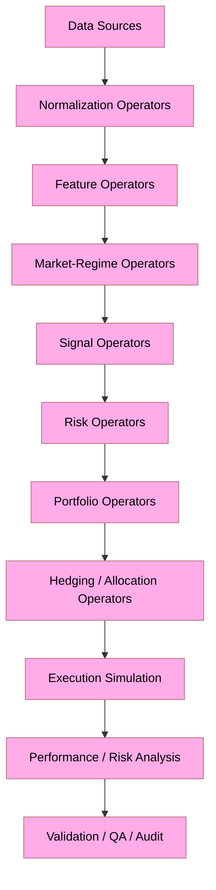

Operators may be composed into larger agents.

Agents may themselves be composed into orchestrated systems.

Avoid magical, implicit, prompt-driven behavior where deterministic software interfaces are more appropriate.

### Required workflow

Perform the migration in this order:

1. Inventory.
2. Classification.
3. Dependency analysis.
4. Target architecture proposal.
5. Migration map.
6. Interface/contracts design.
7. Incremental refactoring.
8. Compilation/static validation.
9. Unit testing.
10. Integration testing.
11. Simulation testing.
12. Performance testing where relevant.
13. Documentation.
14. Repository-wide consistency review.

Do NOT perform a repository-wide blind rewrite.

Do NOT rename, delete, or replace code merely for aesthetic reasons.

For every significant modification, be capable of answering:

* WHAT changed?
* WHY was it necessary?
* HOW does the replacement work?
* WHAT depended upon the old implementation?
* WHAT tests demonstrate that the migration remains correct?

Preserve useful implementations when they are generic and technically sound.

Replace project-specific X Voice X concepts where they have no legitimate role in the new system.

---

# META-PROMPT 1 — REPOSITORY FORENSICS AND INVENTORY

Before modifying anything, inspect the entire repository.

Generate an internal inventory containing:

```text
PATH
TYPE
LANGUAGE
PURPOSE
CURRENT DEPENDENCIES
CURRENT DEPENDENTS
REUSABILITY
MIGRATION ACTION
TARGET LOCATION
RATIONALE
```

Use these migration actions:

```text
KEEP
KEEP_AND_RENAME
REFACTOR
GENERALIZE
SPLIT
MERGE
REPLACE
ARCHIVE
DELETE
REVIEW_MANUALLY
```

For every source file determine whether it is:

* application logic;
* domain logic;
* infrastructure;
* configuration;
* test;
* benchmark;
* documentation;
* CI/CD;
* developer tooling;
* generated content;
* obsolete;
* X Voice X-specific;
* reusable generic infrastructure.

Do not alter files during this stage.

Identify:

* duplicated abstractions;
* hidden coupling;
* circular dependencies;
* language-specific dependencies;
* project-specific assumptions;
* credentials or secrets;
* dead files;
* dead code;
* generated artifacts accidentally checked into source;
* `.agent.md` files;
* prompt-only agent implementations;
* documentation pretending to be executable architecture.

Create a migration dependency graph before making structural modifications.

---

# META-PROMPT 2 — REMOVE `.agent.md` AS THE AGENT ARCHITECTURE

Locate every `.agent.md`, prompt-persona file, or equivalent declarative agent definition.

Do NOT mechanically translate them into another prompt format.

Instead extract four categories of information:

```text
CAPABILITY
POLICY
CONFIGURATION
DOCUMENTATION
```

Then place each category in the correct architectural location.

Example:

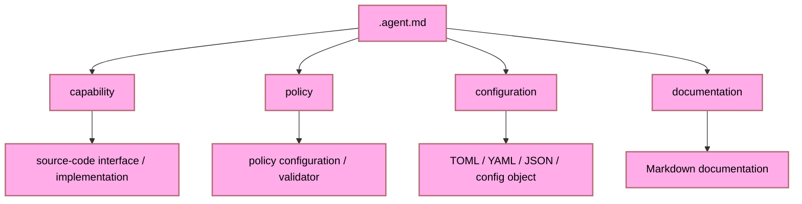

No executable agent shall require a Markdown persona in order to exist.

If LLM-backed reasoning is eventually used, the LLM component must be an implementation detail behind a typed software interface.

Example conceptual design:

```python
class Operator(Protocol):
    def execute(self, context: OperatorContext) -> OperatorResult:
        ...
```

A language-model implementation might then satisfy that interface:

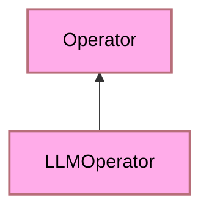

but:

```text
LLM prompt != Agent architecture
```

---

# META-PROMPT 3 — DEFINE THE CROSS-LANGUAGE OBJECT/OPERATOR MODEL

Design the system around language-neutral contracts before implementing language-specific details.

At minimum define conceptual contracts for:

```text
Operator
Agent
Context
Input
Output
Event
Signal
Decision
OrderIntent
Position
Portfolio
RiskState
MarketState
MarketRegime
Instrument
Observation
FeatureVector
Confidence
Uncertainty
Provenance
AuditRecord
```

Every operator should conceptually support:

```text
identity
version
inputs
outputs
configuration
validation
execution
observability
failure semantics
provenance
```

Prefer explicit input/output objects over arbitrary dictionaries.

Avoid global mutable state.

Avoid hidden side effects.

Separate:

```text
calculation
decision
execution
persistence
communication
visualization
```

An operator should do one primary thing well.

Composition should provide complexity.

---

# META-PROMPT 4 — MULTI-LANGUAGE RESPONSIBILITY BOUNDARIES

Do NOT use four languages merely because four languages are permitted.

Each language must have a defensible role.

Use this default allocation unless repository evidence strongly supports another design.

## Python

Primary role:

* research;
* orchestration;
* quantitative experimentation;
* data science;
* feature engineering;
* statistical analysis;
* ML inference/training integration;
* backtesting;
* notebooks where justified;
* rapid strategy development.

Potential modules:

```text
research/
strategies/
features/
analytics/
backtesting/
orchestration/
```

## C++

Primary role:

* computational kernels;
* latency-sensitive numerical operations;
* high-throughput simulation;
* pricing engines;
* optimization;
* performance-critical market-data processing.

Potential modules:

```text
cpp/quant/
cpp/pricing/
cpp/simulation/
cpp/numerics/
```

## Rust

Primary role:

* memory-safe systems components;
* deterministic engines;
* concurrency-sensitive services;
* execution simulation;
* risk-critical infrastructure;
* high-integrity event processing.

Potential modules:

```text
rust/risk/
rust/execution/
rust/events/
rust/core/
```

## Go

Primary role:

* network services;
* APIs;
* process orchestration;
* distributed workers;
* telemetry infrastructure;
* service discovery;
* operational tooling.

Potential modules:

```text
go/api/
go/services/
go/telemetry/
go/orchestrator/
```

If functionality has no legitimate reason to cross a language boundary, keep it within one language.

Minimize FFI.

Prefer process/service boundaries where operationally sensible.

When FFI is required, formally document:

```text
ABI
ownership
lifetimes
error semantics
serialization
thread safety
version compatibility
```

---

# META-PROMPT 5 — TARGET DOMAIN ARCHITECTURE

The new repository concerns a hybrid system spanning four related domains:

```text
EARTH
Portfolio / Income / Allocation

AIR
Hedging / Risk Control

FIRE
Volatility / Options / Tactical Alpha

WATER
Macroeconomics / Cross-Market Regime Analysis
```

These are conceptual classifications only.

Do NOT allow thematic terminology to replace precise financial terminology in source-code interfaces.

For example:

GOOD:

```text
MarketRegimeOperator
PortfolioRiskOperator
VolatilitySurfaceOperator
HedgeOptimizationOperator
```

AVOID:

```text
FireAgent
WaterAgent
MagicEarthPredictor
```

The thematic names may exist in UI, documentation, visualization, or project branding.

The source architecture should remain technically explicit.

---

# META-PROMPT 6 — DATA PIPELINE

Design market information as a provenance-preserving pipeline.

Conceptual stages:

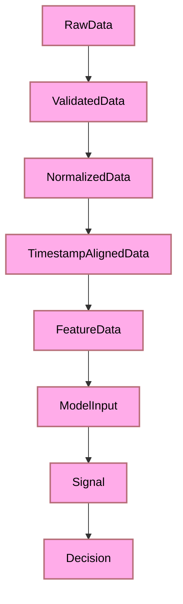

Potential data categories include:

* OHLCV;
* trades;
* quotes;
* order-book data;
* options chains;
* implied volatility;
* volatility surfaces;
* interest rates;
* yield curves;
* currencies;
* commodities;
* futures;
* macroeconomic releases;
* corporate events;
* fundamentals;
* market indices;
* news;
* technology news;
* geopolitical information;
* economic information.

Every datum used by a decision should be capable of carrying provenance including:

```text
source
source_timestamp
ingestion_timestamp
normalization_version
transformation_version
quality status
```

Never silently mix incompatible timestamps, frequencies, currencies, units, or adjusted/unadjusted price series.

---

# META-PROMPT 7 — CANDLESTICKS ARE FEATURES, NOT ORACLES

Implement candlestick formations as measurable features.

Do not encode assumptions that candlestick formations necessarily predict future returns.

Represent patterns using explicit feature operators.

Examples:

```text
DojiFeature
HammerFeature
EngulfingFeature
MorningStarFeature
EveningStarFeature
BodyRatioFeature
UpperShadowRatioFeature
LowerShadowRatioFeature
GapFeature
RangeExpansionFeature
```

Evaluate their incremental information relative to:

* volatility;
* volume;
* momentum;
* trend;
* liquidity;
* regime;
* macroeconomic state;
* event/news context.

The system must permit the empirical conclusion that a particular candlestick feature provides:

```text
positive information
negative information
no measurable information
regime-dependent information
```

Do not force confirmation of the original hypothesis.

---

# META-PROMPT 8 — MARKET REGIME ENGINE

Create a first-class market-regime abstraction.

A regime may consider:

```text
trend
volatility
liquidity
correlation
dispersion
rates
inflation
credit conditions
commodity behavior
currency behavior
macro releases
news state
cross-asset stress
```

Do not represent regime classification as a single unquestioned label.

Preferred conceptual output:

```text
MarketRegimeState {
    probabilities,
    confidence,
    uncertainty,
    contributing_features,
    timestamp,
    model_version
}
```

Allow multiple independent regime estimators.

Create disagreement metrics between them.

Do not silently collapse disagreement.

Model disagreement itself as information.

---

# META-PROMPT 9 — RISK BEFORE PROFIT

Separate:

```text
Prediction
Signal
Decision
Risk Approval
Execution
```

A profitable-looking signal must NOT automatically produce an order.

Conceptual flow:

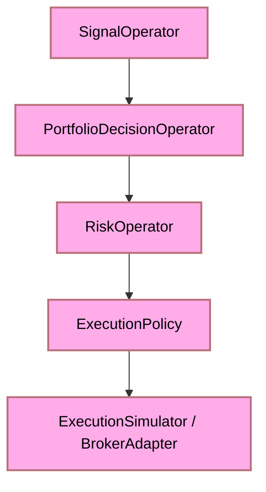

Risk operators should be capable of rejecting, modifying, sizing, delaying, or hedging a proposed action.

Potential risk dimensions:

* market risk;
* volatility risk;
* liquidity risk;
* concentration risk;
* correlation risk;
* leverage;
* drawdown;
* tail risk;
* counterparty risk;
* model risk;
* execution risk;
* stale-data risk;
* regime uncertainty.

---

# META-PROMPT 10 — PAPER/SIMULATION FIRST

Default every execution component to:

```text
NO LIVE TRADING
```

until an explicit future integration deliberately enables otherwise.

Architect separate interfaces:

```text
ExecutionSimulator
PaperBroker
LiveBrokerAdapter
```

The initial repository should prioritize:

```text
historical replay
backtesting
walk-forward testing
Monte Carlo analysis
scenario testing
stress testing
paper execution
```

Never silently route simulated decisions into live markets.

Any future live execution implementation must require explicit configuration and visible environment separation.

---

# META-PROMPT 11 — AVOID LOOKAHEAD AND DATA LEAKAGE

Treat temporal correctness as a hard requirement.

Every strategy must demonstrate that at time `t` it only uses information that would actually have been available at `t`.

Detect and prevent:

* future-data leakage;
* revised macroeconomic data leakage;
* survivorship bias;
* delisted-asset omission;
* improperly adjusted prices;
* future news leakage;
* train/test contamination;
* normalization using future statistics;
* improperly aligned market sessions.

Create explicit tests for temporal leakage.

A backtest that accidentally sees the future is a failed test regardless of profitability.

---

# META-PROMPT 12 — AGENTS AS COMPOSITION

Implement complex agents by composing smaller operators.

Example:

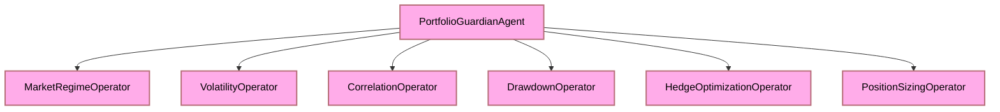

Another example:

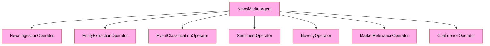

Do not create giant god-objects called `TradingAgent` that ingest every possible datum and make every possible decision.

Prefer:

```text
small operators
+
typed composition
+
explicit orchestration
```

---

# META-PROMPT 13 — EVENT MODEL

Prefer an explicit event architecture where beneficial.

Potential event types:

```text
MarketDataReceived
FeatureCalculated
RegimeChanged
SignalGenerated
RiskLimitApproached
RiskLimitExceeded
PortfolioRebalanced
HedgeRequested
OrderIntentCreated
ExecutionSimulated
ModelDriftDetected
DataQualityFailure
OperatorFailure
```

Events should contain:

```text
event_id
event_type
timestamp
producer
schema_version
correlation_id
payload
provenance
```

Do not rely upon unstructured text messages between core components.

---

# META-PROMPT 14 — CONFIGURATION

Move changeable parameters out of source code where appropriate.

Prefer strongly validated configuration.

Use configuration formats such as:

```text
TOML
YAML
JSON
```

only for declarative information.

Configuration may specify:

* enabled operators;
* model parameters;
* risk limits;
* data sources;
* instruments;
* simulation periods;
* portfolio constraints;
* logging;
* telemetry;
* service endpoints.

Configuration must NOT become another programming language.

Do not encode arbitrary executable logic in configuration.

---

# META-PROMPT 15 — SCHEMAS AND INTEROPERABILITY

Because this is a polyglot repository, establish shared schemas.

Create a language-neutral schema layer where justified.

Possible technologies include:

```text
Protocol Buffers
JSON Schema
Apache Arrow schemas
FlatBuffers
Cap'n Proto
```

Select technologies based upon actual requirements rather than novelty.

Generate bindings where appropriate rather than manually duplicating structures across:

```text
Python
C++
Rust
Go
```

Avoid four subtly incompatible definitions of:

```text
Order
Position
Instrument
Signal
Portfolio
RiskState
```

---

# META-PROMPT 16 — NUMERICAL CORRECTNESS

Financial mathematics must be treated as engineering mathematics.

Define numerical conventions explicitly:

* floating-point precision;
* decimal versus binary floating point;
* currency precision;
* rounding;
* basis-point representation;
* percentage representation;
* day-count convention;
* compounding;
* calendars;
* trading sessions;
* time zones;
* missing values;
* NaN/Inf handling.

Never compare floating-point values for exact equality where tolerance is required.

For algorithms with known analytical solutions, test numerical implementations against them.

---

# META-PROMPT 17 — TEST TAXONOMY

Create distinct test layers.

```text
tests/
    unit/
    property/
    integration/
    regression/
    numerical/
    temporal/
    simulation/
    strategy/
    risk/
    interoperability/
    performance/
```

The exact physical layout may vary by language ecosystem.

Test:

### Unit correctness

Does the individual operator perform its defined calculation?

### Property correctness

Are mathematical invariants preserved?

### Numerical correctness

Are calculations accurate within justified tolerances?

### Temporal correctness

Does the implementation avoid future information?

### Integration correctness

Do operators communicate correctly?

### Cross-language correctness

Do Python/C++/Rust/Go representations agree?

### Strategy correctness

Does the strategy behave according to specification?

### Risk correctness

Can the risk layer prevent prohibited behavior?

### Simulation correctness

Does historical replay behave deterministically where expected?

### Regression correctness

Do known historical cases remain stable after refactoring?

### Performance

Are computationally critical paths sufficiently efficient?

---

# META-PROMPT 18 — SHADOW QA / TRUSTED CI GATE

Create a local quality pipeline that can run before ordinary repository CI.

Conceptual sequence:

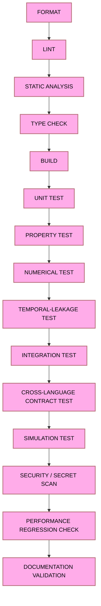

Record results in machine-readable form.

The dashboard should consume these outputs rather than scrape arbitrary console text wherever possible.

Every gate should have:

```text
gate_id
status
duration
failure_reason
commit
timestamp
tool_version
artifact links
```

---

# META-PROMPT 19 — DASHBOARD ARCHITECTURE

Design dashboards as consumers of structured telemetry.

Do not couple dashboard code to individual tests.

Model concepts such as:

```text
Project
Sprint
Run
Pipeline
Gate
Experiment
Strategy
Backtest
Simulation
Metric
Artifact
Failure
Regression
```

Support:

```text
one project
many projects

one sprint
many sprints

one experiment
many experiment runs

one strategy
many parameterizations
```

Do not make the dashboard specific to the first trading strategy.

It should eventually support other engineering/research projects with minimal domain-specific adaptation.

---

# META-PROMPT 20 — METRICS MUST ANSWER QUESTIONS

Before adding a metric, state what decision that metric supports.

Reject vanity metrics.

Useful financial/research metrics may include:

```text
annualized return
volatility
Sharpe ratio
Sortino ratio
maximum drawdown
Calmar ratio
hit rate
profit factor
turnover
transaction cost
slippage
tail loss
VaR
CVaR / expected shortfall
beta
correlation
tracking error
hedge effectiveness
exposure
leverage
regime-conditioned performance
```

But do not assume that every metric belongs in every experiment.

For engineering quality, measure things such as:

```text
test pass rate
failure recurrence
regression count
pipeline duration
flaky-test rate
defect escape rate
simulation reproducibility
coverage where meaningful
```

Never optimize a proxy after it ceases to represent the underlying objective.

---

# META-PROMPT 21 — OBSERVABILITY AND PROVENANCE

Every meaningful decision should be reconstructable.

For a decision, the system should eventually be capable of answering:

```text
Which data were available?

Which operator versions ran?

Which models ran?

What features were produced?

What regime was inferred?

What signals were generated?

What uncertainty was reported?

What risk rules were evaluated?

What decision was accepted/rejected?

Why?

Which code/configuration version produced the result?
```

Use structured logs.

Prefer correlation IDs and run IDs.

Avoid log messages that cannot be associated with an experiment, simulation, or execution context.

---

# META-PROMPT 22 — FAILURE SEMANTICS

Do not hide failures.

Define failure classes such as:

```text
DataFailure
ValidationFailure
NumericalFailure
ModelFailure
RiskFailure
ExecutionFailure
ConfigurationFailure
DependencyFailure
TimeoutFailure
InteroperabilityFailure
InvariantViolation
```

Differentiate:

```text
recoverable
retryable
degraded
fatal
```

Never convert a serious failure into a neutral empty result unless the contract explicitly defines that behavior.

---

# META-PROMPT 23 — DIRECTORY DESIGN

After examining the old repository, propose a target structure resembling this conceptual model:

```text
/
├── apps/
├── config/
├── docs/
├── schemas/
├── data/
│   ├── definitions/
│   └── samples/
├── python/
│   ├── src/
│   ├── tests/
│   └── research/
├── cpp/
│   ├── include/
│   ├── src/
│   └── tests/
├── rust/
│   ├── crates/
│   └── tests/
├── go/
│   ├── cmd/
│   ├── internal/
│   └── pkg/
├── strategies/
├── models/
├── simulations/
├── benchmarks/
├── dashboards/
├── tools/
├── scripts/
├── tests/
│   ├── interoperability/
│   └── end_to_end/
├── ci/
└── artifacts/
```

This is a starting hypothesis.

Do NOT force this structure if repository evidence suggests a cleaner design.

Explain deviations.

---

# META-PROMPT 24 — BUILD SYSTEMS

Respect native tooling.

Likely tooling may include:

```text
Python:
pyproject.toml

C++:
CMake

Rust:
Cargo

Go:
go.mod
```

Provide repository-level orchestration around these native build systems rather than replacing them.

The root build/developer interface should offer predictable commands such as:

```text
bootstrap
configure
build
test
lint
check
simulate
benchmark
qa
dashboard
clean
```

Implementation may use an appropriate cross-platform task runner or scripts.

Do not create a fragile shell-script maze.

---

# META-PROMPT 25 — DEPENDENCY DISCIPLINE

Before introducing a dependency:

1. Determine whether the standard library already solves the problem.
2. Determine whether an existing repository dependency already solves it.
3. Evaluate maintenance status.
4. Evaluate license.
5. Evaluate security implications.
6. Evaluate binary/runtime cost.
7. Evaluate cross-platform implications.
8. Explain why it is needed.

Do not install libraries merely to save a few lines of straightforward code.

Conversely, do not reinvent complex, mature infrastructure without justification.

---

# META-PROMPT 26 — SECURITY AND SECRET MANAGEMENT

Search for:

```text
API keys
broker tokens
database passwords
cloud credentials
private keys
webhook secrets
hard-coded credentials
```

Never migrate secrets into new files.

Use environment/configuration indirection.

Ensure examples contain placeholders only.

Provide `.env.example` if appropriate.

Ensure `.gitignore` prevents local secret files from being committed.

Financial account credentials must never appear in logs.

---

# META-PROMPT 27 — DOCUMENTATION MODEL

Documentation should explain the software.

Documentation should not substitute for software.

Maintain documents for:

```text
architecture
operator model
data model
risk model
testing model
build instructions
simulation methodology
language boundaries
interoperability
decision provenance
repository migration
```

Where appropriate every major subsystem should explain:

```text
WHAT
WHY
HOW
INPUTS
ARGS
THROWS
EXCEPTIONS
RETURNS
OUTPUTS
INVARIANTS
FAILURE MODES
TESTING
PERFORMANCE CHARACTERISTICS
SPACE AND TIME ANALYSIS (BIG O FOR BOTH)
```

---

# META-PROMPT 28 — REFACTORING RULE

Before editing an existing implementation ask:

```text
Is the code incorrect?

Is it insecure?

Is it incompatible with the new architecture?

Is it duplicated?

Is it unmaintainable?

Is it preventing required functionality?

Is there measurable technical benefit to changing it?
```

If all answers are effectively NO:

```text
DO NOT REWRITE IT.
```

Prefer the smallest justified modification.

Do not perform stylistic churn disguised as architectural improvement.

---

# META-PROMPT 29 — MIGRATION EXECUTION

Execute restructuring incrementally.

For each migration unit:

```text
1. State current component.
2. State target component.
3. Identify dependencies.
4. Create/modify target interfaces.
5. Migrate implementation.
6. Update callers.
7. Add/update tests.
8. Run relevant quality gates.
9. Verify behavior.
10. Remove obsolete implementation only after replacement is proven.
```

Avoid deleting the old implementation before its replacement passes tests.

Keep commits logically separable where possible.

---

# META-PROMPT 30 — DO NOT OVER-ENGINEER

The intended architecture may eventually become large.

The current implementation does NOT need to implement every conceivable financial instrument or strategy.

Prioritize foundational abstractions supporting extension.

Start with a narrow vertical slice such as:

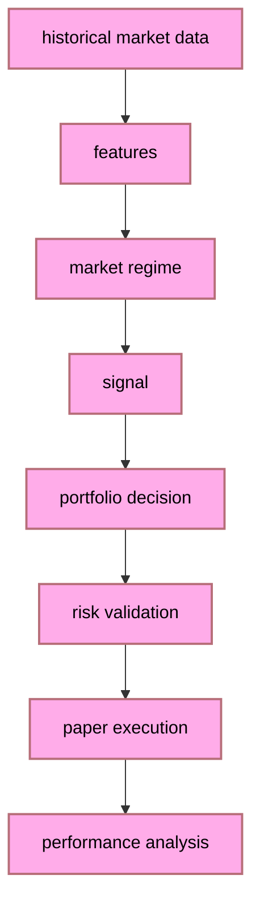

Prove the architecture with one coherent path.

Then expand.

Do not build twenty empty abstractions merely because they might someday be useful.

---

# META-PROMPT 31 — FIRST DELIVERABLE

Before performing extensive source modifications, produce:

## A. Existing Repository Inventory

What currently exists?

## B. Reusable Components

What can remain?

## C. X Voice X-Specific Components

What must disappear or be generalized?

## D. Agent Conversion Table

For every `.agent.md` or equivalent:

```text
OLD AGENT
OLD RESPONSIBILITY
NEW OBJECT/OPERATOR
TARGET LANGUAGE
TARGET MODULE
CONFIGURATION
POLICIES
TESTS REQUIRED
```

## E. Proposed Architecture

Show component boundaries and dependency direction.

## F. Proposed Repository Tree

Show the actual proposed structure.

## G. Language Responsibility Matrix

Explain precisely why Python, C++, Rust, and Go are each being used.

## H. Migration Sequence

Provide the safest order of operations.

## I. Risk Register

Identify likely architectural, numerical, financial-modeling, interoperability, and migration risks.

## J. Questions / Assumptions

Do not block progress unnecessarily.

Where information is missing, make conservative assumptions, document them, and continue unless the ambiguity would make implementation destructive or irreversible.

---

# META-PROMPT 32 — IMPLEMENTATION AUTHORIZATION

After the architecture and migration map are internally coherent, begin implementation incrementally.

The overriding constraints remain:

```text
NO BLIND REWRITE.

NO .agent.md EXECUTABLE AGENTS.

AGENTS ARE OBJECTS/OPERATORS.

TYPED CONTRACTS OVER PROMPT MAGIC.

COMPOSITION OVER GOD OBJECTS.

RISK BEFORE EXECUTION.

SIMULATION BEFORE LIVE TRADING.

PROVENANCE OVER OPAQUE DECISIONS.

EMPIRICAL VALIDATION OVER ASSUMED PREDICTIVE POWER.

CORRECTNESS BEFORE PERFORMANCE.

PERFORMANCE BEFORE PREMATURE MICRO-OPTIMIZATION.

REUSE CORRECT CODE.

JUSTIFY CHANGES.

TEST EVERYTHING THAT CAN FAIL.
```

At the end of each substantial migration stage, report:

```text
CHANGED
PRESERVED
REMOVED
NEW
TESTED
FAILED
DEFERRED
NEXT
```

Do not declare the repository migrated merely because files have been renamed.

Migration is complete only when the architecture, implementation, tests, documentation, build system, and repository semantics consistently represent the new trading-agent platform.

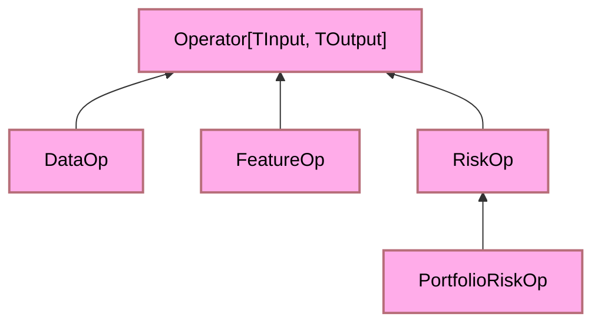

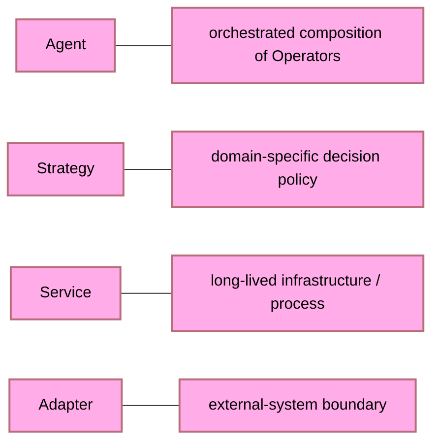

---

## Changelog Table

Track all substantive changes across prompt sequences in the table below. Every row must be justified.

| # | Date (UTC) | Prompt Sequence | File / Artifact | Change Type | Summary              | Justification                      | Author / Agent |
| - | ---------- | --------------- | --------------- | ----------- | -------------------- | ---------------------------------- | -------------- |
| 1 | —         | —              | —              | —          | Initial template row | Placeholder until first real entry | —             |

> **Change Types:** `ADDED` · `MODIFIED` · `DELETED` · `REFACTORED` · `INVESTIGATED` · `PLANNED` · `AMENDED` · `DEFERRED`

---

## References

| ID  | Source                                                                                                                                                 | URL / Path                                                                                                | Notes                                                                                            |
| --- | ------------------------------------------------------------------------------------------------------------------------------------------------------ | --------------------------------------------------------------------------------------------------------- | ------------------------------------------------------------------------------------------------ |
| R1  | Alpaca Markets API Docs                                                                                                                                | [https://docs.alpaca.markets](https://docs.alpaca.markets)                                                 | Primary broker adapter reference                                                                 |
| R2  | Alpaca Trade API Python SDK                                                                                                                            | [https://github.com/alpacahq/alpaca-trade-api-python](https://github.com/alpacahq/alpaca-trade-api-python) | SDK used by adapters                                                                             |
| R3  | prompt_patterns.md                                                                                                                                     | `./prompt_patterns.md`                                                                                  | This file — canonical prompt engineering spec                                                   |
| R4  | Markowitz, H. (1952). Portfolio Selection.*Journal of Finance*, 7(1), 77–91.                                                                        | https://doi.org/10.1111/j.1540-6261.1952.tb01525.x                                                        | Foundational mean-variance optimisation; basis for §5.5`PortfolioOptimizationOperator`.       |
| R5  | Kelly, J. L. (1956). A New Interpretation of Information Rate.*Bell System Technical Journal*, 35(4), 917–926.                                      | https://doi.org/10.1002/j.1538-7305.1956.tb03809.x                                                        | Kelly criterion derivation; basis for §5.2`PositionSizingOperator`.                           |
| R6  | Sharpe, W. F. (1966). Mutual Fund Performance.*Journal of Business*, 39(1), 119–138.                                                                | https://doi.org/10.1086/294846                                                                            | Reward-to-variability ratio (Sharpe ratio); basis for §5.3 risk-adjusted performance metrics.   |
| R7  | Sortino, F. A., & van der Meer, R. (1991). Downside Risk.*Journal of Portfolio Management*, 17(4), 27–31.                                           | https://doi.org/10.3905/jpm.1991.409343                                                                   | Sortino ratio and downside deviation; basis for §5.3`PerformanceAnalysisOperator`.            |
| R8  | Rockafellar, R. T., & Uryasev, S. (2000). Optimization of Conditional Value-at-Risk.*Journal of Risk*, 2(3), 21–41.                                 | https://doi.org/10.21314/JOR.2000.038                                                                     | CVaR LP formulation; basis for §5.6`RiskOperator` CVaR constraint.                            |
| R9  | Hamilton, J. D. (1989). A New Approach to the Economic Analysis of Nonstationary Time Series and the Business Cycle.*Econometrica*, 57(2), 357–384. | https://doi.org/10.2307/1912559                                                                           | Hidden Markov regime-switching model; basis for §5.4`MarketRegimeOperator` transition matrix. |
| R10 | Ederington, L. H. (1979). The Hedging Performance of the New Futures Markets.*Journal of Finance*, 34(1), 157–170.                                  | https://doi.org/10.1111/j.1540-6261.1979.tb02077.x                                                        | Minimum-variance hedge ratio derivation; basis for §5.7`HedgeOptimizationOperator`.           |
| R11 | Pardo, R. (2008).*The Evaluation and Optimization of Trading Strategies* (2nd ed.). Wiley.                                                           | ISBN 978-0-470-12801-5                                                                                    | Walk-forward validation methodology; basis for META-PROMPT 10 simulation-first discipline.       |
| R12 | Lopez de Prado, M. (2018).*Advances in Financial Machine Learning*. Wiley.                                                                           | ISBN 978-1-119-48208-6                                                                                    | Temporal leakage / purging / embargo methodology; basis for §5.8 and META-PROMPT 11.            |
| R13 | Ben-Tal, A., & Nemirovski, A. (1998). Robust Convex Optimization.*Mathematics of Operations Research*, 23(4), 769–805.                              | https://doi.org/10.1287/moor.23.4.769                                                                     | Robust portfolio optimisation ellipsoidal uncertainty; basis for §5.5 robust extension.         |
| R14 | Shannon, C. E. (1948). A Mathematical Theory of Communication.*Bell System Technical Journal*, 27(3), 379–423.                                      | https://doi.org/10.1002/j.1538-7305.1948.tb01338.x                                                        | Information entropy; basis for regime uncertainty quantification$H_t$ in §5.4.                |
| R15 | Young, T. W. (1991). Calmar Ratio: A Smoother Tool.*Futures Magazine*, 20(1).                                                                        | —                                                                                                        | Calmar ratio definition; basis for §5.3 drawdown-adjusted performance metric.                   |

---

## End-of-Sequence Audit Log Requirement

> **MANDATORY — applies to every prompt sequence without exception.**

At the **end of every prompt sequence** (i.e., when the agent considers the current task unit complete), the agent **MUST** generate a dedicated Markdown audit log file named with the following convention:

```
audit/<ISO-8601-date>_<sequence-slug>.md
```

**Example:** `audit/2025-07-14_refactor-operator-pipeline.md`

### Required Sections in Each Audit Log File

```markdown
# Audit Log — <Sequence Slug>

**Date (UTC):** YYYY-MM-DDTHH:MM:SSZ  
**Sequence ID:** <slug>  
**Triggered By:** <prompt summary, one sentence>

---

## Investigated
<!-- Files, modules, concepts, or decisions that were read, analysed, or researched but not changed. -->

## Planned
<!-- Designs, architectures, or approaches that were outlined but not yet implemented. -->

## Changed
<!-- Files or artifacts that were directly modified. List file path + reason. -->

## Modified
<!-- In-place edits to existing content. Diff-level summary per file. -->

## Amended
<!-- Corrections to prior decisions, documentation, or logic. State what was wrong and why. -->

## Deleted
<!-- Files, functions, sections, or data removed. Justify each deletion explicitly. -->

## Added
<!-- Net-new files, functions, sections, or data. -->

## Deferred
<!-- Items identified but explicitly not acted on in this sequence. State reason. -->

## Justification Summary
<!-- One paragraph explaining why the aggregate set of changes is correct, necessary, and safe. -->

## References
<!-- IDs from the global References table or ad-hoc URIs used during this sequence. -->
```

### Rules

1. **Every entry must be justified.** A change without a justification is invalid and must be flagged `UNJUSTIFIED`.
2. The audit file is **append-only after creation** — do not overwrite a prior audit file; create a new one per sequence. In fact, create a new audit file. Safer. Save into AUDIT_LOGS/ at parent root level.
3. If a sequence produced **no changes**, still create the file and populate `Investigated` and `Justification Summary` explaining why no changes were warranted.
4. The audit file **must be committed** alongside any code or documentation changes it describes.
5. The audit log is itself subject to changelog tracking — add an `ADDED` row to the [Changelog Table](#changelog-table) for every new audit file.
