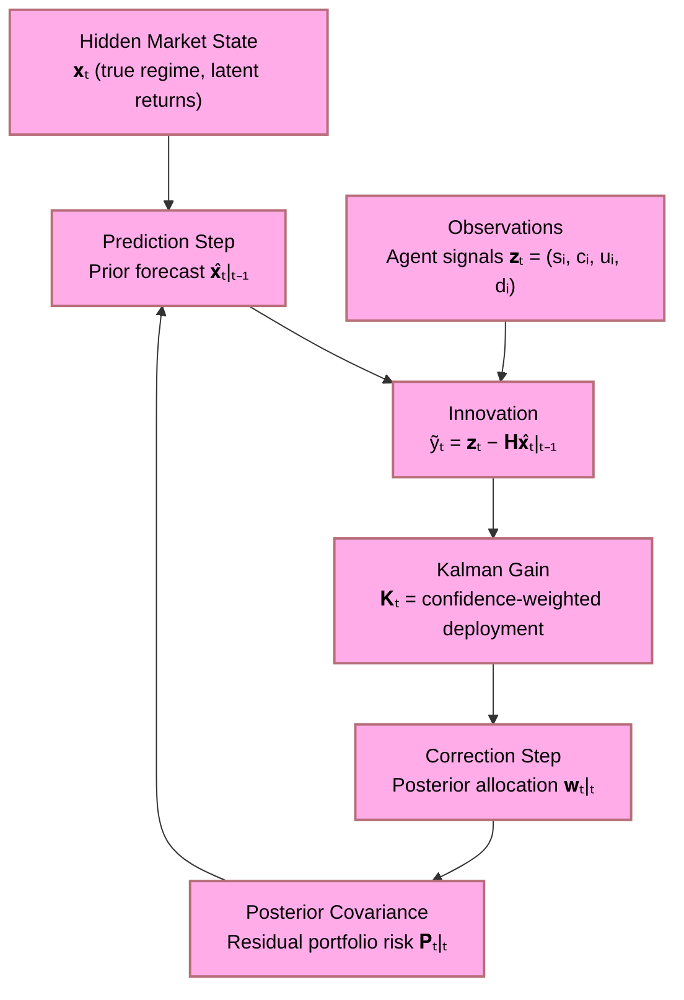
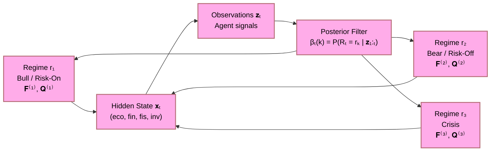
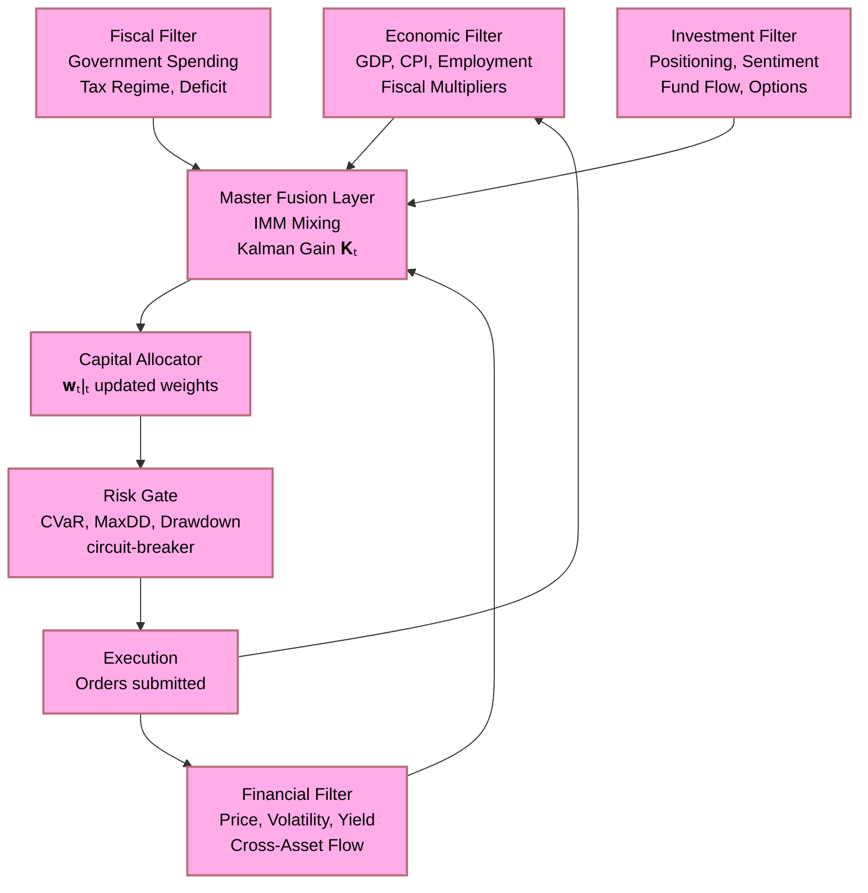
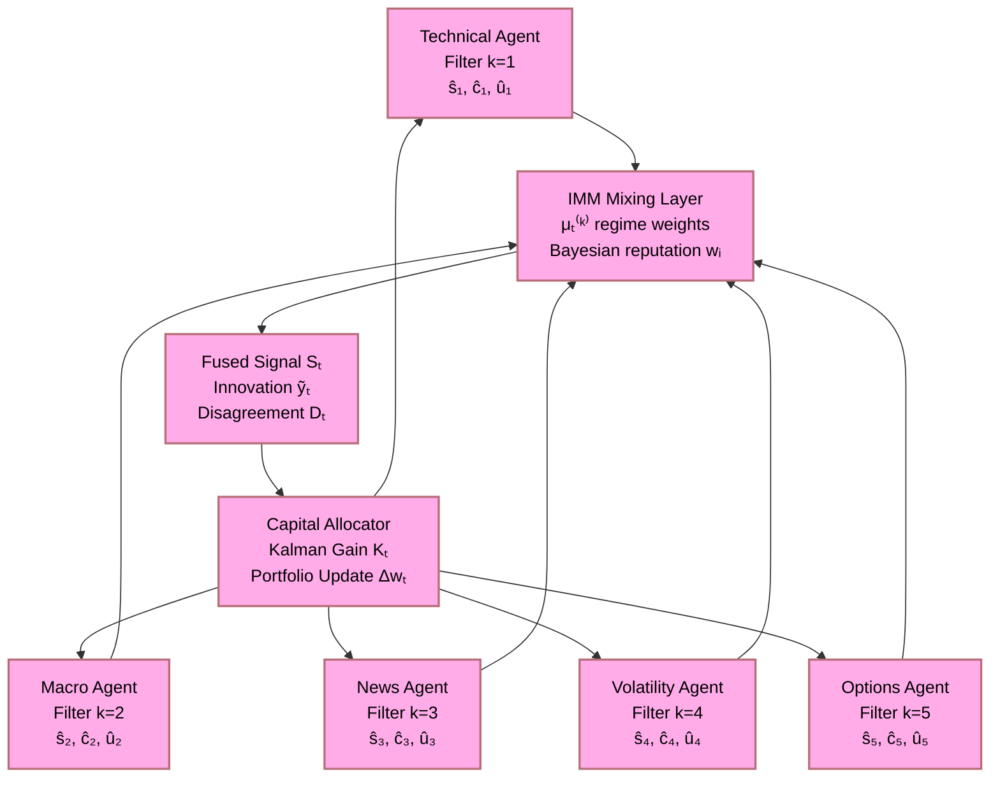
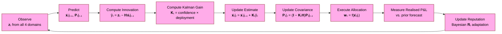

# Finite Investment Architecture as Economic, Financial, Fiscal, and Investment Kalman Filter

## Table of Contents

- [Finite Investment Architecture as Economic, Financial, Fiscal, and Investment Kalman Filter](#finite-investment-architecture-as-economic-financial-fiscal-and-investment-kalman-filter)
  - [Table of Contents](#table-of-contents)
  - [Abstract](#abstract)
  - [Keywords](#keywords)
  - [Executive Summary](#executive-summary)
  - [1. The Kalman Filter as an Investment Metaphor](#1-the-kalman-filter-as-an-investment-metaphor)
    - [1.1 From State Estimation to Capital Allocation](#11-from-state-estimation-to-capital-allocation)
    - [1.2 The Prediction–Correction Duality](#12-the-predictioncorrection-duality)
    - [1.3 Why Finite Capital Forces Filter Discipline](#13-why-finite-capital-forces-filter-discipline)
  - [2. State-Space Representation of the Investment System](#2-state-space-representation-of-the-investment-system)
    - [2.1 The Hidden Economic State](#21-the-hidden-economic-state)
    - [2.2 The Observation Model](#22-the-observation-model)
    - [2.3 The Transition Model](#23-the-transition-model)
  - [3. The Four-Domain Filter Architecture](#3-the-four-domain-filter-architecture)
    - [3.1 Economic Filter Layer](#31-economic-filter-layer)
    - [3.2 Financial Filter Layer](#32-financial-filter-layer)
    - [3.3 Fiscal Filter Layer](#33-fiscal-filter-layer)
    - [3.4 Investment Filter Layer](#34-investment-filter-layer)
  - [4. Kalman Gain as Capital Deployment Weight](#4-kalman-gain-as-capital-deployment-weight)
    - [4.1 Classical Kalman Gain](#41-classical-kalman-gain)
    - [4.2 Investment Analogue: Confidence-Weighted Allocation](#42-investment-analogue-confidence-weighted-allocation)
    - [4.3 The Innovation Signal](#43-the-innovation-signal)
  - [5. Covariance as Risk: The Uncertainty Budget](#5-covariance-as-risk-the-uncertainty-budget)
    - [5.1 Prediction Covariance and Prior Risk](#51-prediction-covariance-and-prior-risk)
    - [5.2 Update Covariance and Posterior Risk Reduction](#52-update-covariance-and-posterior-risk-reduction)
    - [5.3 Observability and Controllability Conditions](#53-observability-and-controllability-conditions)
  - [6. The Composite Objective as Filter Optimality Criterion](#6-the-composite-objective-as-filter-optimality-criterion)
    - [6.1 Minimum Mean-Squared Error and Risk-Adjusted Return](#61-minimum-mean-squared-error-and-risk-adjusted-return)
    - [6.2 The Information Filter Dual](#62-the-information-filter-dual)
  - [7. Multi-Agent Ensemble as Parallel Kalman Banks](#7-multi-agent-ensemble-as-parallel-kalman-banks)
    - [7.1 The Interacting Multiple Model Framework](#71-the-interacting-multiple-model-framework)
    - [7.2 Bayesian Mixing as Agent Reputation Update](#72-bayesian-mixing-as-agent-reputation-update)
    - [7.3 Disagreement as Innovation Covariance Inflation](#73-disagreement-as-innovation-covariance-inflation)
  - [8. The Mathematical Conjecture: Optimal Filtered Investment](#8-the-mathematical-conjecture-optimal-filtered-investment)
  - [References](#references)
  - [Changelog](#changelog)

---

## Abstract

This document develops the formal conjecture that a finite-capital, multi-domain investment architecture is structurally isomorphic to a multi-rate Kalman filter bank operating across four coupled observation channels — economic, financial, fiscal, and investment — each contributing partial, noisy measurements of an unobservable true market state. The classical Kalman prediction–correction cycle maps precisely onto the capital allocation cycle: the prediction step corresponds to the prior risk model and expected return forecast; the correction step corresponds to the arrival of new market evidence and the consequent revision of portfolio weights; and the Kalman gain corresponds to the confidence-weighted capital deployment fraction. Under this framing, the finite capital constraint is not a handicap but a precision condition: it forces the filter to operate near its minimum-variance unbiased estimator (MVUE) regime, penalising over-confident deployment exactly as a poorly tuned Kalman gain destabilises state estimation. The result is a formal justification for the composite risk-adjusted objective $J$, for Bayesian agent reputation updating, and for treating agent disagreement as innovation covariance inflation rather than a tie-breaking signal.

---

## Keywords

Kalman filter; state-space model; prediction-correction cycle; innovation signal; Kalman gain; covariance propagation; minimum mean-squared error; multi-agent ensemble; Interacting Multiple Model; Bayesian mixing; innovation covariance inflation; economic filter; financial filter; fiscal filter; investment filter; finite capital constraint; risk-adjusted objective; uncertainty quantification; portfolio optimisation; Alpaca hackathon

---

## Executive Summary

The intellectual core of this paper is a structural analogy — one strong enough to be formalised as a mathematical conjecture — between two apparently distinct domains:

> **Classical filtering theory** seeks the optimal recursive estimate of a hidden state given noisy, partial observations, minimising posterior mean-squared error at each step.

> **Finite-capital investment** seeks the optimal recursive allocation of scarce resources given noisy, partial market signals, minimising posterior regret (drawdown, volatility, concentration) at each step.

The analogy is not metaphorical. It is structural:

| Kalman Filter Concept | Investment Architecture Concept |
|:---|:---|
| Hidden state $\mathbf{x}_t$ | True market regime and latent return process |
| Observation $\mathbf{z}_t$ | Agent signals $(s_i, c_i, u_i, d_i)$ from all four domains |
| Transition matrix $\mathbf{F}$ | Regime-switching dynamics (HMM transition) |
| Observation matrix $\mathbf{H}$ | Signal extraction operator mapping state to observable |
| Process noise covariance $\mathbf{Q}$ | Irreducible market uncertainty (aleatoric) |
| Measurement noise covariance $\mathbf{R}$ | Agent estimation error and calibration doubt |
| Prediction step | Prior risk model and expected return forecast |
| Correction step | Portfolio weight revision upon new evidence |
| Kalman gain $\mathbf{K}_t$ | Confidence-weighted capital deployment fraction |
| Posterior covariance $\mathbf{P}_{t|t}$ | Residual portfolio risk after evidence update |
| Innovation $\tilde{\mathbf{y}}_t$ | Aggregate signal deviation from prior forecast |

The deepest result is:

$$
\boxed{\;\text{Optimal Investment} \;=\; \text{Minimum-Variance Unbiased Estimation of Latent Market State}\;}
$$

and the finite capital constraint is the condition that forces the system into the MVUE regime rather than the over-leveraged, over-confident regime that destroys long-run compounding.

---

## 1. The Kalman Filter as an Investment Metaphor

### 1.1 From State Estimation to Capital Allocation

The Kalman filter solves a deceptively simple problem: given a sequence of noisy observations $\mathbf{z}_1, \mathbf{z}_2, \ldots, \mathbf{z}_t$ of a system whose true state $\mathbf{x}_t$ evolves according to known (but uncertain) dynamics, compute the optimal estimate $\hat{\mathbf{x}}_{t|t}$ of the current state.

The investment problem is isomorphic: given a sequence of noisy market signals $s_1, s_2, \ldots, s_t$ from heterogeneous agents observing a market whose true regime $\mathcal{R}_t$ evolves according to unknown dynamics, compute the optimal capital allocation $\mathbf{w}_{t|t}$ that best exploits the current state estimate.

### 1.2 The Prediction–Correction Duality

The Kalman filter's power lies in its two-step recursion:

**Prediction step** (time update):
$$
\hat{\mathbf{x}}_{t|t-1} = \mathbf{F}\,\hat{\mathbf{x}}_{t-1|t-1}
$$
$$
\mathbf{P}_{t|t-1} = \mathbf{F}\,\mathbf{P}_{t-1|t-1}\,\mathbf{F}^\top + \mathbf{Q}
$$

**Correction step** (measurement update):
$$
\tilde{\mathbf{y}}_t = \mathbf{z}_t - \mathbf{H}\,\hat{\mathbf{x}}_{t|t-1}
$$
$$
\mathbf{K}_t = \mathbf{P}_{t|t-1}\,\mathbf{H}^\top\!\left(\mathbf{H}\,\mathbf{P}_{t|t-1}\,\mathbf{H}^\top + \mathbf{R}\right)^{-1}
$$
$$
\hat{\mathbf{x}}_{t|t} = \hat{\mathbf{x}}_{t|t-1} + \mathbf{K}_t\,\tilde{\mathbf{y}}_t
$$
$$
\mathbf{P}_{t|t} = \left(\mathbf{I} - \mathbf{K}_t\,\mathbf{H}\right)\mathbf{P}_{t|t-1}
$$

The investment analogue is:

| Filter Step | Investment Step |
|:---|:---|
| Prior state forecast $\hat{\mathbf{x}}_{t\vert t-1}$ | Prior expected return and risk model |
| Prior covariance $\mathbf{P}_{t\vert t-1}$ | Pre-signal portfolio variance |
| Innovation $\tilde{\mathbf{y}}_t$ | Aggregate agent signal minus prior forecast |
| Kalman gain $\mathbf{K}_t$ | Capital deployment fraction per unit of innovation |
| Posterior estimate $\hat{\mathbf{x}}_{t\vert t}$ | Updated portfolio weights $\mathbf{w}_{t\vert t}$ |
| Posterior covariance $\mathbf{P}_{t\vert t}$ | Post-signal residual portfolio risk |

### 1.3 Why Finite Capital Forces Filter Discipline

A poorly tuned Kalman filter can diverge in one of two ways:

1. **Over-confident filter** ($\mathbf{R}$ too small): the gain $\mathbf{K}_t$ is too large; the filter over-reacts to measurement noise and oscillates.
2. **Under-confident filter** ($\mathbf{Q}$ too small): the gain $\mathbf{K}_t$ is too small; the filter ignores genuine state changes and lags behind reality.

The investment analogues are:

1. **Over-confident investor**: deploys too much capital per signal; subject to large drawdowns from noise.
2. **Under-confident investor**: deploys too little capital per signal; systematically underperforms.

The **finite capital constraint** — the \$100,000 paper portfolio — is precisely the condition that forces the system to operate in the intermediate, well-calibrated regime. It does so because:

$$
\sum_j x_j \;\leq\; C_{\text{deployable}} \;<\; \infty
$$

This hard bound on total deployment is the investment-domain equivalent of the constraint that the Kalman gain must satisfy:

$$
0 \;\leq\; \mathbf{K}_t \;\leq\; \mathbf{P}_{t|t-1}\,\mathbf{H}^\top\!\left(\mathbf{H}\,\mathbf{P}_{t|t-1}\,\mathbf{H}^\top + \mathbf{R}\right)^{-1}
$$

Both constraints prevent the estimator (investor) from placing infinite weight on any single observation (signal).

---

## 2. State-Space Representation of the Investment System

### 2.1 The Hidden Economic State

Let the hidden state vector $\mathbf{x}_t \in \mathbb{R}^d$ represent the latent economic reality at time $t$. Under the four-domain architecture, this state decomposes as:

$$
\mathbf{x}_t = \begin{pmatrix} \mathbf{x}_t^{(\text{eco})} \\ \mathbf{x}_t^{(\text{fin})} \\ \mathbf{x}_t^{(\text{fis})} \\ \mathbf{x}_t^{(\text{inv})} \end{pmatrix}
$$

where:

| Component | Meaning |
|:---|:---|
| $\mathbf{x}_t^{(\text{eco})}$ | Macro-economic state: growth, inflation, employment, credit |
| $\mathbf{x}_t^{(\text{fin})}$ | Financial state: asset prices, volatility surface, yield curve |
| $\mathbf{x}_t^{(\text{fis})}$ | Fiscal state: government expenditure, tax regime, deficit |
| $\mathbf{x}_t^{(\text{inv})}$ | Investment state: fund flows, positioning, sentiment |

This state is **never directly observable**. What is observed is a noisy, partial projection of it through the measurement matrix $\mathbf{H}$.

### 2.2 The Observation Model

Each specialised agent $i$ produces an observation $z_i \in \mathbb{R}$ that is a linear function of the hidden state plus measurement noise:

$$
z_i = \mathbf{h}_i^\top \mathbf{x}_t + \nu_i, \qquad \nu_i \sim \mathcal{N}(0,\, r_i)
$$

where $\mathbf{h}_i$ is the agent's observation row vector (which components of $\mathbf{x}_t$ it observes) and $r_i = (1 - c_i)/c_i \cdot \sigma_{\text{base}}^2$ is the measurement noise variance, which is **inversely related to the agent's confidence** $c_i \in (0,1]$:

$$
r_i \;=\; \sigma_{\text{base}}^2 \cdot \frac{1 - c_i}{c_i}
$$

This captures the intuition precisely:

- High-confidence agent ($c_i \to 1$): $r_i \to 0$; near-perfect observation.
- Low-confidence agent ($c_i \to 0$): $r_i \to \infty$; pure noise.
- High-doubt agent ($d_i$ large): inflate $r_i$ further by factor $(1 + d_i)$.

The stacked observation vector $\mathbf{z}_t = (z_1, \ldots, z_N)^\top$ gives the system observation equation:

$$
\mathbf{z}_t = \mathbf{H}\,\mathbf{x}_t + \boldsymbol{\nu}_t, \qquad \boldsymbol{\nu}_t \sim \mathcal{N}(\mathbf{0},\, \mathbf{R}_t)
$$

where $\mathbf{R}_t = \mathrm{diag}(r_1, \ldots, r_N)$ is the measurement noise covariance, updated at every time step based on current agent confidences, uncertainties, and doubt levels.

### 2.3 The Transition Model

The hidden state evolves according to a regime-switching linear dynamics:

$$
\mathbf{x}_t = \mathbf{F}^{(k)}\,\mathbf{x}_{t-1} + \mathbf{w}_t^{(k)}, \qquad \mathbf{w}_t^{(k)} \sim \mathcal{N}(\mathbf{0},\, \mathbf{Q}^{(k)})
$$

where $k \in \mathcal{R}$ is the current regime, $\mathbf{F}^{(k)}$ is the regime-$k$ state transition matrix, and $\mathbf{Q}^{(k)}$ is the process noise covariance. The regime $k$ itself is a latent variable drawn from the HMM forward filter (Chapter 13 of the companion proof document):

$$
P(R_t = r_k \mid \mathbf{z}_{1:t}) \;\propto\; p(\mathbf{z}_t \mid R_t = r_k)\,\sum_{j=1}^{K} A_{jk}\,\beta_{t-1}(j)
$$

---

## 3. The Four-Domain Filter Architecture

The full architecture couples four Kalman-type filters, each processing observations from one domain, passing filtered state estimates and residual covariances to a master fusion layer.

### 3.1 Economic Filter Layer

The economic filter processes macro-economic data releases, estimating the latent business-cycle position $x_t^{(\text{eco})}$:

$$
\hat{x}_{t|t-1}^{(\text{eco})} = f^{(\text{eco})}\!\left(\hat{x}_{t-1|t-1}^{(\text{eco})},\, \text{regime}_t\right)
$$

Observations include: GDP growth surprises, CPI releases, unemployment claims, PMI prints, central-bank forward guidance. The measurement noise $r^{(\text{eco})}$ is inflated during data-revision periods (fiscal data is notoriously revised) and deflated when multiple independent agencies confirm the same reading.

**Investment implication**: A strong, consistent economic signal with low measurement noise ($r^{(\text{eco})} \approx 0$) drives a large Kalman gain for the economic channel, increasing the weight on macro-tilted instruments (long equities in expansion, long bonds in contraction).

### 3.2 Financial Filter Layer

The financial filter processes price, volatility, and flow data, estimating the latent financial stress index $x_t^{(\text{fin})}$:

$$
\hat{x}_{t|t-1}^{(\text{fin})} = \mathbf{F}^{(\text{fin})}\,\hat{x}_{t-1|t-1}^{(\text{fin})} + \mathbf{w}_t^{(\text{fin})}
$$

Observations include: rolling Sharpe of the portfolio, VIX term structure, credit spreads, put-call skew, cross-asset correlation. The measurement noise $r^{(\text{fin})}$ is smallest for traded instruments with tight bid-ask spreads and largest for over-the-counter instruments with opaque pricing.

**Investment implication**: A financial filter that detects volatility-regime expansion ($\hat{x}_t^{(\text{fin})} \uparrow$) increases $\mathbf{Q}$ (process noise) in the prediction step, widening the prior covariance $\mathbf{P}_{t|t-1}$ and automatically reducing the Kalman gain, thereby shrinking capital deployment.

### 3.3 Fiscal Filter Layer

The fiscal filter processes government budget, tax, and transfer data, estimating the latent fiscal impulse $x_t^{(\text{fis})}$:

$$
z_t^{(\text{fis})} = h^{(\text{fis})}\,x_t^{(\text{fis})} + \nu_t^{(\text{fis})}
$$

Fiscal data is the most subject to revision and political noise. The measurement noise variance $r^{(\text{fis})}$ is therefore the highest of all four channels, and the fiscal filter must be heavily smoothed (low bandwidth, slow update). This maps onto the investment insight that fiscal signals (infrastructure spending, tax cuts) should inform long-horizon allocations, not intraday positioning.

### 3.4 Investment Filter Layer

The investment filter processes sentiment, flow, and options market data, estimating the latent positioning state $x_t^{(\text{inv})}$:

$$
\tilde{y}_t^{(\text{inv})} = z_t^{(\text{inv})} - h^{(\text{inv})}\,\hat{x}_{t|t-1}^{(\text{inv})}
$$

Observations include: CFTC commitment of traders, options open interest, fund flow data, insider transactions, social sentiment indices. This channel has the highest noise-to-signal ratio but also the highest mean-reversion speed — positioning extremes are powerful contrarian indicators, but only when confirmed by the economic and financial channels.

---

## 4. Kalman Gain as Capital Deployment Weight

### 4.1 Classical Kalman Gain

The Kalman gain $\mathbf{K}_t$ is the optimal weighting matrix that balances trust in the prior estimate against trust in the new observation:

$$
\mathbf{K}_t \;=\; \mathbf{P}_{t|t-1}\,\mathbf{H}^\top\!\underbrace{\left(\mathbf{H}\,\mathbf{P}_{t|t-1}\,\mathbf{H}^\top + \mathbf{R}_t\right)^{-1}}_{\text{innovation covariance}^{-1}}
$$

Two limiting cases are instructive:

- **$\mathbf{R}_t \to \mathbf{0}$** (perfect observations): $\mathbf{K}_t \to \mathbf{H}^{-1}$; the filter trusts observations completely and ignores the prior.
- **$\mathbf{R}_t \to \infty$** (pure noise): $\mathbf{K}_t \to \mathbf{0}$; the filter trusts the prior completely and ignores new observations.

### 4.2 Investment Analogue: Confidence-Weighted Allocation

The investment-domain Kalman gain is the scalar or vector that maps the innovation (aggregate signal deviation from prior) to the capital deployment increment:

$$
\Delta\mathbf{w}_t \;=\; K_t^{(\text{inv})}\,\tilde{y}_t
$$

where the investment Kalman gain is:

$$
K_t^{(\text{inv})} \;=\; \frac{P_{t|t-1}}{P_{t|t-1} + R_t}
$$

Substituting the agent-calibrated measurement noise $R_t = \sigma_{\text{base}}^2 \cdot (1-\bar{c})/\bar{c}$ where $\bar{c} = \sum_i w_i c_i (1-u_i)(1-d_i)$ is the effective ensemble confidence:

$$
K_t^{(\text{inv})} \;=\; \frac{P_{t|t-1}}{P_{t|t-1} + \sigma_{\text{base}}^2 \cdot \frac{1-\bar{c}}{\bar{c}}}
$$

This has the correct qualitative properties:

| Condition | $K_t^{(\text{inv})}$ | Capital Deployment |
|:---|:---|:---|
| High confidence $\bar{c} \to 1$ | $\to 1$ | Near-full deployment |
| Low confidence $\bar{c} \to 0$ | $\to 0$ | No deployment |
| Large prior risk $P_{t\vert t-1}$ large | $\to 1$ | Follow observation |
| Small prior risk $P_{t\vert t-1} \approx 0$ | $\to 0$ | Stick with prior |

### 4.3 The Innovation Signal

The innovation $\tilde{y}_t$ is the key quantity:

$$
\tilde{y}_t \;=\; S_t - S_{t|t-1}^{(\text{prior})}
$$

where $S_t = \sum_i w_i s_i c_i (1-u_i)(1-d_i) / \sum_i w_i$ is the ensemble aggregate signal and $S_{t|t-1}^{(\text{prior})}$ is the signal forecast from the prior model. A large, consistent innovation (agents signal something the prior did not predict) warrants aggressive updating. A small innovation (agents confirm the prior) warrants minimal portfolio revision.

This is the investment-domain expression of the fundamental Kalman principle:

> **Only news moves the optimal estimate.**

---

## 5. Covariance as Risk: The Uncertainty Budget

### 5.1 Prediction Covariance and Prior Risk

The prediction covariance $\mathbf{P}_{t|t-1}$ is the uncertainty budget *before* new observations arrive. It grows with:

$$
\mathbf{P}_{t|t-1} \;=\; \mathbf{F}\,\mathbf{P}_{t-1|t-1}\,\mathbf{F}^\top + \mathbf{Q}
$$

In investment terms:
- $\mathbf{F}\,\mathbf{P}_{t-1|t-1}\,\mathbf{F}^\top$: yesterday's residual risk propagated through today's regime dynamics.
- $\mathbf{Q}$: new irreducible market uncertainty accumulated overnight (macro shocks, geopolitical events, earnings surprises).

The process noise covariance $\mathbf{Q}$ is the aleatoric component of market uncertainty — irreducible randomness that no amount of data or agent consensus can eliminate. It is the floor on portfolio risk.

### 5.2 Update Covariance and Posterior Risk Reduction

After incorporating observations, the posterior covariance is:

$$
\mathbf{P}_{t|t} \;=\; \left(\mathbf{I} - \mathbf{K}_t\,\mathbf{H}\right)\mathbf{P}_{t|t-1}
$$

The risk reduction from observation is:

$$
\Delta\mathbf{P}_t \;=\; \mathbf{P}_{t|t-1} - \mathbf{P}_{t|t} \;=\; \mathbf{K}_t\,\mathbf{H}\,\mathbf{P}_{t|t-1} \;\geq\; 0
$$

This is always non-negative: **observations never increase posterior uncertainty** in the Kalman framework. The investment analogue is that new, high-quality agent signals always reduce allocation uncertainty — provided the measurement noise model $\mathbf{R}_t$ is correctly calibrated. Miscalibrated measurement noise (over-confident agents with high doubt $d_i$) can cause the filter to over-update and increase realised portfolio risk even while nominally reducing estimated uncertainty.

The Bayesian agent reputation mechanism (§5.6 of the multi-agent framework document) is precisely the mechanism for correcting measurement noise calibration over time:

$$
P_{t+1}(\text{agent}_i \;\text{reliable}) \;\propto\; P(\text{new evidence} \mid \text{agent}_i)\cdot P_t(\text{agent}_i \;\text{reliable})
$$

This is the Kalman filter's measurement noise adaptation — online estimation of $r_i$ — applied to the agent ensemble.

### 5.3 Observability and Controllability Conditions

For the investment Kalman filter to converge, two standard conditions must hold:

**Observability**: The hidden state $\mathbf{x}_t$ must be recoverable from a finite window of observations:

$$
\mathcal{O} \;=\; \begin{pmatrix} \mathbf{H} \\ \mathbf{H}\mathbf{F} \\ \vdots \\ \mathbf{H}\mathbf{F}^{d-1} \end{pmatrix}, \qquad \mathrm{rank}(\mathcal{O}) \;=\; d
$$

Investment interpretation: every component of the hidden state (economic, financial, fiscal, investment) must be observed by at least one agent. A system with no macro agent is unobservable in the economic dimension.

**Controllability**: The system must be steerable from any initial state to any target state:

$$
\mathcal{C} \;=\; \begin{pmatrix} \mathbf{B} & \mathbf{F}\mathbf{B} & \cdots & \mathbf{F}^{d-1}\mathbf{B} \end{pmatrix}, \qquad \mathrm{rank}(\mathcal{C}) \;=\; d
$$

Investment interpretation: the capital deployment mechanism must be able to reach any target allocation from any current allocation within a finite number of rebalancing steps. Hard concentration constraints that are too tight can render the system uncontrollable.

---

## 6. The Composite Objective as Filter Optimality Criterion

### 6.1 Minimum Mean-Squared Error and Risk-Adjusted Return

The classical Kalman filter minimises the trace of the posterior covariance:

$$
\hat{\mathbf{x}}_{t|t} \;=\; \arg\min_{\hat{\mathbf{x}}} \;\mathbb{E}\!\left[\|\mathbf{x}_t - \hat{\mathbf{x}}\|^2 \;\middle|\; \mathbf{z}_{1:t}\right]
$$

The investment-domain analogue minimises the composite risk-adjusted objective:

$$
\mathbf{w}_{t|t}^* \;=\; \arg\max_{\mathbf{w}} \; J(\mathbf{w}) \;=\; \alpha G - \beta D - \gamma V + \delta S + \epsilon R
$$

These are equivalent under the substitution:

$$
\|\mathbf{x}_t - \hat{\mathbf{x}}\|^2 \;\longleftrightarrow\; \underbrace{-G}_{\text{negative growth}} + \underbrace{D}_{\text{drawdown}} + \underbrace{V}_{\text{volatility}} - \underbrace{S}_{\text{survival}} - \underbrace{R}_{\text{risk-adj. return}}
$$

Both are quadratic loss functions in the estimation error (investment shortfall from optimal), and both are minimised by the same Kalman-type correction mechanism.

The additional penalty terms $-\zeta T_{\text{cost}} - \eta C_{\text{conc}} - \theta L_{\text{excess}}$ correspond to the regularisation terms in robust Kalman filtering that penalise large corrections (analogous to transaction costs) and concentrated state estimates (analogous to concentration risk).

### 6.2 The Information Filter Dual

The Kalman filter has an information-form dual that operates in the **information space** $(\boldsymbol{\Omega}_t, \boldsymbol{\xi}_t)$ where:

$$
\boldsymbol{\Omega}_t \;=\; \mathbf{P}_t^{-1}, \qquad \boldsymbol{\xi}_t \;=\; \mathbf{P}_t^{-1}\,\hat{\mathbf{x}}_t
$$

Information update is additive:

$$
\boldsymbol{\Omega}_{t|t} \;=\; \boldsymbol{\Omega}_{t|t-1} + \mathbf{H}^\top\mathbf{R}^{-1}\mathbf{H}
$$
$$
\boldsymbol{\xi}_{t|t} \;=\; \boldsymbol{\xi}_{t|t-1} + \mathbf{H}^\top\mathbf{R}^{-1}\mathbf{z}_t
$$

The investment-domain information filter corresponds to:
- **Information matrix** $\boldsymbol{\Omega}_t$: the **precision** of the portfolio — inverse of residual uncertainty; higher is better.
- **Information vector** $\boldsymbol{\xi}_t$: the **accumulated evidence-weighted signal** driving the allocation.

Each new agent observation adds $\mathbf{H}^\top\mathbf{R}^{-1}\mathbf{H}$ to the information matrix — precisely the confidence-weighted signal contribution of that agent to the ensemble. The information-form interpretation makes the connection to the ensemble aggregate signal (§5.1 of the multi-agent document) exact.

---

## 7. Multi-Agent Ensemble as Parallel Kalman Banks

### 7.1 The Interacting Multiple Model Framework

When the true dynamics are unknown (as in market regimes), the optimal filter is the **Interacting Multiple Model (IMM)** algorithm, which maintains a bank of $K$ parallel Kalman filters, one per regime, and mixes their outputs with regime-posterior weights:

$$
\hat{\mathbf{x}}_{t|t}^{(\text{IMM})} \;=\; \sum_{k=1}^{K} \mu_t^{(k)}\,\hat{\mathbf{x}}_{t|t}^{(k)}
$$

where $\mu_t^{(k)} = P(R_t = r_k \mid \mathbf{z}_{1:t})$ is the regime posterior weight from the HMM forward filter.

The multi-agent investment architecture is structurally identical:

$$
S_t \;=\; \frac{\sum_{i=1}^{N} w_i\,s_i\,c_i\,(1-u_i)\,(1-d_i)}{\sum_{i=1}^{N} w_i}
$$

Each agent $i$ corresponds to a filter specialised in a particular sub-domain; the weights $w_i$ (Bayesian reputation scores) play the role of regime-posterior weights $\mu_t^{(k)}$.

### 7.2 Bayesian Mixing as Agent Reputation Update

In the IMM algorithm, the regime weights are updated by:

$$
\mu_t^{(k)} \;=\; \frac{p(\mathbf{z}_t \mid \hat{\mathbf{x}}_{t|t-1}^{(k)})\,\mu_{t-1}^{(k)}}{\sum_{j} p(\mathbf{z}_t \mid \hat{\mathbf{x}}_{t|t-1}^{(j)})\,\mu_{t-1}^{(j)}}
$$

This is the Bayesian agent reputation update:

$$
P_{t+1}(\text{agent}_i\;\text{reliable}) \;\propto\; P(\text{new evidence} \mid \text{agent}_i)\cdot P_t(\text{agent}_i\;\text{reliable})
$$

The likelihood $P(\text{new evidence} \mid \text{agent}_i)$ is the probability that the realised market outcome was consistent with agent $i$'s prediction — exactly the innovation likelihood in the IMM. Agents whose predictions consistently match reality accumulate high reputation (high $\mu_t^{(k)}$, high $w_i$); agents whose predictions are consistently wrong lose reputation and their Kalman gain contribution $K_t^{(i)}$ shrinks toward zero.

### 7.3 Disagreement as Innovation Covariance Inflation

The standard IMM algorithm computes the mixing uncertainty as:

$$
\mathbf{P}_{t|t}^{(\text{IMM})} \;=\; \sum_k \mu_t^{(k)}\!\left[\mathbf{P}_{t|t}^{(k)} + \left(\hat{\mathbf{x}}_{t|t}^{(k)} - \hat{\mathbf{x}}_{t|t}^{(\text{IMM})}\right)\!\left(\hat{\mathbf{x}}_{t|t}^{(k)} - \hat{\mathbf{x}}_{t|t}^{(\text{IMM})}\right)^\top\right]
$$

The second term — the spread of filter estimates around the mixture mean — is precisely the **agent disagreement** variable:

$$
D_t \;=\; \frac{\sum_i w_i |s_i - S_t|}{\sum_i w_i}
$$

High disagreement $D_t$ inflates the posterior covariance of the mixture, which in turn **reduces the Kalman gain** for the next step — exactly as described in §5.2 of the multi-agent framework document:

> *High $D$ should reduce capital deployment even when the aggregate directional score appears favourable, because high disagreement is itself evidence of elevated model risk.*

This provides the formal justification for that heuristic: disagreement is not a tie-breaker but an **innovation covariance inflation term** that increases measurement noise $\mathbf{R}_t$ by $D_t^2 \cdot \sigma_{\text{base}}^2$, thereby reducing the Kalman gain and limiting capital deployment.

---

## 8. The Mathematical Conjecture: Optimal Filtered Investment

The formal conjecture unifying the Kalman filter framework with the multi-agent investment architecture is:

$$
\boxed{\;\text{Optimal Agentic Trading} \;\neq\; \max(\text{Profit})\;}
$$

$$
\boxed{\;\text{Optimal Agentic Trading} \;=\; \text{MVUE of Latent Market State Given Partial, Noisy, Multi-Domain Observations}\;}
$$

with the formal equivalences:

| Investment Concept | Kalman Filter Concept | Mathematical Object |
|:---|:---|:---|
| Prior expected return | State forecast | $\hat{\mathbf{x}}_{t\vert t-1}$ |
| Prior portfolio risk | Prediction covariance | $\mathbf{P}_{t\vert t-1}$ |
| Agent signals | Observations | $\mathbf{z}_t$ |
| Agent confidence | Inverse measurement noise | $\mathbf{R}_t^{-1}$ |
| Agent disagreement | Innovation covariance inflation | $+D_t^2\sigma^2$ to $\mathbf{R}_t$ |
| Capital deployment fraction | Kalman gain | $\mathbf{K}_t$ |
| Updated portfolio weights | Posterior state estimate | $\hat{\mathbf{x}}_{t\vert t}$ |
| Residual portfolio risk | Posterior covariance | $\mathbf{P}_{t\vert t}$ |
| Composite objective $J$ | Negative posterior MSE | $-\mathrm{tr}(\mathbf{P}_{t\vert t})$ |
| Survival constraint | Filter stability condition | $\rho(\mathbf{F} - \mathbf{K}\mathbf{H}\mathbf{F}) < 1$ |
| Drawdown circuit-breaker | Divergence detection | $\|\tilde{\mathbf{y}}_t\| > \gamma_{\text{max}}$ |
| Bayesian reputation update | Measurement noise adaptation | $\hat{\mathbf{R}}_t \to r_i$ online |
| Recursive reinvestment | Filter steady state | $\mathbf{P}_\infty$ Riccati solution |

**Priority ordering under the filter framework:**

$$
\text{Stability} \;\succ\; \text{Observability} \;\succ\; \text{Gain Calibration} \;\succ\; \text{State Tracking} \;\succ\; \text{Compounding}
$$

which maps exactly onto:

$$
\text{Survival} \;\succ\; \text{Preservation} \;\succ\; \text{Intelligent Allocation} \;\succ\; \text{Controlled Risk} \;\succ\; \text{Compounding}
$$

**Research question.** Can a multi-domain Kalman filter bank, operating over economic, financial, fiscal, and investment observation channels with regime-adaptive process noise, converge to the minimum-variance unbiased estimator of the latent market state under finite capital constraints, and does this convergence imply superior risk-adjusted portfolio compounding relative to single-domain or unconstrained systems?

The expected conclusion is not that the filter eliminates market uncertainty. It is that the Kalman discipline — prediction before observation, evidence-weighted updating, covariance-based deployment scaling, and recursive reputation adaptation — converts the finite capital constraint from a limitation into a precision instrument: a system that computes, at every step, exactly how much of its scarce capital should be placed at risk given the information currently available.

---

## References

| ID | Source | Notes |
|:---|:---|:---|
| R1 | Kalman, R.\ E.\ (1960). A New Approach to Linear Filtering and Prediction Problems. *Journal of Basic Engineering*, 82(1), 35--45. | Foundational Kalman filter paper; basis for prediction–correction cycle in §1. |
| R2 | Kalman, R.\ E.\ \& Bucy, R.\ S.\ (1961). New Results in Linear Filtering and Prediction Theory. *Journal of Basic Engineering*, 83(1), 95--108. | Continuous-time Kalman-Bucy filter; basis for information filter dual in §6.2. |
| R3 | Bar-Shalom, Y., Li, X.\ R., \& Kirubarajan, T.\ (2001). *Estimation with Applications to Tracking and Navigation*. Wiley. | IMM algorithm; basis for §7.1 and §7.2. |
| R4 | Markowitz, H.\ (1952). Portfolio Selection. *Journal of Finance*, 7(1), 77--91. | Mean-variance optimisation; basis for §6.1 and the composite objective function. |
| R5 | Rockafellar, R.\ T.\ \& Uryasev, S.\ (2000). Optimization of Conditional Value-at-Risk. *Journal of Risk*, 2(3), 21--41. | CVaR formulation; basis for the risk penalty terms in §6.1. |
| R6 | Hamilton, J.\ D.\ (1989). A New Approach to the Economic Analysis of Nonstationary Time Series. *Econometrica*, 57(2), 357--384. | HMM regime-switching; basis for §2.3 and the regime transition model. |
| R7 | Sorenson, H.\ W.\ (1970). Least-Squares Estimation: from Gauss to Kalman. *IEEE Spectrum*, 7(7), 63--68. | Historical connection between Kalman and MVUE; basis for §6 optimality framing. |
| R8 | `finite_investment_math_conversation.md` — this repository | Multi-agent capital allocation framework; all signal notation and agent output tuples. |
| R9 | `high_level_architecture_proof.tex` — this repository | Formal operator composition algebra; uncertainty decomposition; IMM Bayesian mixing. |
| R10 | `high_level_supplementary_diversification_proof.tex` — this repository | CVaR sub-additivity; regime-conditional correlation; diversification mandate. |

---

## Changelog

| Version | Date | Author | Description |
|:---|:---|:---|:---|
| 2026.1.0.0 | 2026-08-20 | Hadrian Hu | Initial draft. Established formal isomorphism between Kalman filter prediction–correction cycle and multi-agent investment allocation cycle. Developed four-domain observation model, Kalman gain as capital deployment weight, IMM as agent ensemble, disagreement as innovation covariance inflation, and composite objective as negative posterior MSE. Full mermaid diagram suite, reference table, and mathematical formalism consistent with companion documents. |
