# State-of-Charge Analogues for Investment Systems: Economic, Financial, Fiscal, Portfolio, Fundamental, Market, and Sector States

## Table of Contents

- [State-of-Charge Analogues for Investment Systems: Economic, Financial, Fiscal, Portfolio, Fundamental, Market, and Sector States](#state-of-charge-analogues-for-investment-systems-economic-financial-fiscal-portfolio-fundamental-market-and-sector-states)
  - [Table of Contents](#table-of-contents)
  - [Abstract](#abstract)
  - [Keywords](#keywords)
  - [Executive Summary](#executive-summary)
  - [1. The State-of-Charge Analogy](#1-the-state-of-charge-analogy)
    - [1.1 From Battery Physics to Investment Architecture](#11-from-battery-physics-to-investment-architecture)
    - [1.2 Why States, Not Signals](#12-why-states-not-signals)
    - [1.3 Coupling to the Kalman Filter Framework](#13-coupling-to-the-kalman-filter-framework)
  - [2. The Seven Investment State Dimensions](#2-the-seven-investment-state-dimensions)
    - [2.1 Taxonomy and Interdependence](#21-taxonomy-and-interdependence)
  - [3. Economic State ($\\mathcal{E}\_t$)](#3-economic-state-mathcale_t)
    - [3.1 Definition and Constituent Variables](#31-definition-and-constituent-variables)
    - [3.2 Economic State Transitions](#32-economic-state-transitions)
    - [3.3 Investment Implications by Economic State](#33-investment-implications-by-economic-state)
  - [4. Financial State ($\\mathcal{F}\_t$)](#4-financial-state-mathcalf_t)
    - [4.1 Definition and Constituent Variables](#41-definition-and-constituent-variables)
    - [4.2 Financial State Transitions](#42-financial-state-transitions)
    - [4.3 Investment Implications by Financial State](#43-investment-implications-by-financial-state)
  - [5. Fiscal State ($\\mathcal{G}\_t$)](#5-fiscal-state-mathcalg_t)
    - [5.1 Definition and Constituent Variables](#51-definition-and-constituent-variables)
    - [5.2 Fiscal State Transitions and Investment Implications](#52-fiscal-state-transitions-and-investment-implications)
  - [6. Portfolio State ($\\mathcal{P}\_t$)](#6-portfolio-state-mathcalp_t)
    - [6.1 Definition and Constituent Variables](#61-definition-and-constituent-variables)
    - [6.2 Portfolio State Transitions and Circuit-Breakers](#62-portfolio-state-transitions-and-circuit-breakers)
  - [7. Fundamental State ($\\mathcal{U}\_t$)](#7-fundamental-state-mathcalu_t)
    - [7.1 Definition and Constituent Variables](#71-definition-and-constituent-variables)
    - [7.2 Fundamental State Transitions](#72-fundamental-state-transitions)
  - [8. Market State ($\\mathcal{M}\_t$)](#8-market-state-mathcalm_t)
    - [8.1 Definition and Constituent Variables](#81-definition-and-constituent-variables)
    - [8.2 Market Microstructure and Regime Interaction](#82-market-microstructure-and-regime-interaction)
  - [9. Sector / Technology State ($\\mathcal{T}\_t$)](#9-sector--technology-state-mathcalt_t)
    - [9.1 Definition and Constituent Variables](#91-definition-and-constituent-variables)
    - [9.2 Sector Rotation Logic](#92-sector-rotation-logic)
  - [10. The Composite State Vector and Inter-State Coupling](#10-the-composite-state-vector-and-inter-state-coupling)
    - [10.1 The Full State Vector](#101-the-full-state-vector)
    - [10.2 Inter-State Coupling Matrix](#102-inter-state-coupling-matrix)
    - [10.3 State-Conditional Capital Deployment](#103-state-conditional-capital-deployment)
  - [11. State Charge Levels: Formalisation](#11-state-charge-levels-formalisation)
    - [11.1 The Charge Metaphor Formalised](#111-the-charge-metaphor-formalised)
    - [11.2 Discharge and Recharge Dynamics](#112-discharge-and-recharge-dynamics)
    - [11.3 Critical Thresholds and Circuit-Breakers](#113-critical-thresholds-and-circuit-breakers)
  - [12. Integration with the Kalman Filter and Multi-Agent Architecture](#12-integration-with-the-kalman-filter-and-multi-agent-architecture)
    - [12.1 States as Hidden Variables in the Kalman Model](#121-states-as-hidden-variables-in-the-kalman-model)
    - [12.2 State Transitions as Process Noise](#122-state-transitions-as-process-noise)
    - [12.3 The Full System Architecture](#123-the-full-system-architecture)
  - [13. The Mathematical Conjecture: Optimal State-Aware Investment](#13-the-mathematical-conjecture-optimal-state-aware-investment)
  - [References](#references)
  - [Changelog](#changelog)

---

## Abstract

This document develops a formal framework of **investment state variables** — analogues to the State of Charge (SoC) concept in battery physics and control engineering — as a companion to the Kalman filter investment architecture. Just as a battery's SoC represents the current stored energy level as a fraction of total capacity, each investment state variable $\mathcal{S}_t \in [0, 1]$ represents the current "charge" of a corresponding investment dimension: economic health, financial stress, fiscal stimulus, portfolio resilience, fundamental valuation, market microstructure quality, and sectoral momentum. The framework identifies seven orthogonal-but-coupled state dimensions, defines their constituent observables, specifies their transition dynamics, and derives the investment implications of each state configuration. Crucially, the composite state vector $\mathbf{X}_t = (\mathcal{E}_t, \mathcal{F}_t, \mathcal{G}_t, \mathcal{P}_t, \mathcal{U}_t, \mathcal{M}_t, \mathcal{T}_t)^\top$ serves as the hidden state in the companion Kalman filter model, providing the structural substrate that the Kalman gain operates upon. The result is a unified architecture in which capital deployment is governed not merely by directional signals but by the full seven-dimensional state charge vector, enabling the system to deploy capital aggressively when all states are favourably charged and to preserve capital defensively when any critical state falls below a threshold.

---

## Keywords

state-of-charge; investment state; economic state; financial state; fiscal state; portfolio state; fundamental state; market state; sector state; state transition; state-space model; Kalman filter; multi-agent; capital allocation; charge threshold; circuit-breaker; state coupling; regime detection; uncertainty quantification; Alpaca hackathon

---

## Executive Summary

The Kalman filter paper established the structural isomorphism between optimal recursive estimation and optimal capital allocation. That paper answered the question: **given signals, how much capital should be deployed?** This companion paper answers the antecedent question: **what is the system's current state, and how does that state condition the deployment decision?**

The central innovation is the **State-of-Charge (SoC) analogy**:

> In battery management systems, the SoC is a scalar in $[0, 1]$ representing residual energy capacity. A battery at SoC $= 0.9$ can sustain high current draw. A battery at SoC $= 0.1$ must be protected from further discharge. The control system modulates current draw continuously based on SoC, never allowing the battery to reach $0$ (deep discharge) regardless of external demand.

The investment analogue replaces "battery" with "investment system" and "energy capacity" with "investment capacity" across seven dimensions:

| State Variable               | Analogy                   | Full Charge ($\approx 1$)  | Discharged ($\approx 0$)         |
| :--------------------------- | :------------------------ | :---------------------------- | :--------------------------------- |
| Economic$\mathcal{E}_t$    | GDP engine charge         | Expansion, strong growth      | Recession, contraction             |
| Financial$\mathcal{F}_t$   | Market liquidity charge   | Low stress, tight spreads     | Crisis, illiquid, dislocated       |
| Fiscal$\mathcal{G}_t$      | Stimulus reservoir        | Expansionary fiscal policy    | Fiscal cliff, austerity            |
| Portfolio$\mathcal{P}_t$   | Capital resilience charge | Low drawdown, ample cash      | Near drawdown limit, depleted      |
| Fundamental$\mathcal{U}_t$ | Valuation health charge   | Reasonable valuations         | Bubble or distressed valuations    |
| Market$\mathcal{M}_t$      | Microstructure quality    | Deep, orderly markets         | Thin, erratic, manipulated         |
| Sector/Tech$\mathcal{T}_t$ | Sectoral momentum charge  | Strong secular tailwinds      | Structural headwinds, rotation out |

The key architectural principle is:

$$
\text{Capital Deployment} \;\propto\; \prod_{d=1}^{7} f_d\!\left(\mathcal{S}_t^{(d)}\right)
$$

where each $f_d$ is a monotone function that approaches zero as state $d$ approaches its critical lower threshold. **No single strong signal overrides a critically discharged state.** The finite capital constraint from the multi-agent framework is thus enforced not merely by the Kalman gain but by the full state vector — a deeper, more physically grounded defence against catastrophic drawdown.

---

## 1. The State-of-Charge Analogy

### 1.1 From Battery Physics to Investment Architecture

In battery management systems, the State of Charge is defined as:

$$
\mathrm{SoC}(t) \;=\; \mathrm{SoC}(t_0) \;-\; \frac{1}{Q_{\mathrm{nom}}} \int_{t_0}^{t} I(\tau)\,\mathrm{d}\tau
$$

where $Q_{\mathrm{nom}}$ is the nominal capacity, $I(\tau)$ is the current draw (positive for discharge, negative for charge), and $\mathrm{SoC} \in [0, 1]$.

The battery control system enforces:

- **Upper cutoff**: $\mathrm{SoC} \leq 1$ (no overcharge)
- **Lower cutoff**: $\mathrm{SoC} \geq \mathrm{SoC}_{\min}$ (no deep discharge)
- **State-dependent current limits**: $I_{\max}(\mathrm{SoC})$ decreases as SoC approaches limits

The investment analogue replaces physical current with capital deployment rate, physical capacity with investment capacity in each dimension, and the overcharge / deep-discharge limits with concentration caps and drawdown circuit-breakers.

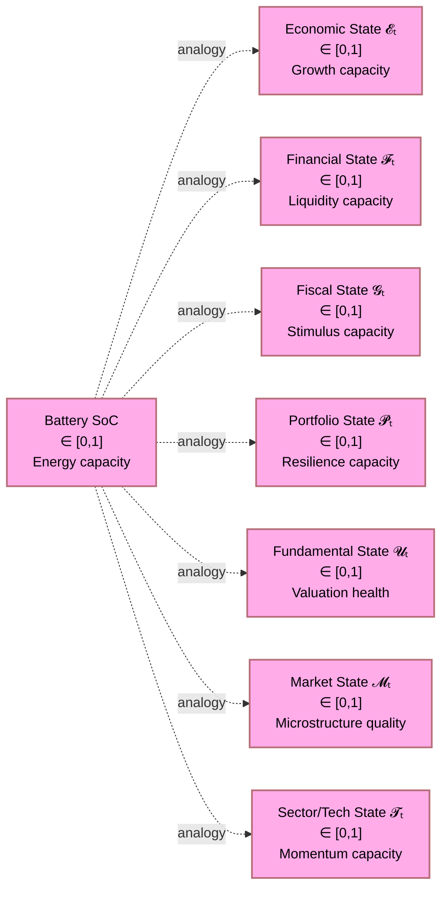

### 1.2 Why States, Not Signals

The multi-agent framework produces *signals* — directional views $s_i \in [-1, 1]$ with confidence and uncertainty. The Kalman filter paper shows how those signals update a hidden state estimate. But what *is* the hidden state?

This paper answers that question by decomposing the hidden state into seven observable-but-latent dimensions, each of which can be estimated from market data and each of which conditions the appropriate response to signals.

The critical distinction is:

| Signal                              | State                                                                            |
| :---------------------------------- | :------------------------------------------------------------------------------- |
| "The market is bullish today"       | "The economic expansion is in month 18 of an average 36-month cycle"             |
| "Volatility is spiking"             | "The financial stress index is at 0.78, near the critical threshold of 0.85"     |
| "A fiscal stimulus bill was passed" | "The fiscal stimulus reservoir is being recharged after 6 months of contraction" |

Signals are **instantaneous observations**. States are **integrated quantities** that evolve continuously, accumulate information across time, and condition the meaning of each new signal. A bullish signal during a fully charged economic state warrants aggressive deployment; the same bullish signal during a near-discharged economic state (approaching recession) warrants extreme caution.

### 1.3 Coupling to the Kalman Filter Framework

The companion Kalman filter paper defines the hidden state vector as:

$$
\mathbf{x}_t = \begin{pmatrix} \mathbf{x}_t^{(\text{eco})} \\ \mathbf{x}_t^{(\text{fin})} \\ \mathbf{x}_t^{(\text{fis})} \\ \mathbf{x}_t^{(\text{inv})} \end{pmatrix}
$$

This paper expands that representation to the full seven-dimensional state:

$$
\mathbf{X}_t \;=\; \begin{pmatrix} \mathcal{E}_t \\ \mathcal{F}_t \\ \mathcal{G}_t \\ \mathcal{P}_t \\ \mathcal{U}_t \\ \mathcal{M}_t \\ \mathcal{T}_t \end{pmatrix} \;\in\; [0,1]^7
$$

Each component is the **normalised state charge** of the corresponding investment dimension, computed by the appropriate specialised agent and fed into the Kalman prediction–correction cycle as a component of the hidden state.

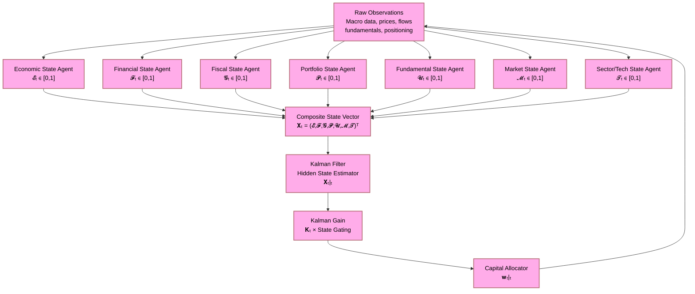

---

## 2. The Seven Investment State Dimensions

### 2.1 Taxonomy and Interdependence

The seven states are not independent. They form a directed influence graph in which some states are upstream (exogenous drivers) and others are downstream (endogenous consequences):

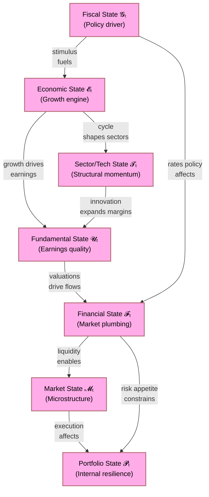

The influence structure implies a processing order for the Kalman filter: exogenous states ($\mathcal{G}_t$, $\mathcal{T}_t$) should be estimated first; endogenous states ($\mathcal{P}_t$, $\mathcal{M}_t$) are estimated last, conditioned on the upstream estimates.

| State                         | Role             | Primary Driver         | Response Horizon |
| :---------------------------- | :--------------- | :--------------------- | :--------------- |
| $\mathcal{E}_t$ Economic    | Upstream engine  | GDP, inflation, credit | Months–years    |
| $\mathcal{F}_t$ Financial   | Market plumbing  | Spreads, vol, flows    | Days–weeks      |
| $\mathcal{G}_t$ Fiscal      | Policy reservoir | Government budget      | Quarters–years  |
| $\mathcal{P}_t$ Portfolio   | Internal health  | Drawdown, cash, risk   | Continuous       |
| $\mathcal{U}_t$ Fundamental | Valuation anchor | Earnings, FCF, debt    | Quarters         |
| $\mathcal{M}_t$ Market      | Microstructure   | Bid-ask, depth, volume | Intraday–days   |
| $\mathcal{T}_t$ Sector/Tech | Structural trend | Innovation, adoption   | Years            |

---

## 3. Economic State ($\mathcal{E}_t$)

### 3.1 Definition and Constituent Variables

The **Economic State** $\mathcal{E}_t \in [0, 1]$ measures the charge level of the macroeconomic expansion engine. It integrates:

$$
\mathcal{E}_t \;=\; \sigma\!\left(\alpha_1 \Delta\mathrm{GDP}_t + \alpha_2 \Delta\mathrm{Emp}_t - \alpha_3 \Delta\mathrm{CPI}_t + \alpha_4 \mathrm{PMI}_t^* + \alpha_5 \Delta\mathrm{Credit}_t\right)
$$

where $\sigma(\cdot)$ is a sigmoid normalisation to $[0, 1]$, and:

| Variable            | Symbol                      | Meaning                                                   |
| :------------------ | :-------------------------- | :-------------------------------------------------------- |
| GDP growth surprise | $\Delta\mathrm{GDP}_t$    | Realised minus consensus GDP growth                       |
| Employment trend    | $\Delta\mathrm{Emp}_t$    | Non-farm payroll trend, unemployment direction            |
| Inflation surprise  | $-\Delta\mathrm{CPI}_t$   | Negative: high unexpected inflation penalises the state   |
| PMI composite       | $\mathrm{PMI}_t^*$        | Normalised composite PMI (manufacturing + services − 50) |
| Credit impulse      | $\Delta\mathrm{Credit}_t$ | Rate of change of private credit growth                   |

The constituent observable vector $\mathbf{z}_t^{(\mathcal{E})}$ feeds into the economic filter layer of the Kalman architecture, with measurement noise covariance $r^{(\mathcal{E})}$ proportional to the data revision history of each indicator.

### 3.2 Economic State Transitions

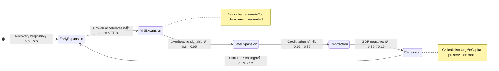

The state transition is governed by:

$$
\mathcal{E}_{t+1} \;=\; \mathcal{E}_t \;+\; \eta_{\mathcal{E}}\!\left(z_t^{(\mathcal{E})} - \mathcal{E}_t\right) \;+\; \mathbf{w}_t^{(\mathcal{E})}
$$

where $\eta_{\mathcal{E}} \in (0, 1)$ is the update rate (slow for economic states, reflecting the low-frequency nature of macro cycles) and $\mathbf{w}_t^{(\mathcal{E})} \sim \mathcal{N}(0, q_{\mathcal{E}}^2)$ is process noise representing structural shocks.

### 3.3 Investment Implications by Economic State

| $\mathcal{E}_t$ Level | Economic Phase           | Favoured Assets          | Penalised Assets | Kalman Gain Modifier              |
| :---------------------- | :----------------------- | :----------------------- | :--------------- | :-------------------------------- |
| $[0.75, 1.0]$         | Mid/Late Expansion       | Cyclicals, EQ, HY Credit | Long bonds, gold | $\times 1.2$ (amplify)          |
| $[0.50, 0.75)$        | Early/Mid Expansion      | Broad equities, EM       | Defensives       | $\times 1.0$ (neutral)          |
| $[0.30, 0.50)$        | Late Cycle / Contraction | Defensives, IG Credit    | Cyclicals, EM    | $\times 0.7$ (reduce)           |
| $[0.10, 0.30)$        | Recession                | Treasuries, gold, cash   | Equities, HY     | $\times 0.4$ (severe reduction) |
| $[0.0, 0.10)$         | Severe recession         | Cash only                | All risk assets  | $\times 0.1$ (emergency)        |

---

## 4. Financial State ($\mathcal{F}_t$)

### 4.1 Definition and Constituent Variables

The **Financial State** $\mathcal{F}_t \in [0, 1]$ measures the charge level of the market's financial plumbing — liquidity, stress, and risk transmission quality. Unlike the economic state (which moves slowly), the financial state can discharge catastrophically in hours.

$$
\mathcal{F}_t \;=\; 1 \;-\; \sigma\!\left(\beta_1 \mathrm{VIX}_t^* + \beta_2 \mathrm{CS}_t^* + \beta_3 \mathrm{TED}_t^* + \beta_4 \mathrm{FCI}_t^* - \beta_5 \mathrm{LIQD}_t^*\right)
$$

where starred quantities are z-score normalised (positive = stress) and:

| Variable                   | Symbol                 | Meaning                                    |
| :------------------------- | :--------------------- | :----------------------------------------- |
| Implied volatility         | $\mathrm{VIX}_t^*$   | VIX / historical VIX ratio                 |
| Credit spreads             | $\mathrm{CS}_t^*$    | IG and HY spread z-scores                  |
| TED spread                 | $\mathrm{TED}_t^*$   | Interbank funding stress                   |
| Financial Conditions Index | $\mathrm{FCI}_t^*$   | Composite tightening index                 |
| Liquidity depth            | $-\mathrm{LIQD}_t^*$ | Negative: high liquidity charges the state |

Note the inversion: the financial state is **1 minus financial stress**. A fully charged financial state ($\mathcal{F}_t \approx 1$) corresponds to minimal stress; a discharged state ($\mathcal{F}_t \approx 0$) corresponds to maximum stress.

### 4.2 Financial State Transitions

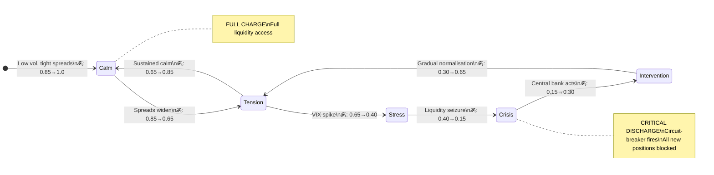

The financial state is the **fastest-moving** of all seven states and the one most likely to trigger circuit-breakers. The measurement noise $r^{(\mathcal{F})}$ is small (real-time traded data) but the process noise $q_{\mathcal{F}}^2$ is large (financial crises are discontinuous).

### 4.3 Investment Implications by Financial State

| $\mathcal{F}_t$ Level | Financial Phase  | Capital Deployment Cap | Additional Constraint       |
| :---------------------- | :--------------- | :--------------------- | :-------------------------- |
| $[0.80, 1.0]$         | Calm / Normal    | 100% of budget         | None                        |
| $[0.60, 0.80)$        | Mild tension     | 75% of budget          | Reduce HY, EM exposure      |
| $[0.40, 0.60)$        | Stress           | 50% of budget          | Long-only, no leverage      |
| $[0.20, 0.40)$        | Acute stress     | 25% of budget          | Treasuries, gold, cash only |
| $[0.0, 0.20)$         | Crisis / Seizure | 0% new positions       | Liquidation protocol active |

---

## 5. Fiscal State ($\mathcal{G}_t$)

### 5.1 Definition and Constituent Variables

The **Fiscal State** $\mathcal{G}_t \in [0, 1]$ measures the charge level of the government's policy toolkit — the degree to which fiscal stimulus is available, active, and transmitting to the real economy.

$$
\mathcal{G}_t \;=\; \sigma\!\left(\gamma_1 \Delta\mathrm{Deficit}_t^* + \gamma_2 \mathrm{FiscalImpulse}_t + \gamma_3 \Delta\mathrm{TransferPayments}_t - \gamma_4 \mathrm{DebtServiceRatio}_t^*\right)
$$

where:

| Variable           | Meaning                                            | Horizon   |
| :----------------- | :------------------------------------------------- | :-------- |
| Deficit expansion  | Government spending net of revenue                 | Quarterly |
| Fiscal impulse     | Year-on-year change in cyclically-adjusted balance | Annual    |
| Transfer payments  | Direct income support, infrastructure spending     | Monthly   |
| Debt service ratio | Constraint on future stimulus capacity             | Annual    |

The fiscal state is the **slowest-moving** of all seven and carries the highest measurement noise (data revisions, political surprise). It should be treated as a long-duration prior that conditions multi-quarter allocation decisions.

### 5.2 Fiscal State Transitions and Investment Implications

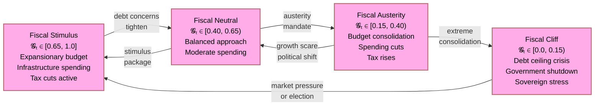

| $\mathcal{G}_t$ Level | Fiscal Phase | Long-Horizon Tilt         | Asset Class Implication             |
| :---------------------- | :----------- | :------------------------ | :---------------------------------- |
| $[0.65, 1.0]$         | Stimulus     | Pro-growth, pro-inflation | Infrastructure, materials, TIPS, EM |
| $[0.40, 0.65)$        | Neutral      | Balanced                  | Broad diversification               |
| $[0.15, 0.40)$        | Austerity    | Defensive                 | Long bonds, utilities, quality      |
| $[0.0, 0.15)$         | Fiscal cliff | Crisis                    | Gold, CHF, short sovereign CDS      |

---

## 6. Portfolio State ($\mathcal{P}_t$)

### 6.1 Definition and Constituent Variables

The **Portfolio State** $\mathcal{P}_t \in [0, 1]$ is the most important state for the multi-agent system because it is the only state that is **fully observable** — it describes the current internal condition of the portfolio, not an external market variable.

$$
\mathcal{P}_t \;=\; \sigma\!\left(\delta_1 \mathrm{CashRatio}_t + \delta_2 \left(1 - \frac{\mathrm{CurrentDD}_t}{\mathrm{MaxPermittedDD}}\right) + \delta_3 \mathrm{SharpeTrailing}_t^* - \delta_4 \mathrm{Concentration}_t^* - \delta_5 \mathrm{LeverageRatio}_t^*\right)
$$

where:

| Variable              | Symbol                             | Meaning                                               |
| :-------------------- | :--------------------------------- | :---------------------------------------------------- |
| Cash ratio            | $\mathrm{CashRatio}_t$           | Fraction of portfolio in cash / liquid reserves       |
| Drawdown headroom     | $1 - \mathrm{DD}/\mathrm{MaxDD}$ | 1 = no drawdown; 0 = at limit                         |
| Trailing Sharpe       | $\mathrm{SharpeTrailing}_t^*$    | Risk-adjusted performance momentum                    |
| Concentration penalty | $-\mathrm{Concentration}_t^*$    | HHI z-score (negative: high concentration discharges) |
| Leverage penalty      | $-\mathrm{LeverageRatio}_t^*$    | Excess leverage discharges the state                  |

This state **gates all capital deployment**: regardless of external states, $\mathcal{P}_t < \mathcal{P}_{\min}$ halts new position opening.

### 6.2 Portfolio State Transitions and Circuit-Breakers

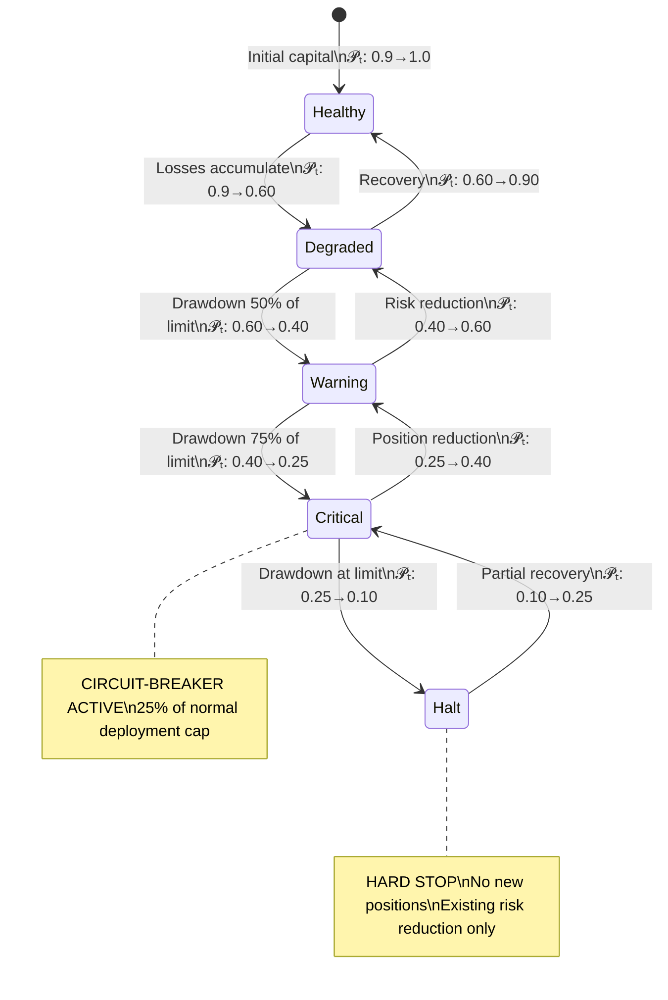

The portfolio state introduces a **state-dependent position-sizing multiplier**:

$$
\mathrm{SizeMultiplier}(\mathcal{P}_t) \;=\; \begin{cases} 1.0 & \mathcal{P}_t \geq 0.70 \\ 0.75 & \mathcal{P}_t \in [0.50, 0.70) \\ 0.50 & \mathcal{P}_t \in [0.35, 0.50) \\ 0.25 & \mathcal{P}_t \in [0.20, 0.35) \\ 0.0 & \mathcal{P}_t < 0.20 \end{cases}
$$

This is the investment-domain equivalent of the battery management system's current-limiting function: as the charge depletes, the draw rate is cut proportionally to prevent catastrophic deep discharge.

---

## 7. Fundamental State ($\mathcal{U}_t$)

### 7.1 Definition and Constituent Variables

The **Fundamental State** $\mathcal{U}_t \in [0, 1]$ measures the health of the earnings and valuation landscape — whether the market is in a fundamentally supportive configuration or an overextended, fragile one.

$$
\mathcal{U}_t \;=\; \sigma\!\left(-\epsilon_1 \mathrm{PERelative}_t^* - \epsilon_2 \mathrm{CAPE}_t^* + \epsilon_3 \mathrm{EarningsRevision}_t + \epsilon_4 \mathrm{FCFYield}_t^* + \epsilon_5 \mathrm{DebtToEBITDA}_t^{*,\,-1}\right)
$$

where:

| Variable               | Symbol                                | Direction | Meaning                            |
| :--------------------- | :------------------------------------ | :-------- | :--------------------------------- |
| PE relative to history | $-\mathrm{PERelative}_t^*$          | Negative  | High PE discharges valuation state |
| Shiller CAPE           | $-\mathrm{CAPE}_t^*$                | Negative  | Elevated CAPE discharges           |
| Earnings revision      | $+\mathrm{EarningsRevision}_t$      | Positive  | Upward revisions charge the state  |
| FCF yield              | $+\mathrm{FCFYield}_t^*$            | Positive  | High FCF yield charges the state   |
| Leverage inverse       | $+\mathrm{DebtToEBITDA}_t^{*,\,-1}$ | Positive  | Lower leverage charges the state   |

The fundamental state distinguishes between two types of "discharged" conditions that require opposite responses:

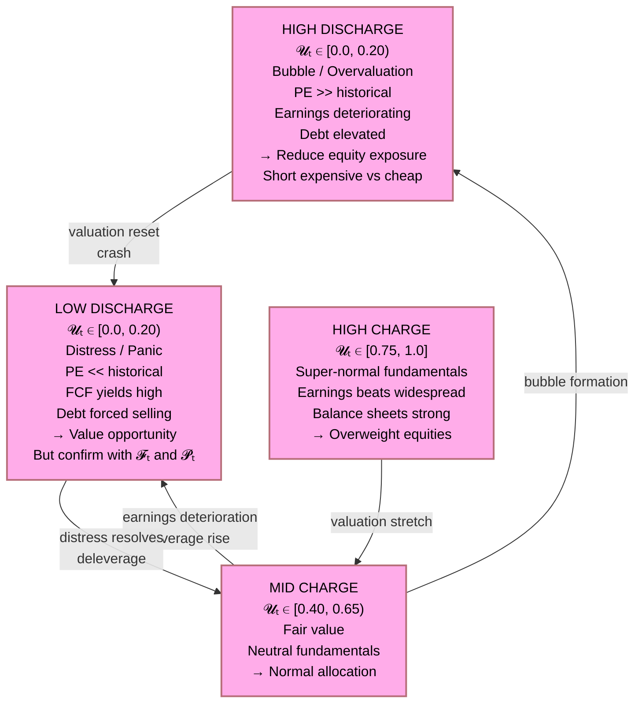

### 7.2 Fundamental State Transitions

The fundamental state is the most **counter-cyclical** of all seven states: it tends to be highest when the economic state is in early expansion (cheap, recovering markets) and lowest at the peak of economic expansion (expensive, extended markets). This counter-cyclicality is a crucial portfolio management signal:

$$
\mathrm{Corr}(\mathcal{U}_t, \mathcal{E}_t) \;\approx\; -0.3 \text{ to } -0.5
$$

The agent system must resolve this tension explicitly: strong economic momentum ($\mathcal{E}_t$ high) combined with deteriorating fundamentals ($\mathcal{U}_t$ low) implies **late-cycle positioning** — reducing equity duration, rotating to quality, increasing hedges.

---

## 8. Market State ($\mathcal{M}_t$)

### 8.1 Definition and Constituent Variables

The **Market State** $\mathcal{M}_t \in [0, 1]$ measures microstructure quality — the degree to which the market machinery is functioning normally, allowing efficient price discovery and low-cost execution.

$$
\mathcal{M}_t \;=\; 1 \;-\; \sigma\!\left(\zeta_1 \mathrm{BidAskSpread}_t^* + \zeta_2 \mathrm{MarketImpact}_t^* + \zeta_3 \mathrm{OrderFlowImbalance}_t^* - \zeta_4 \mathrm{VolumeDepth}_t^* - \zeta_5 \mathrm{PriceEfficiency}_t^*\right)
$$

| Variable             | Symbol                              | Meaning                     | Good Market |
| :------------------- | :---------------------------------- | :-------------------------- | :---------- |
| Bid-ask spread       | $\mathrm{BidAskSpread}_t^*$       | Normalised transaction cost | Tight       |
| Market impact        | $\mathrm{MarketImpact}_t^*$       | Cost of moving the market   | Low         |
| Order flow imbalance | $\mathrm{OrderFlowImbalance}_t^*$ | One-sided flow (toxic)      | Balanced    |
| Volume depth         | $-\mathrm{VolumeDepth}_t^*$       | Depth of book               | Deep        |
| Price efficiency     | $-\mathrm{PriceEfficiency}_t^*$   | Arbitrage-free pricing      | Efficient   |

### 8.2 Market Microstructure and Regime Interaction

The market state is the **fastest** of all seven states, capable of transitioning from healthy to crisis within minutes during flash crashes or liquidity events. It is strongly correlated with the financial state but is distinct:

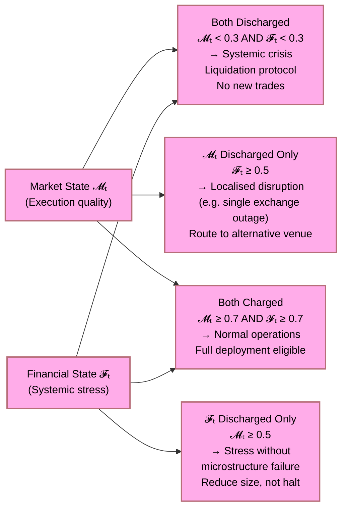

| $\mathcal{M}_t$ Level | Microstructure Quality | Execution Constraint         |
| :---------------------- | :--------------------- | :--------------------------- |
| $[0.80, 1.0]$         | Deep, efficient        | Full position sizing         |
| $[0.60, 0.80)$        | Mild friction          | 80% sizing, use limit orders |
| $[0.40, 0.60)$        | Elevated friction      | 60% sizing, VWAP execution   |
| $[0.20, 0.40)$        | Dislocated             | 30% sizing, iceberg only     |
| $[0.0, 0.20)$         | Seized                 | No new orders, monitor only  |

---

## 9. Sector / Technology State ($\mathcal{T}_t$)

### 9.1 Definition and Constituent Variables

The **Sector/Technology State** $\mathcal{T}_t \in [0, 1]$ measures the structural charge of secular innovation and sectoral momentum — not cyclical rotation but multi-year adoption curves and technological disruption trajectories.

$$
\mathcal{T}_t \;=\; \sigma\!\left(\theta_1 \mathrm{AdoptionCurvePosition}_t + \theta_2 \mathrm{RDSpendingGrowth}_t^* + \theta_3 \mathrm{PatentFlow}_t^* + \theta_4 \mathrm{SectorMarginExpansion}_t - \theta_5 \mathrm{CompetitiveEntryRate}_t^*\right)
$$

| Variable                | Meaning                                                                                                        |
| :---------------------- | :------------------------------------------------------------------------------------------------------------- |
| Adoption curve position | Where on the S-curve is the dominant technology (early = low, peak slope = max charge, saturation = declining) |
| R&D spending growth     | Indicator of future innovation pipeline                                                                        |
| Patent flow             | Leading indicator of competitive moats                                                                         |
| Sector margin expansion | Operational leverage from scale                                                                                |
| Competitive entry rate  | Negative: high entry erodes margins and discharges the state                                                   |

### 9.2 Sector Rotation Logic

The sector/tech state enables formal sector rotation based on the intersection of the adoption curve position and the economic cycle:

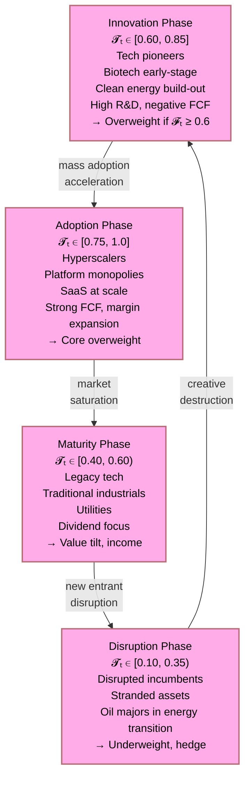

The sector state is the most **long-duration** state and should drive the Strategic/Permanent layer allocation ($\ell = 5$) in the time-horizon layering framework. Short-horizon signals should not override a strong sector state charge accumulated over years.

---

## 10. The Composite State Vector and Inter-State Coupling

### 10.1 The Full State Vector

The seven states are collected into the composite state vector:

$$
\mathbf{X}_t \;=\; \begin{pmatrix} \mathcal{E}_t \\ \mathcal{F}_t \\ \mathcal{G}_t \\ \mathcal{P}_t \\ \mathcal{U}_t \\ \mathcal{M}_t \\ \mathcal{T}_t \end{pmatrix} \;\in\; [0,1]^7
$$

The system is "fully charged" when $\mathbf{X}_t \approx \mathbf{1}$ and is "critically discharged" when any component falls below its critical threshold $\mathcal{S}_{\min}^{(d)}$:

$$
\text{System Healthy} \;\Longleftrightarrow\; \mathcal{S}_t^{(d)} \geq \mathcal{S}_{\min}^{(d)} \;\;\forall\, d \in \{1,\ldots,7\}
$$

| State             | Critical Threshold$\mathcal{S}_{\min}^{(d)}$ | Consequence of Breach                  |
| :---------------- | :--------------------------------------------- | :------------------------------------- |
| $\mathcal{E}_t$ | 0.15                                           | Capital preservation mode; no new risk |
| $\mathcal{F}_t$ | 0.20                                           | All new positions blocked              |
| $\mathcal{G}_t$ | 0.10                                           | Long-horizon allocations frozen        |
| $\mathcal{P}_t$ | 0.20                                           | Hard stop; drawdown limit reached      |
| $\mathcal{U}_t$ | 0.15 (bubble) or 0.10 (distress)               | Reduce equity; seek confirmation       |
| $\mathcal{M}_t$ | 0.20                                           | No new orders; monitor only            |
| $\mathcal{T}_t$ | 0.15                                           | Exit disrupted sectors; avoid          |

### 10.2 Inter-State Coupling Matrix

The states are not independent. The coupling matrix $\boldsymbol{\Gamma} \in \mathbb{R}^{7 \times 7}$ captures the directed influence:

$$
\boldsymbol{\Gamma} \;=\; \begin{pmatrix}
0 & +\gamma_{12} & 0 & +\gamma_{14} & +\gamma_{15} & 0 & 0 \\
-\gamma_{21} & 0 & 0 & +\gamma_{24} & 0 & +\gamma_{26} & 0 \\
+\gamma_{31} & +\gamma_{32} & 0 & +\gamma_{34} & 0 & 0 & 0 \\
0 & 0 & 0 & 0 & 0 & -\gamma_{46} & 0 \\
+\gamma_{51} & -\gamma_{52} & +\gamma_{53} & +\gamma_{54} & 0 & 0 & +\gamma_{57} \\
0 & +\gamma_{62} & 0 & 0 & 0 & 0 & 0 \\
+\gamma_{71} & 0 & +\gamma_{73} & 0 & +\gamma_{75} & 0 & 0
\end{pmatrix}
$$

where $\Gamma_{ij}$ represents the signed influence of state $j$ on the rate of change of state $i$ (positive = charges, negative = discharges). Key couplings include:

- $\gamma_{12}$: Financial stress discharges economic state (credit crunch)
- $\gamma_{31}$: Strong economy supports fiscal capacity to replenish
- $\gamma_{52}$: High financial stress discharges fundamental state (distressed selling)
- $\gamma_{54}$: Portfolio resilience buffers fundamental assessment
- $\gamma_{57}$: Sectoral innovation charges fundamental state

### 10.3 State-Conditional Capital Deployment

The full state-conditional capital deployment function integrates all seven states:

$$
C_{\text{deployed}}(\mathbf{X}_t) \;=\; C_{\text{available}} \;\times\; \underbrace{K_t^{(\text{Kalman})}}_{\text{signal gain}} \;\times\; \underbrace{\prod_{d=1}^{7} g_d\!\left(\mathcal{S}_t^{(d)}\right)}_{\text{state gating}}
$$

where the gating function $g_d$ for each state is:

$$
g_d(\mathcal{S}) \;=\; \begin{cases} 1 & \mathcal{S} \geq \mathcal{S}_{\text{full}}^{(d)} \\ \displaystyle\frac{\mathcal{S} - \mathcal{S}_{\min}^{(d)}}{\mathcal{S}_{\text{full}}^{(d)} - \mathcal{S}_{\min}^{(d)}} & \mathcal{S} \in \left[\mathcal{S}_{\min}^{(d)},\, \mathcal{S}_{\text{full}}^{(d)}\right) \\ 0 & \mathcal{S} < \mathcal{S}_{\min}^{(d)} \end{cases}
$$

This piecewise-linear gating ensures:

1. Full deployment when all states are above their "full charge" threshold
2. Proportional reduction as any state degrades toward its critical threshold
3. Complete halt when any state falls below the critical threshold

---

## 11. State Charge Levels: Formalisation

### 11.1 The Charge Metaphor Formalised

For each state dimension $d$, define:

$$
\text{Charge Rate:} \qquad \dot{\mathcal{S}}_t^{(d)} \;=\; \kappa_d^{+}\!\left(1 - \mathcal{S}_t^{(d)}\right)\,\mathbf{1}\!\left[\text{positive stimulus}\right] \;-\; \kappa_d^{-}\,\mathcal{S}_t^{(d)}\,\mathbf{1}\!\left[\text{negative shock}\right]
$$

where:

- $\kappa_d^{+}$: charge rate (speed of recovery)
- $\kappa_d^{-}$: discharge rate (speed of deterioration)
- $(1 - \mathcal{S}_t^{(d)})$: remaining capacity (slows charging as state approaches 1)

The asymmetry $\kappa_d^{-} > \kappa_d^{+}$ for most states reflects the empirical observation that financial systems discharge faster than they recover — the same asymmetry that makes drawdown control more important than return maximisation.

| State                         | $\kappa_d^{+}$ (Charge Rate) | $\kappa_d^{-}$ (Discharge Rate) | Asymmetry Ratio |
| :---------------------------- | :----------------------------- | :-------------------------------- | :-------------- |
| $\mathcal{E}_t$ Economic    | 0.03/month                     | 0.08/month                        | $2.7\times$   |
| $\mathcal{F}_t$ Financial   | 0.15/day                       | 0.60/day                          | $4.0\times$   |
| $\mathcal{G}_t$ Fiscal      | 0.01/month                     | 0.02/month                        | $2.0\times$   |
| $\mathcal{P}_t$ Portfolio   | 0.05/day                       | 0.20/day                          | $4.0\times$   |
| $\mathcal{U}_t$ Fundamental | 0.02/month                     | 0.04/month                        | $2.0\times$   |
| $\mathcal{M}_t$ Market      | 0.50/hour                      | 2.0/hour                          | $4.0\times$   |
| $\mathcal{T}_t$ Sector/Tech | 0.005/month                    | 0.010/month                       | $2.0\times$   |

### 11.2 Discharge and Recharge Dynamics

```mermaid
flowchart LR
    classDef node fill:#FFACE9,stroke:#b76e79,color:#000000,stroke-width:2px

    FULL["FULL CHARGE\n𝓢 ∈ [0.80, 1.0]\nMaximum capacity\nFull deployment\nCompounding active"]:::node

    PARTIAL["PARTIAL CHARGE\n𝓢 ∈ [0.50, 0.80)\nReduced but functional\nScaled deployment\nMonitor closely"]:::node

    LOW["LOW CHARGE\n𝓢 ∈ [0.25, 0.50)\nSignificantly degraded\nConservative only\nRecharge protocol active"]:::node

    CRITICAL["CRITICAL CHARGE\n𝓢 ∈ [𝓢ₘᵢₙ, 0.25)\nNear failure threshold\nMinimal deployment only\nEmergency protocols"]:::node

    DEPLETED["DEPLETED\n𝓢 < 𝓢ₘᵢₙ\nCircuit-breaker fires\nZero new deployment\nLiquidation if needed"]:::node

    FULL -->|"shock / crisis\nκ⁻ × Δt"| PARTIAL
    PARTIAL -->|"further\ndischarge"| LOW
    LOW -->|"approaching\nthreshold"| CRITICAL
    CRITICAL -->|"threshold\nbreach"| DEPLETED
    DEPLETED -->|"slow\nrecovery"| CRITICAL
    CRITICAL -->|"improvement\nκ⁺ × (1-𝓢) × Δt"| LOW
    LOW -->|"sustained\nrecovery"| PARTIAL
    PARTIAL -->|"full\nnormalisation"| FULL
```

### 11.3 Critical Thresholds and Circuit-Breakers

The system implements a **layered circuit-breaker architecture** based on the state charge levels:

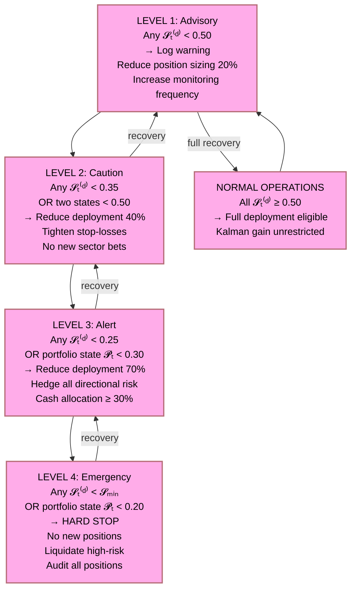

---

## 12. Integration with the Kalman Filter and Multi-Agent Architecture

### 12.1 States as Hidden Variables in the Kalman Model

The companion Kalman filter paper defines the hidden state as a vector tracking the latent market reality. This paper specifies exactly what that vector contains:

$$
\mathbf{x}_t^{(\text{Kalman})} \;\equiv\; \mathbf{X}_t \;=\; (\mathcal{E}_t,\, \mathcal{F}_t,\, \mathcal{G}_t,\, \mathcal{P}_t,\, \mathcal{U}_t,\, \mathcal{M}_t,\, \mathcal{T}_t)^\top
$$

Each specialised agent observes one or more components of this state vector with noise:

$$
z_i^{(d)} \;=\; h_i^{(d)}\,\mathcal{S}_t^{(d)} \;+\; \nu_i^{(d)}, \qquad \nu_i^{(d)} \sim \mathcal{N}\!\left(0,\, \frac{1 - c_i}{c_i}\,\sigma_{\text{base}}^2\right)
$$

The Kalman filter then estimates all seven state components jointly, propagating uncertainty through the inter-state coupling matrix $\boldsymbol{\Gamma}$.

### 12.2 State Transitions as Process Noise

The transition model for the composite state vector is:

$$
\mathbf{X}_{t+1} \;=\; \mathbf{F}_{\mathbf{X}}\,\mathbf{X}_t \;+\; \boldsymbol{\Gamma}\,\mathbf{X}_t \;+\; \mathbf{w}_t, \qquad \mathbf{w}_t \sim \mathcal{N}(\mathbf{0},\, \mathbf{Q}_t)
$$

where $\mathbf{F}_{\mathbf{X}} = \mathrm{diag}(f_1, \ldots, f_7)$ contains per-state mean-reversion rates, $\boldsymbol{\Gamma}$ is the coupling matrix from §10.2, and $\mathbf{Q}_t$ is the time-varying process noise covariance:

$$
\mathbf{Q}_t \;=\; \mathrm{diag}\!\left(q_{\mathcal{E}}^2,\, q_{\mathcal{F}}^2,\, q_{\mathcal{G}}^2,\, q_{\mathcal{P}}^2,\, q_{\mathcal{U}}^2,\, q_{\mathcal{M}}^2,\, q_{\mathcal{T}}^2\right)
$$

The regime-switching detected by the HMM modulates $\mathbf{Q}_t$: in crisis regimes, $q_{\mathcal{F}}^2$ and $q_{\mathcal{M}}^2$ are inflated dramatically, reflecting the discontinuous nature of financial crises.

### 12.3 The Full System Architecture

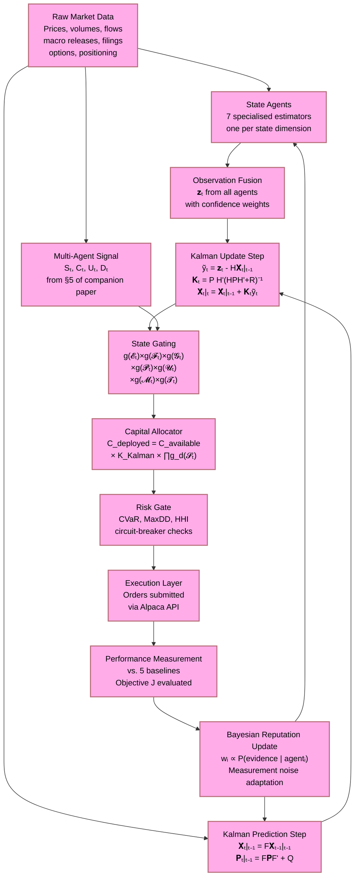

---

## 13. The Mathematical Conjecture: Optimal State-Aware Investment

The mathematical conjecture of this paper, as a companion to the Kalman filter conjecture, is:

$$
\boxed{\;\text{Optimal Agentic Trading} \;\neq\; \max(\text{Signal Strength})\;}
$$

$$
\boxed{\;\text{Optimal Agentic Trading} \;=\; \max\!\left(\text{Signal Strength} \;\middle|\; \text{State Vector } \mathbf{X}_t \text{ is Sufficiently Charged}\right)\;}
$$

Formally, the optimal capital deployment policy is:

$$
\pi^*(\mathbf{X}_t, S_t) \;=\; \begin{cases} K_t^{(\text{Kalman})} \cdot C_{\text{available}} \cdot \prod_{d=1}^{7} g_d(\mathcal{S}_t^{(d)}) & \text{if } \mathcal{S}_t^{(d)} \geq \mathcal{S}_{\min}^{(d)} \;\forall\, d \\ 0 & \text{otherwise} \end{cases}
$$

The **combined conjecture** (Kalman filter paper + this paper) states:

| Condition                                                                   | Investment Action   | Justification                                     |
| :-------------------------------------------------------------------------- | :------------------ | :------------------------------------------------ |
| $\mathbf{X}_t \approx \mathbf{1}$ (all charged) AND strong signal $S_t$ | Maximum deployment  | Favourable state + strong evidence                |
| $\mathbf{X}_t \approx \mathbf{1}$ (all charged) AND weak signal $S_t$   | Moderate deployment | Favourable state but low innovation               |
| Mixed states AND strong signal$S_t$                                       | Reduced deployment  | Signal is strong but system is partially degraded |
| Any$\mathcal{S}_t^{(d)} < \mathcal{S}_{\min}^{(d)}$                       | Zero new deployment | Circuit-breaker override regardless of signal     |

The **priority ordering** across all three companion documents is unified as:

$$
\underbrace{\text{State Integrity}}_{\text{This paper}} \;\succ\; \underbrace{\text{Filter Stability}}_{\text{Kalman paper}} \;\succ\; \underbrace{\text{Signal Quality}}_{\text{Multi-agent paper}} \;\succ\; \underbrace{\text{Allocation Intelligence}}_{\text{All three}} \;\succ\; \underbrace{\text{Compounding}}_{\text{All three}}
$$

The deepest result is:

> **The finite capital constraint, enforced by the seven-state gating function, is the investment-domain analogue of the battery management system's State-of-Charge protection circuit. It transforms the multi-agent Kalman filter from a pure signal-processing machine into a survival-first, compounding-second capital engine.**

```mermaid
flowchart LR
    classDef node fill:#FFACE9,stroke:#b76e79,color:#000000,stroke-width:2px

    S1["OBSERVE\nAll 7 state dimensions\nKalman prediction step"]:::node
    S2["ESTIMATE STATES\n𝐗̂ₜ|ₜ updated\nAll 7 charges computed"]:::node
    S3["GATE DEPLOYMENT\n∏g_d(𝓢ₜ) evaluated\nCircuit-breakers checked"]:::node
    S4["PROCESS SIGNALS\nMulti-agent ensemble\nKalman gain Kₜ"]:::node
    S5["ALLOCATE CAPITAL\nC_deployed = budget\n× Kₜ × ∏g_d"]:::node
    S6["EXECUTE TRADES\nRisk gate final check\nOrders submitted"]:::node
    S7["MEASURE OUTCOMES\nObjective J vs. baselines\nState updates"]:::node
    S8["UPDATE REPUTATIONS\nBayesian wᵢ update\nR̂ₜ adaptation"]:::node

    S1 --> S2 --> S3 --> S4 --> S5 --> S6 --> S7 --> S8 --> S1
```

**Research question.** Can a seven-dimensional state-gated capital deployment function, integrated with the multi-domain Kalman filter and multi-agent signal ensemble, achieve superior risk-adjusted compounding under finite capital constraints relative to signal-only or state-only systems — and can the state charge framework provide a formal, auditable mechanism for enforcing the survival-first priority ordering across all market environments?

The expected conclusion is not that monitoring seven states eliminates market risk. It is that the state charge framework provides the **physical grounding** for every capital deployment decision: just as a battery management system knows exactly how much energy it has and how quickly it can draw it down without damage, the investment system knows exactly how "charged" each dimension of its operating environment is, and modulates its capital draw rate accordingly — protecting the principal that makes all future compounding possible.

---

## References

| ID  | Source                                                                                                                                                          | Notes                                                                                                  |
| :-- | :-------------------------------------------------------------------------------------------------------------------------------------------------------------- | :----------------------------------------------------------------------------------------------------- |
| R1  | `finite_investment_architecture_as_economic_financial_fiscal_investment_kalman_filter.md` — this repository                                                  | Companion Kalman filter paper; all state-space notation, Kalman gain, and IMM framework.               |
| R2  | `finite_investment_math_conversation.md` — this repository                                                                                                   | Multi-agent capital allocation framework; agent output tuples, confidence, uncertainty, doubt.         |
| R3  | `high_level_architecture_proof.tex` — this repository                                                                                                        | Formal proof framework; uncertainty decomposition; Bayesian regime detection; HMM.                     |
| R4  | `high_level_supplementary_diversification_proof.tex` — this repository                                                                                       | Diversification mandate; CVaR sub-additivity; regime-conditional correlation; constraint architecture. |
| R5  | Plett, G.\ L.\ (2004). Extended Kalman filtering for battery management systems of LiPB-based HEV battery packs.*Journal of Power Sources*, 134(2), 252--292. | State-of-Charge estimation; basis for the SoC analogy in §1.                                          |
| R6  | Hamilton, J.\ D.\ (1989). A New Approach to the Economic Analysis of Nonstationary Time Series.*Econometrica*, 57(2), 357--384.                               | HMM regime-switching; basis for state transition dynamics in §3--§9.                                 |
| R7  | Markowitz, H.\ (1952). Portfolio Selection.*Journal of Finance*, 7(1), 77--91.                                                                                | Mean-variance optimisation; basis for the portfolio state definition in §6.                           |
| R8  | Rockafellar, R.\ T.\\& Uryasev, S.\ (2000). Optimization of Conditional Value-at-Risk. *Journal of Risk*, 2(3), 21--41.                                       | CVaR; basis for the circuit-breaker integration in §11.3.                                             |
| R9  | Bar-Shalom, Y., Li, X.\ R.,\& Kirubarajan, T.\ (2001). *Estimation with Applications to Tracking and Navigation*. Wiley.                                      | IMM algorithm; basis for §12.1 and inter-state coupling.                                              |
| R10 | Lopez de Prado, M.\ (2018).*Advances in Financial Machine Learning*. Wiley.                                                                                   | Temporal leakage; feature engineering; information hierarchy across state dimensions.                  |

---

## Changelog

| Version    | Date       | Author     | Description                                                                                                                                                                                                                                                                                                                                                                                                                                                                                                                                           |
| :--------- | :--------- | :--------- | :---------------------------------------------------------------------------------------------------------------------------------------------------------------------------------------------------------------------------------------------------------------------------------------------------------------------------------------------------------------------------------------------------------------------------------------------------------------------------------------------------------------------------------------------------- |
| 2026.1.0.0 | 2026-08-20 | Hadrian Hu | Initial draft. Established seven-dimensional investment state framework as SoC analogy companion to the Kalman filter paper. Defined Economic, Financial, Fiscal, Portfolio, Fundamental, Market, and Sector/Technology states with constituent variables, transition dynamics, charge/discharge rates, investment implications, circuit-breaker thresholds, and full integration with the Kalman filter and multi-agent architectures. Full mermaid diagram suite, reference tables, and mathematical formalism consistent with companion documents. |
