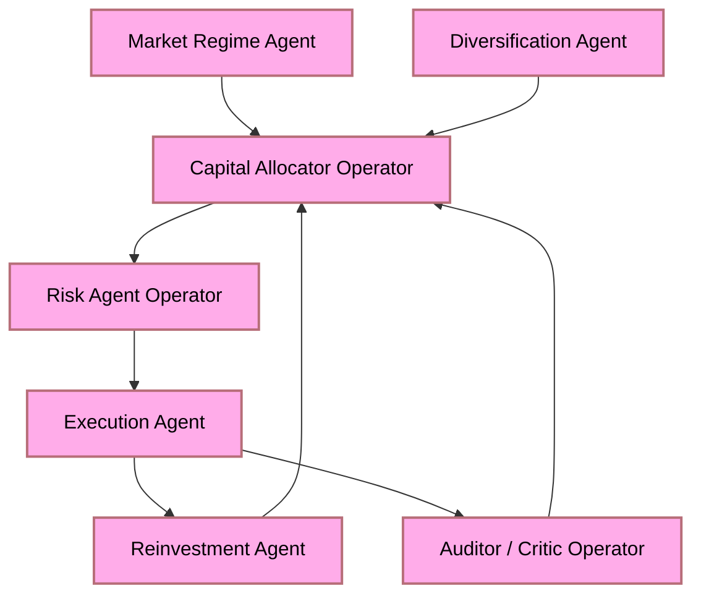
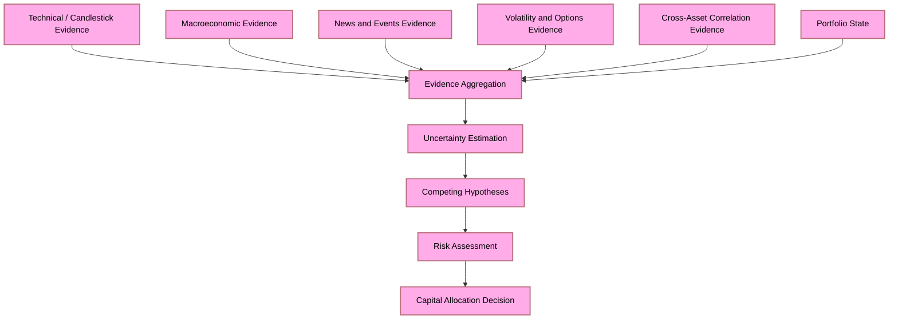
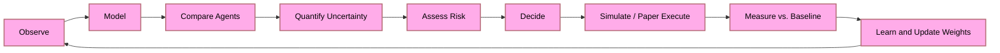

# Finite Capital, Multi-Agent Allocation: A Mathematical Framework for Constrained Agentic Trading

## Table of Contents

- [Abstract](#abstract)
- [Keywords](#keywords)
- [Executive Summary](#executive-summary)
- [1. The Hackathon Thesis: Constrained Capital as the Real Test](#1-the-hackathon-thesis-constrained-capital-as-the-real-test)
  - [1.1 Central Hypothesis](#11-central-hypothesis)
  - [1.2 Initial Capital Partition](#12-initial-capital-partition)
  - [1.3 The Agent Architecture](#13-the-agent-architecture)
  - [1.4 The Composite Objective Function](#14-the-composite-objective-function)
- [2. Recursive Reinvestment and Capital State Transitions](#2-recursive-reinvestment-and-capital-state-transitions)
  - [2.1 The Marginal Dollar Problem](#21-the-marginal-dollar-problem)
  - [2.2 Capital State Transition Model](#22-capital-state-transition-model)
  - [2.3 Evaluation Against Baselines](#23-evaluation-against-baselines)
- [3. Information Hierarchy: Technical Analysis as Feature, Not Oracle](#3-information-hierarchy-technical-analysis-as-feature-not-oracle)
  - [3.1 The Insufficiency of Price History Alone](#31-the-insufficiency-of-price-history-alone)
  - [3.2 The Full Evidence Set](#32-the-full-evidence-set)
  - [3.3 Decision Under Uncertainty vs. Prediction](#33-decision-under-uncertainty-vs-prediction)
- [4. Signal Architecture and Agent Output Contracts](#4-signal-architecture-and-agent-output-contracts)
  - [4.1 Directional Signal Normalization](#41-directional-signal-normalization)
  - [4.2 Agent Output Tuple](#42-agent-output-tuple)
  - [4.3 Why Direction Alone Is Insufficient](#43-why-direction-alone-is-insufficient)
- [5. The Master Capital Allocator](#5-the-master-capital-allocator)
  - [5.1 Ensemble Aggregate Signal](#51-ensemble-aggregate-signal)
  - [5.2 Disagreement as an Independent Variable](#52-disagreement-as-an-independent-variable)
  - [5.3 Allocator State Space](#53-allocator-state-space)
  - [5.4 Continuous Action Space and Capital Deployment](#54-continuous-action-space-and-capital-deployment)
  - [5.5 Constrained Portfolio Optimization](#55-constrained-portfolio-optimization)
  - [5.6 Bayesian Agent Reputation](#56-bayesian-agent-reputation)
- [6. The Mathematical Conjecture: Optimal Agentic Trading](#6-the-mathematical-conjecture-optimal-agentic-trading)
- [References](#references)
- [Changelog](#changelog)

---

## Abstract

This document formalizes the mathematical conjecture underlying the Alpaca Hackathon experiment: that a heterogeneous multi-agent system, operating under a fixed and comparatively limited initial capital constraint of \$100,000, can achieve superior risk-adjusted outcomes by dynamically allocating capital across imperfectly correlated strategies, reinvesting realized returns, and progressively expanding into additional investment instruments as capital and measured confidence increase. The formulation departs from maximum-profit optimization and instead positions autonomous trading as constrained probabilistic capital allocation under uncertainty. Each specialized agent produces a normalized directional signal $s_i \in [-1, 1]$ alongside explicit measures of confidence, uncertainty, and doubt. A master capital allocator aggregates these signals with disagreement weighting and deploys capital through a constrained optimization problem governed by risk, drawdown, concentration, and survival constraints. The winning condition is not maximum terminal portfolio value but maximum risk-adjusted capital utility given uncertainty, constraints, and available information.

---

## Keywords

multi-agent systems; constrained capital allocation; uncertainty quantification; bear-bull normalization; ensemble signal aggregation; Bayesian agent reputation; master capital allocator; recursive reinvestment; risk-adjusted objective; CVaR; maximum drawdown; Alpaca hackathon; portfolio diversification; temporal information hierarchy

---

## Executive Summary

The intellectual core of this hackathon experiment is not "can agents discover profitable trades?" It is the considerably stronger question:

> **Can intelligent diversification and recursive reinvestment compensate for constrained initial capital?**

The answer is formulated as a constrained optimization problem in which:

1. **Direction is normalized** across all heterogeneous agents to $s_i \in [-1, 1]$ --- a common interface that separates analytical methodology from decision representation.
2. **Confidence, uncertainty, and doubt** are modelled as distinct channels $(c_i, u_i, d_i)$ rather than collapsed into a single score.
3. **Disagreement** among agents is treated as an independent allocation variable, not a tie-breaker.
4. **The master allocator** reasons over a rich multidimensional state and deploys capital through a constrained optimization problem with explicit survival, drawdown, diversification, and liquidity constraints.
5. **Success** is measured by a composite objective $J$ that rewards growth, survival, and risk-adjusted return while penalizing drawdown, volatility, and concentration.

The deepest result is that:

$$\text{Optimal Agentic Trading} \;\neq\; \max(\text{Profit})$$

but rather:

$$\text{Optimal Agentic Trading} = \max\bigl(\text{Risk-Adjusted Capital Utility} \mid \text{Uncertainty},\, \text{Constraints},\, \text{Information}\bigr)$$

---

## 1. The Hackathon Thesis: Constrained Capital as the Real Test

### 1.1 Central Hypothesis

With \$100,000 of paper capital, the experiment does not test whether agents can discover one spectacular trade. It tests whether an agentic system can turn a constrained initial capital base into a progressively stronger portfolio through allocation, risk control, reinvestment, and adaptive time-horizon management.

**Central Hypothesis:**

> Under a fixed and comparatively limited initial capital constraint, an agentic investment system can improve long-run risk-adjusted portfolio growth by dynamically allocating capital across imperfectly correlated strategies, reinvesting realized returns, and progressively expanding into additional investment instruments as capital and confidence increase.

This is considerably more defensible than simply "maximize profit." Maximum raw profit encourages pathological behaviour: 100% allocation to the highest ex-post return asset trivially wins any simulation. That is not interesting AI.

### 1.2 Initial Capital Partition

The initial \$100,000 is partitioned into experimental buckets, which are parameters rather than investment advice:

| Bucket | Amount | Purpose |
|:-------|-------:|:--------|
| Core / Stable | \$35,000 | Capital preservation; low-volatility instruments |
| Diversified Growth | \$20,000 | Broad-market or multi-asset growth exposure |
| Opportunistic / Short-Horizon | \$15,000 | Tactical, shorter time-horizon strategies |
| Alternative / Higher-Volatility | \$10,000 | Asymmetric or higher-risk instruments |
| Cash / Liquidity Reserve | \$10,000 | Mandatory floor; not deployed without explicit trigger |
| Dynamic Agent Allocation | \$10,000 | Autonomously managed; agents justify all movements |

Each bucket has defined risk limits, drawdown tolerances, and rebalancing triggers. Agents must justify any inter-bucket capital movement through the risk-gate pipeline.

### 1.3 The Agent Architecture

The architecture is not one omniscient trading AI. It is a composition of specialized operators:

The allocator proposes; risk constrains; execution acts; the auditor evaluates whether each action improved the portfolio; and the loop continues.

### 1.4 The Composite Objective Function

The winning condition is a composite risk-adjusted objective:

$$J = \alpha G - \beta D - \gamma V + \delta S + \epsilon R$$

where:

| Symbol | Meaning |
|:-------|:--------|
| $G$ | Portfolio growth (total return over the period) |
| $D$ | Maximum drawdown experienced |
| $V$ | Portfolio volatility (annualised standard deviation) |
| $S$ | Survival / capital preservation metric |
| $R$ | Risk-adjusted return (e.g., Sharpe or Calmar ratio) |
| $\alpha, \beta, \gamma, \delta, \epsilon \geq 0$ | Configurable penalty and reward weights |

Additional penalty terms may include excessive turnover $T_{\text{cost}}$, concentration $C_{\text{conc}}$, and pathological leverage $L_{\text{excess}}$:

$$J = \alpha G - \beta D - \gamma V + \delta S + \epsilon R - \zeta T_{\text{cost}} - \eta C_{\text{conc}} - \theta L_{\text{excess}}$$

This objective produces the counterintuitive but correct result:

> An agent producing $\$100{,}000 \to \$160{,}000$ before crashing to $\$70{,}000$ can **lose** to one producing $\$100{,}000 \to \$135{,}000$ with substantially smaller drawdowns and a portfolio positioned for continued compounding.

---

## 2. Recursive Reinvestment and Capital State Transitions

### 2.1 The Marginal Dollar Problem

Suppose the agents realize \$5,000 in returns. The question is not "How do we make another \$5,000?" It is:

> **Where does the marginal dollar now have the highest expected utility?**

As capital increases, the feasible investment universe itself changes. Strategies that were previously inefficient because position sizes were too small become rational at higher capital levels. The marginal utility of capital is therefore non-linear and regime-dependent.

### 2.2 Capital State Transition Model

At each reinvestment decision, the allocator solves:

$$\delta^* = \arg\max_{\delta}\; \mathbb{E}\!\left[\, U\!\left(W_{t+1} \mid W_t + \delta,\, \mathcal{I}_t\right)\,\right]$$

subject to capital and risk constraints, where $\delta$ is the incremental deployment, $W_t$ is current wealth, and $U(\cdot)$ is the utility function encoding the composite objective $J$.

### 2.3 Evaluation Against Baselines

The agentic portfolio is evaluated against:

1. **Buy-and-hold** --- equal-weight static allocation, no rebalancing.
2. **Equal weighting with rebalancing** --- mechanical periodic rebalance.
3. **Static diversified allocation** --- fixed target weights, threshold rebalancing.
4. **Single-strategy optimization** --- maximize one signal source.
5. **Greedy profit-maximizer** --- unconstrained maximum-return agent.

The agentic system is expected to underperform the greedy maximizer in bull-market regimes and to substantially outperform it in drawdown severity, survival probability, and post-stress recovery speed.

---

## 3. Information Hierarchy: Technical Analysis as Feature, Not Oracle

### 3.1 The Insufficiency of Price History Alone

Candlesticks contain genuine information about historical price behaviour and market participation: momentum, reversals, volatility structure, support and resistance dynamics. However, the fundamental epistemological constraint is:

$$P_{t+1} \;\not\equiv\; f\!\left(P_t,\, P_{t-1},\, \ldots\right)$$

because tomorrow's price is governed by the full information set available to all market participants at $t+1$, not merely the price history. A surprise central-bank announcement, an earnings shock, a geopolitical event, or a regulatory decision can alter the information set almost instantaneously. No pattern in yesterday's candles contains information about an unforeseen event tomorrow.

### 3.2 The Full Evidence Set

The system estimates returns conditioned on the full observable information set:

$$\mathbf{X}_t \;=\; \bigl\{\, \text{price/volume},\;\; \text{technical structure},\;\; \text{fundamentals},\;\; \text{macroeconomics},\;\; \text{news/events},\;\; \text{volatility},\;\; \text{options},\;\; \text{cross-asset},\;\; \text{portfolio state}\,\bigr\}$$

This allows the system to approximate:

$$P\!\left(R_{t+h} \;\middle|\; \mathbf{X}_t\right)$$

rather than the informationally impoverished:

$$P\!\left(R_{t+h} \;\middle|\; \text{candlesticks alone}\right)$$

The larger information set does not eliminate uncertainty. It provides a better basis for *reasoning about* uncertainty.

### 3.3 Decision Under Uncertainty vs. Prediction

The critical distinction is:

| Mode | Statement |
|:-----|:----------|
| **Prediction** | "The stock will rise tomorrow." |
| **Decision under uncertainty** | "Current evidence moderately favours appreciation, but event risk and volatility remain elevated; therefore take limited exposure, preserve liquidity, define the loss boundary, and reconsider if the information state changes." |

News, macroeconomic releases, and technical patterns are all *evidence* --- not ground truth. A rate cut is not mechanically bullish: it may already be fully priced in, or the market may interpret it as a signal that economic conditions are deteriorating. Therefore every evidence source must produce:

$$\text{Signal} \;=\; \bigl(\, \text{direction},\;\; \text{confidence},\;\; \text{provenance},\;\; \text{novelty}\,\bigr)$$

rather than a binary `BULLISH / BEARISH` label.

---

## 4. Signal Architecture and Agent Output Contracts

### 4.1 Directional Signal Normalization

Every specialized agent --- technical, macroeconomic, news, volatility, options, hedging, risk --- maps its heterogeneous internal analysis into a common normalized directional signal:

$$s_i \in [-1,\, 1]$$

where $-1$ represents maximally bearish evidence, $0$ represents neutral or indeterminate evidence, and $+1$ represents maximally bullish evidence. This normalization allows agents operating through fundamentally different analytical methodologies to share a common decision interface without forcing them to use the same internal model.

### 4.2 Agent Output Tuple

Direction alone is insufficient for capital allocation. Each agent emits a full output tuple:

$$\mathcal{A}_i = \bigl(\, s_i,\;\; c_i,\;\; u_i,\;\; d_i,\;\; p_i^{+},\;\; p_i^{-},\;\; \Delta t_i,\;\; r_i \,\bigr)$$

where:

| Symbol | Domain | Meaning |
|:-------|:------:|:--------|
| $s_i$ | $[-1, 1]$ | Directional market view |
| $c_i$ | $(0, 1]$ | Confidence in the directional view |
| $u_i$ | $[0, 1]$ | Uncertainty (signals may conflict or be sparse) |
| $d_i$ | $[0, 1]$ | Doubt (agent's historical calibration in the current regime) |
| $p_i^+$ | $[0, 1]$ | Estimated probability of favourable outcome |
| $p_i^-$ | $[0, 1]$ | Estimated probability of unfavourable outcome |
| $\Delta t_i$ | $\mathbb{R}_{>0}$ | Relevant investment time horizon |
| $r_i$ | $\mathbb{R}_{\geq 0}$ | Estimated risk or loss exposure |

### 4.3 Why Direction Alone Is Insufficient

Confidence, uncertainty, and doubt are not the same thing and must not be collapsed into one number:

- **Low confidence** arises when evidence is weak or sparse.
- **High uncertainty** arises when strong signals directly conflict.
- **High doubt** arises when the agent's own historical performance in the current regime has been poor.

Furthermore, a bullish signal with $c_i = 0.80$ over $\Delta t_i = 15\,\text{min}$ is not directly comparable to a moderately bullish signal with $c_i = 0.65$ over $\Delta t_i = 6\,\text{months}$. The time horizon must remain an explicit channel.

---

## 5. The Master Capital Allocator

### 5.1 Ensemble Aggregate Signal

The master capital allocator weights agent signals by confidence, uncertainty, doubt, and regime-conditioned historical reliability:

$$S = \frac{\displaystyle\sum_{i=1}^{N} w_i\, s_i\, c_i\, (1 - u_i)\,(1 - d_i)}{\displaystyle\sum_{i=1}^{N} w_i}$$

The weight $w_i$ encodes the historical reliability of agent $i$ in the current regime, its instrument-specific expertise, its recent calibration quality, and the relevance of its time horizon $\Delta t_i$ to the current allocation decision.

### 5.2 Disagreement as an Independent Variable

The aggregate signal $S = 0$ has two fundamentally different interpretations:

$$\underbrace{(+0.9) + (-0.9) \approx 0}_{\text{violent disagreement}} \qquad \text{vs.} \qquad \underbrace{(+0.05) + (-0.05) \approx 0}_{\text{genuine neutrality}}$$

The allocator must distinguish these cases. Disagreement is therefore computed explicitly as:

$$D = \frac{\displaystyle\sum_{i=1}^{N} w_i\, |s_i - S|}{\displaystyle\sum_{i=1}^{N} w_i}$$

High $D$ should reduce capital deployment even when the aggregate directional score appears favourable, because high disagreement is itself evidence of elevated model risk.

### 5.3 Allocator State Space

The allocator reasons over a multidimensional state:

$$\mathcal{X}_t = \bigl(\, S,\;\; C,\;\; U,\;\; D,\;\; R,\;\; H,\;\; V,\;\; O,\;\; \Delta t \,\bigr)$$

| Symbol | Meaning |
|:------:|:--------|
| $S$ | Ensemble directional score |
| $C$ | Ensemble confidence |
| $U$ | Ensemble uncertainty |
| $D$ | Agent disagreement |
| $R$ | Current portfolio risk |
| $H$ | Hedging requirements |
| $V$ | Volatility / regime information |
| $O$ | Options-related state (skew, surface, implied vol) |
| $\Delta t$ | Relevant investment horizon |

### 5.4 Continuous Action Space and Capital Deployment

The allocator replaces the discrete `BUY / HOLD / SELL` vocabulary with a continuous action $a \in [-1,\, 1]$:

| Action $a$ | Interpretation |
|:----------:|:---------------|
| $-1.0$ | Maximum permitted reduction / short |
| $-0.4$ | Moderate reduction |
| $\phantom{-}0.0$ | No change |
| $+0.3$ | Small allocation increase |
| $+1.0$ | Maximum permitted long allocation |

The allocator converts this continuous action into actual capital subject to the full constraint set:

$$x_j = C_{\text{available}} \cdot f\!\left(S_j,\;\; C_j,\;\; U_j,\;\; D_j,\;\; R_j\right)$$

### 5.5 Constrained Portfolio Optimization

The full capital deployment problem is:

$$\max_{\mathbf{x}}\; \mathbb{E}\!\left[R(\mathbf{x})\right] - \lambda_R R - \lambda_D \,\mathrm{DD} - \lambda_U U - \lambda_C C_{\text{concentration}} - \lambda_T T_{\text{cost}}$$

subject to:

$$\sum_j x_j \leq C_{\text{deployable}}$$

and the following additional constraints:

- **Liquidity floor:** $x_{\text{cash}} \geq x_{\text{cash,min}}$
- **Single-instrument cap:** $x_j \,/\, C_{\text{total}} \leq w_{\max}$ for all $j$
- **Sector / bucket limits:** $\sum_{j \in \text{bucket}_k} x_j \leq B_k$ for all $k$
- **Options notional limit:** total portfolio delta $|\Delta_{\text{total}}| \leq \Delta_{\max}$
- **Drawdown circuit-breaker:** halt new position-opening when $\mathrm{DD} > \mathrm{DD}_{\max}$
- **Uncertainty hedge requirement:** when $\hat{U}_t > \theta_U$, minimum hedge ratio is enforced

### 5.6 Bayesian Agent Reputation

Agent weights $w_i$ are not static. They are updated via a Bayesian reputation mechanism after every paper-trading episode:

$$P_{t+1}\!\left(\text{agent}_i\;\text{reliable}\right) \;\propto\; P\!\left(\text{new evidence} \;\middle|\; \text{agent}_i\right)\cdot P_t\!\left(\text{agent}_i\;\text{reliable}\right)$$

If the volatility agent performs well during volatility-expansion regimes, its weight $w_i$ increases when the regime classifier detects similar conditions in future. If a candlestick agent repeatedly fails during news-driven markets, its contribution in that regime class is reduced automatically. This produces a regime-conditioned, self-calibrating ensemble rather than a fixed committee of voters.

---

## 6. The Mathematical Conjecture: Optimal Agentic Trading

The mathematical spine connecting the four hackathon domains --- hedging, volatility, risk, and options --- into one coherent problem is:

$$\boxed{\;\text{Optimal Agentic Trading} \;\neq\; \max\bigl(\text{Profit}\bigr)\;}$$

$$\boxed{\;\text{Optimal Agentic Trading} = \max\!\left(\text{Risk-Adjusted Capital Utility} \;\middle|\; \text{Uncertainty},\;\; \text{Constraints},\;\; \text{Information}\right)\;}$$

with the priority ordering:

$$\text{Survival} \;\succ\; \text{Preservation} \;\succ\; \text{Intelligent Allocation} \;\succ\; \text{Controlled Risk} \;\succ\; \text{Compounding}$$

**Formal statement.** A heterogeneous multi-agent system that explicitly models direction, confidence, uncertainty, disagreement, risk, and prior calibration performance can allocate finite capital more robustly across trading, portfolio, hedging, and options strategies than systems optimizing primarily for directional prediction or maximum terminal profit.

**Key empirical prediction.** Under constrained initial capital, allocation quality is *more* important, not less important. Limited capital makes each deployment decision higher-stakes, and the marginal value of better risk control is higher when position sizes represent a larger fraction of total wealth.

**Research question.** Can intelligent diversification and recursive reinvestment compensate for constrained initial capital?

The expected conclusion is not that diversification magically manufactures wealth, but that agentic orchestration can improve the use of scarce capital by continuously deciding:

1. What capital should be protected.
2. What realized gains should be reinvested, and where.
3. What risks are worth accepting at the current capital level.
4. When increasing capital makes previously unavailable strategies rational.

---

## References

| ID | Source | Notes |
|:---|:-------|:------|
| R1 | Markowitz, H. (1952). Portfolio Selection. *Journal of Finance*, 7(1), 77--91. | Mean-variance optimisation; basis for constrained portfolio operator in §5.5. |
| R2 | Kelly, J. L. (1956). A New Interpretation of Information Rate. *Bell System Technical Journal*, 35(4), 917--926. | Kelly fraction; basis for position-sizing under $c_i$ and $u_i$ adjustments. |
| R3 | Rockafellar, R. T., & Uryasev, S. (2000). Optimization of Conditional Value-at-Risk. *Journal of Risk*, 2(3), 21--41. | CVaR formulation; basis for drawdown constraint in §5.5. |
| R4 | Hamilton, J. D. (1989). A New Approach to the Economic Analysis of Nonstationary Time Series and the Business Cycle. *Econometrica*, 57(2), 357--384. | HMM regime-switching; basis for regime-conditioned agent weights §5.6. |
| R5 | Lopez de Prado, M. (2018). *Advances in Financial Machine Learning*. Wiley. | Temporal leakage and information hierarchy; basis for §3. |
| R6 | `prompt_patterns.md` --- this repository | Canonical operator/agent architecture and mathematical foundations. |
| R7 | `high_level_concept.md` --- this repository | Portfolio diversification philosophy, four-domain model, asset-class universe. |
| R8 | `high_level_architecture_whitepaper.tex` --- this repository | Formal operator composition algebra and four-domain interaction specification. |

---

## Changelog

| Version | Date | Author | Description |
|:--------|:-----|:-------|:------------|
| 2026.1.0.0 | 2026-08-20 | Caius Lysander | Initial professional-grade conversion from raw conversation transcript. Added YAML front matter, full LaTeX math formatting, mermaid diagrams, structured sections with ToC, References, and Changelog. All informal prose restructured into formal mathematical exposition. |